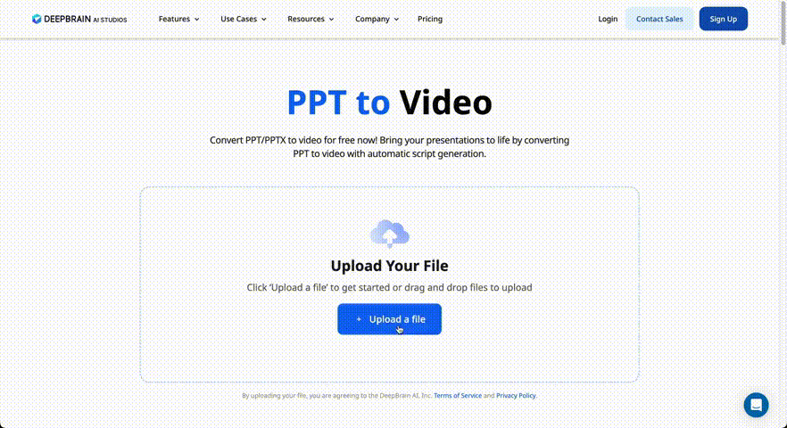
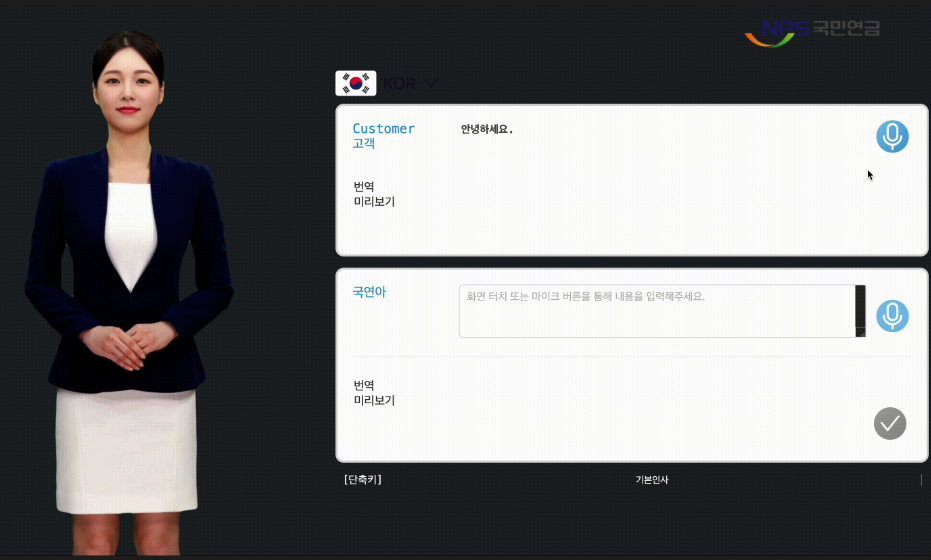
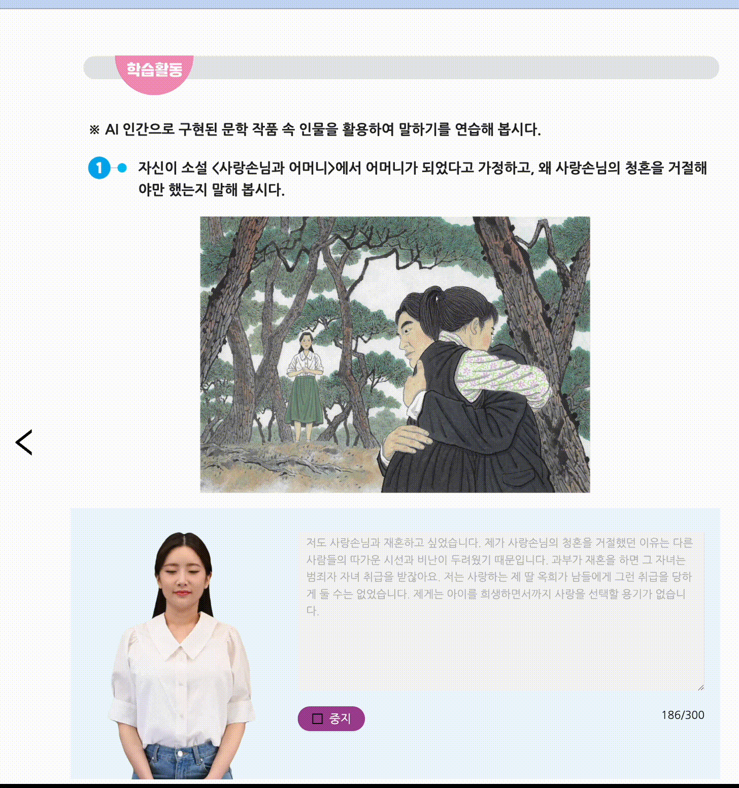
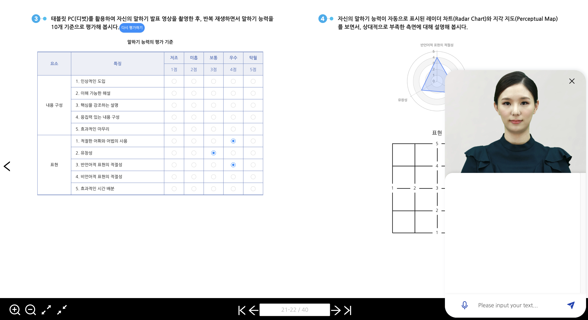
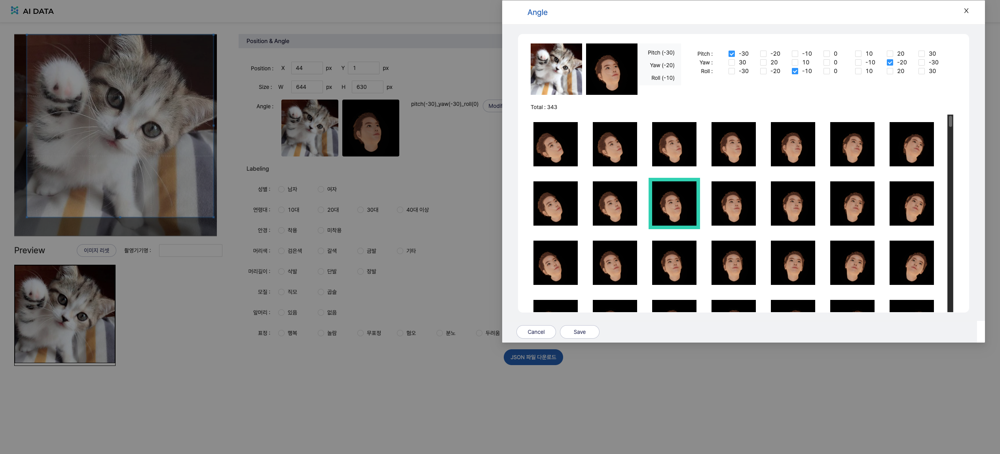
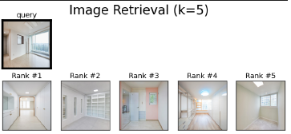
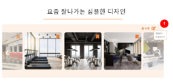

## 1. Outline

### 1.1. Profile

이름: 안동주 (An Dongju)

- 연락처: +82 10-6303-2184
- 이메일: andongjoo1@naver.com
- GitHub: https://github.com/dev-frankie
- LinkedIn: https://www.linkedin.com/in/adj0715/

측정으로 개선을 증명하는 4년차 프론트엔드 리드 개발자입니다. AI 스타트업에서 프론트엔드를 주력으로 백엔드·CI/CD까지 폭넓게 경험하며 10여 종의 제품을 개발·런칭했습니다. **계측 기반 성능 최적화 · 대규모 아키텍처 리팩토링 · AI 개발 프로세스 방법론**에 강점이 있고, 단순 기능 구현을 넘어 팀이 지속적으로 성장·검증할 수 있는 구조와 자산화된 개발 방식을 만드는 데 기여합니다.

### 1.2. SKILLS

| 구분                | 상세                                                                  |
| ------------------- | --------------------------------------------------------------------- |
| Language            | TypeScript, JavaScript, Python                                        |
| Framework / Library | React 18, Next.js, Node.js                                            |
| State               | Zustand, Recoil, Redux, TanStack Query, RTK Query                     |
| UI / 시각화         | shadcn/ui, Storybook, Canvas · Fabric.js, D3.js · ECharts · Chart.js  |
| Test / Quality      | Vitest, Playwright, ESLint, Husky, Lighthouse CI, Sentry, OpenTelemetry |
| Infra / CI-CD       | Docker, Kubernetes, Redis, AWS(S3 · SES · ElastiCache), Jenkins, ArgoCD, GitHub Actions |
| 기타                | OpenAPI 타입 · Zod 자동화, NextAuth, SSE, FSD 아키텍처, MCP, @datumo/agent-harness |

**Skill Description**

- **아키텍처 리팩토링** — FSD(Feature-Sliced Design), SSR/SSG/ISR, v→v 전면 리팩토링(Redux/RTK Query·SSR 도입), Middleware/BFF 패턴으로 변경 안전성과 확장성을 확보합니다.
- **계측 기반 성능 최적화** — Core Web Vitals, @next/bundle-analyzer, Lighthouse CI Budget Gate, User Timing API 자동 측정으로 "체감"이 아닌 수치로 개선을 증명합니다.
- **상태 관리** — Zustand·Recoil·Redux, TanStack Query/RTK Query로 복잡한 환경의 전역 상태와 서버 상태 캐시를 일관되게 관리합니다.
- **테스트 · 품질 자동화** — Vitest 단위 테스트 + Playwright E2E + GitHub Actions로 lint·format·typecheck·test·build를 merge 차단 게이트로 운영합니다.
- **AI 개발 방법론** — 작성자(Claude) ≠ 검증자(Codex) 교차검증 하네스를 사내 NPM 패키지로 자산화해 팀 전체의 리뷰 일관성을 끌어올립니다.

### 1.3. EXPERIENCE SUMMARY

**셀렉트스타** (Seoul, Korea) · 프론트엔드 파트 리더 _(2025.07 ~ 현재)_

> **Datumo Platform — LLM 평가 SaaS 프론트엔드 리드 개발**
>
> - 레거시 SSG → 동적 아키텍처 전환 및 Company/Workspace/Application 3계층 권한 체계 구축
> - 전역 상태 Recoil → Zustand 429개 이관, OpenAPI → 타입·Zod schema-first 도입
> - 실시간 협업(SSE) · Red Teaming · 대용량 테이블(TanStack Table) 등 핵심 기능 개발
> - 계측 기반 성능 최적화(barrel 코드 스플리팅 규명, User Timing 자동 측정)
> - AI 개발 방법론 자산화(@datumo/agent-harness NPM 패키지 배포)
> - 테스트·CI·관측성 체계화 및 프론트엔드 파트 리딩(파트원 3명)

**딥브레인 AI** (Seoul, Korea) · 웹 개발 _(2022.03 ~ 2025.03)_

> **AI Studios v3 서비스 개발**
>
> - 대규모 데이터 실시간 통계 및 시각화
> - 요금제 확장 및 구독 해지 방어 시스템 개발
> - 캔버스 기반 에디터 신규 개발 및 유지보수
> - 마케팅 도구를 활용한 전략 지원 및 캠페인
> - 글로벌 다국어 지원 및 지역화 서비스
>
> **Account 서버 설계 및 백오피스 개발**
>
> - 자사 서비스 통합 로그인 npm 패키지 배포
> - 로그인 인증 · 통합 어드민 · 백오피스 시스템 설계 및 개발
>
> **B2B · 대형 SI 프로젝트**
>
> - 월드비전 AI 시상영상 · KB증권 드림아바타 · 태블릿 AI 실시간 통역 · 서울시 교육청 AI 디지털 교과서 · 국민은행 금융비서 · 농협은행 AI 허브/Kiosk · AI 학습 데이터 라벨링·검수 플랫폼

**Deepbuild Inc** (Seoul, Korea) · ML Engineering Team _(2021.07 ~ 2022.02)_

> **Pinterior 서비스 개발** — 상권 데이터 분석, 인테리어 추천 모델 최적화 및 웹 서빙

## 2. WORK EXPERIENCE

### 2.1. 셀렉트스타 — Datumo Platform

셀렉트스타는 누적 투자 434억 규모의 AI 학습 데이터 구축 전문 기업으로, LLM 평가 SaaS **Datumo Platform**의 프론트엔드 리드 개발을 담당하고 있습니다. 단일 평가 도구(Eval)에서 **Eval + Red Teaming + Console + Observability**를 아우르는 플랫폼으로의 확장을 아키텍처 리팩토링과 핵심 기능 개발 양면에서 리드했습니다.

- 역할: 프론트엔드 파트 리더 (파트원 3명)
- Skills: TypeScript, Next.js 14→16, Zustand, TanStack Query, openapi-fetch · orval(zod), NextAuth, next-intl, Sentry, Vitest, Playwright, eslint-plugin-boundaries

#### 2.1.1 **레거시 SSG → 동적 아키텍처 전환 및 3계층 권한 체계**

**문제**

- 레거시가 SSG(정적 생성) 기반이라 서버 사이드에서 인증 검증과 권한 기반 라우팅 제어가 **구조적으로 불가능**했습니다.
- 단일 평가 도구를 Company/Workspace 다계층 권한 플랫폼으로 확장하는 데 근본 제약이 있었습니다.

**가정**

- 정적 구조의 한계는 렌더링 방식이 아니라 *서버에서 요청을 가로챌 수 없다*는 데 있으므로, API Routes 기반 동적 구조 + Middleware(BFF)로 전환하면 인증 가드가 성립할 것으로 판단했습니다.

**해결**

- Next.js 14 → 16 업그레이드 후 SSG → API Routes 기반 동적 아키텍처로 전환
- NextAuth + Next.js Proxy(BFF)로 브라우저는 Next API Routes만 호출하고 플랫폼 API는 서버에서만 접근하도록 구성
- **Company / Workspace / Application 3계층 권한(+슈퍼어드민)** 라우팅 가드 설계·구현
- FSD(Feature-Sliced Design) 도입으로 `app / views / widgets / features / entities / shared` 계층과 단방향 의존성 규칙 확립, public API(barrel) 규칙으로 임의 deep import 차단 — 총 **67개 슬라이스**(Entities 9 · Features 23 · Widgets 17 · Views 18), 슬라이스별 번들 크기 자동 추적

**성과**

- 정적 구조에서 불가능했던 **인증 기반 라우팅 가드**를 실현하여 서비스 보안성·확장성 확보
- 기능 수정 시 영향 범위를 FSD 레이어 내로 격리, 사이드이펙트 예측 가능성 확보

---

#### 2.1.2 **FSD 아키텍처 강제 및 전역 상태 이관**

**문제**

- FSD 규칙은 문서로 존재했지만 강제력 격차가 컸습니다 — `feature → feature` import 약 **39건**, deep import 약 30건이 대부분 사람의 기억에 의존해 drift.
- 전역 상태가 Recoil atom/atomFamily **429개**(atom 427 + atomFamily 2)로 흩어져 흐름 파악이 어렵고, DevTools 미지원으로 디버깅 비용이 높았습니다.

**가정**

- 사람이 기억하는 규칙은 결국 drift하므로 *ESLint로 경계를 강제*해야 위반이 멈춘다고 봤습니다.
- 상태는 *중앙 스토어 + DevTools로 추적 가능성 확보*가 최우선이라 판단(atom 분산이 유지되는 Jotai가 아닌 Zustand 선택).

**해결**

- `eslint-plugin-boundaries`로 FSD 레이어 의존 방향과 slice public API import를 강제(relative import까지 검사), 경계 검사 자체에 대한 테스트 추가
- Recoil → **Zustand 429개 이관** — Flux 단방향 + 중앙 스토어 + Redux DevTools(타임트래블). 기존 atom 인터페이스를 selector로 래핑해 소비처 변경을 최소화하며 **도메인별 점진 이관**

**성과**

- `feature → feature` import **39 → 0**, 위반 시 PR 차단 → **문서 규칙에서 실행 규칙으로** 전환
- 전역 상태 추적·디버깅 효율 개선, 변경 영향 범위를 FSD 레이어 내로 격리

---

#### 2.1.3 **타입 안전성 시스템화 · API 계약 자동화**

**문제**

- `strict: true`였지만 **type-aware ESLint 미사용**(`parserOptions.project: false`)이라 타입 정보 기반 규칙이 전혀 돌지 않았습니다.
- 타입 우회로: `as unknown as never` 이중 단언 **53곳**(프로덕션 38), non-null `!` 약 72곳. 배열/Record 인덱스 접근이 `undefined`를 반영하지 않음(`noUncheckedIndexedAccess` off).
- 손으로 유지하던 **약 3,200줄 `PlatformBackendPaths` 타입 계층**의 경로 누락·느슨한 `requestBody(Record<string, unknown>)`가 백엔드 계약과 drift.

**가정**

- 단순 `strict` 플래그로는 부족 — 컴파일러가 타입 정보로 인덱스 접근·uncaught promise·불필요 단언까지 잡게 하면 실제 버그가 표면화되고, 계약은 *스펙 원본에서 자동 생성*해야 drift가 멈춘다.

**해결**

- **type-aware ESLint**(`projectService`) 도입 + `no-unsafe-*` · `no-floating-promises` · `no-unnecessary-type-assertion` · `switch-exhaustiveness-check`를 error로 승격
- **`noUncheckedIndexedAccess`** 활성화 후 발생한 타입 오류 **221건**을 6개 디렉토리에 걸쳐 전수 해소 — 사용처마다 고치는 대신 *변수 정의부에서 1회 가드*하는 소스-가드 전략(예: `Table.tsx` 가드 1개로 33건, columns 빌더 40 → 4)
- `no-floating-promises` 방치 Promise **109건** triage(프로덕션 66건 `void` 처리), `no-unnecessary-type-assertion` **125건** auto-fix(단, load-bearing 단언 오탐을 겪고 'auto-fix 후 tsc 검증 필수' 원칙 정립)
- `as unknown as never` 53곳의 근본 원인을 수기 타입 계층으로 특정 → `sanitize → orval(zod) → prettier` **OpenAPI 자동 생성 파이프라인** 구축, `GET /api/member/me` 응답 검증기 슬라이스로 반복 가능성 입증(agent:verify·review 모두 GREEN)

**성과**

- type-aware ESLint 도입 후 프로덕션 `no-unsafe-*` 위반 **7건**에 불과함을 측정 — `strict:true` 위에 실질 타입 안전성 확보
- `noUncheckedIndexedAccess` **221건 전수 해소**, 브랜치 GREEN(tsc 0 · eslint clean) 유지, 손유지 3,200줄 계약을 스펙 자동 생성으로 대치 시작

---

#### 2.1.4 **실시간 협업 · Red Teaming · 대용량 테이블**

**문제**

- LLM 평가는 수 분–수십 분이 걸리는 비동기 작업이라 진행 상태를 실시간으로 파악하기 어려웠습니다.
- 여러 사용자가 같은 평가를 동시에 다룰 때의 편집 충돌, 수천–수만 행 결과의 렌더링 성능이 과제였습니다.

**가정**

- 폴링의 낭비는 *클라이언트가 서버에 계속 되묻는* 구조에서 나오므로 서버 푸시(SSE)로 제거할 수 있고, 대용량 테이블은 무거운 그리드 라이브러리 대신 *화면에 필요한 만큼만 DOM에 유지*(headless + 가상화)하면 성능과 커스터마이징 자유도를 함께 얻을 것으로 봤습니다.

**해결**

- **실시간 협업** — Polling → SSE로 전환해 평가 진행을 실시간 스트리밍(불필요한 반복 요청 제거). 4개 named event(스냅샷·잡 진행·프레즌스·버전) + viewerSessionId 기반 echo suppression(자기 변경 제외) + `navigator.sendBeacon` leave 신호로 active users 표시와 편집 버전 충돌 감지·최신 반영을 갖춘 공동 편집 구현
- **Red Teaming** — 공격셋 기반 자동 Red Teaming 플로우 + human-in-the-loop 채팅으로 평가 → 취약점 탐지 → 재현을 한 흐름으로 연결
- **대용량 테이블** — 무거운 그리드 라이브러리 의존을 제거하고 Headless(TanStack Table) + shadcn/ui로 가상화 · 2중 헤더 · rowspan/colspan 테이블을 직접 구현, 상세는 가상화 + 동적 컬럼(show/hide, 드래그앤드랍 순서 변경) 적용
- **대시보드** — D3 → ECharts/Recharts 전환 + 드래그앤드랍 그리드로 사용자가 위젯을 배치하는 커스텀 대시보드 제공

**성과**

- 평가 진행이 실시간 반영되고 폴링 대비 요청 수가 크게 감소, 다중 사용자가 충돌 없이 협업
- 가상화는 도입에서 끝내지 않고 손익분기점을 합성 데이터로 실측했습니다. 렌더되는 `<tr>`은 데이터 양과 무관하게 22개로 상수이고, 이 상수가 이득이 되는 지점은 지표마다 달랐습니다 — **초기 렌더는 1,000행부터**(677 → 90ms, 7.5배), **스크롤은 5,000행부터**(15.6 → 63fps, long task 30 → 0건)이고, 50,000행에서는 DOM **1,400,191 → 808노드** · 힙 **2,508 → 268MB** · 페인트 **31.2초 → 0.22초**
- 반대로 현재 페이지 크기(100행) 구간에서는 행당 payload가 클 때만 초기 렌더가 개선되고(47KB에서 455 → 163ms) 스크롤 FPS는 118 → 76으로 **오히려 나빠지는** 트레이드오프임을 확인해, 처음에 근거로 적었던 "DOM 46 → 18행" 문장을 철회하고 이 수치로 대체했습니다

---

#### 2.1.5 **계측 기반 페이지 성능 최적화**

**문제**

- 초기 로딩 지연·Layout Shift로 사용성이 저하됐고, 차트 라이브러리 `recharts`(282.5KB parsed / **116.5KB gzip**)가 대시보드를 열지도 않는 사용자에게까지 **공유 초기 번들**로 배달됐습니다.
- Task 진입(평가 Run 조회)은 **7-way 조인**이 필요해 목록·상세가 느렸고, 성능을 지속 측정·감시할 체계가 없었습니다.

**가정**

- 처음엔 *대시보드 컴포넌트를 `dynamic(ssr:false)`로 지연하면 분리될 것*으로 가정했으나 리빌드 후 청크 콘텐츠 해시가 **바이트 동일**(`6333-3f3bb7b9…` before=after)이라 **가설 기각** — 진범은 barrel(`widgets/.../index.ts`)의 정적 재수출로, ModalRegister(앱 부팅) 등 **6개 소비처**가 recharts를 정적 그래프로 끌어들이고 있었습니다.
- "체감이 빨라졌다"는 주장이 아니라 *ms 단위 계측으로 증명*해야 한다고 봤습니다.

**해결**

- **barrel 재수출 제거 + 소비처 deep 경로 dynamic import**로 정적 경로를 완전히 차단(변경 파일 2개). `build-manifest`(공유 초기 청크)에서 recharts 추방 + `react-loadable-manifest`에 동적 청크(2560·6723) 등록으로 async임을 실측
- **Task 진입 최적화** — 카드 **호버 시점 prefetch(hover 인텐트) + SSR HydrationBoundary** + `@tanstack/react-virtual` 가상화. **Playwright + User Timing API**로 prefetch·virtualize 4조합 × 4 Task × 5회 median(**총 80샘플, 약 9.4분**) 자동 측정해 수치로 검증
- 이미지·폰트 사이즈 예약 + 스켈레톤으로 Layout Shift 방지, 정적 파일 S3 업로드 + CDN 캐싱
- `perf:rank` 번들 랭킹(First-party·서드파티·청크 3섹션 + 중복 버전 감지) + Lighthouse median(라우트당 3회) 파이프라인 구축, `perf:bundle-diff`로 main 번들 baseline 대비 PR별 gzip·패키지별 증감을 diff하고 **Top 15 패키지 랭킹 + Lighthouse 결과를 PR 스티키 코멘트로 자동 게시**(GitHub Actions)

**성과**

- recharts **116.5KB**(gzip)를 초기·공유 번들에서 제거 — 총 번들은 스플릿 오버헤드로 +2KB지만 **라우트 First Load JS는 −117KB** (총합이 아닌 초기 로드로 판단)
- **Task 진입 472ms → 323ms(약 32%↓, 4케이스 평균)**, 최악 케이스(llm-as-judge)는 **623ms → 148ms(약 4배)**, Lighthouse 60 → 90+, CLS 0.2 → 0.05
- 80샘플 자동 측정 + 번들 diff CI로 성능 회귀를 PR 단계에서 자동 감지, "번들 최적화는 총합이 아니라 라우트별 초기 로드로 판단"을 팀 규칙(`fsd-architecture.mdc` · `CLAUDE.md`)으로 문서화

---

#### 2.1.6 **Sentry 관측성 고도화**

**문제**

- 에러 계측이 `captureException` 단 1곳(`global-error.tsx`)뿐이고 환경·릴리즈·샘플링·노이즈 필터가 전무해, 이슈만으로는 원인 추적이 불가능했습니다.
- `sendDefaultPii: true`로 PII가 전량 전송되고 `tracesSampleRate: 1`로 트레이스를 전량 수집(quota·비용 위험). `SENTRY_AUTH_TOKEN`이 `.gitignore` 누락(점 없는 파일명)으로 커밋돼 여러 원격 브랜치에 노출됐습니다.

**가정**

- 이슈 하나로 원인까지 추적하려면 에러를 **API 단위로 그룹핑**하고, 노이즈는 메시지 문자열이 아니라 **에러 code 기반**으로 걸러야 다국어·문구 변경에도 필터가 깨지지 않는다고 봤습니다.

**해결**

- **중앙 집중 계측** — TanStack Query `QueryCache/MutationCache`의 `onError` 단일 길목에서 전 서버 요청 에러에 Scope(level·tags·context·fingerprint)를 자동 부착(계측 지점 1곳 → 전 API 커버 단일 진입점)
- **커스텀 fingerprint**로 그룹화 축을 StackTrace → API(method+endpoint+status+code)로 고정, 이슈 제목에 상태코드·메서드·BFF 경로 + 가변 세그먼트를 `{id}`로 정규화(예: `[500] GET /api/applications/{id}/eval-runs/{id}/tasks/{id}`)
- **노이즈 3계층 필터**(Inbound Filters · beforeSend · SKIP_RULES) — `PlatformApiError.code` 기반 정밀 skip + BFF 특성 반영(클라 런타임 네트워크 throw는 drop, BFF→백엔드 실패는 신호로 유지)
- 4단계 Level 체계(fatal/error/warning/breadcrumb), Tags/Context/`setUser(id+email)` 적재, `tracesSampleRate 1 → tracesSampler` 샘플링, environment(dev/qa/prod/onprem)·`release=git SHA` 마킹, `sendDefaultPii` PII를 scrub 모듈로 스크럽
- 커밋된 `SENTRY_AUTH_TOKEN` 발견 → 토큰 재발급·`.gitignore` 수정·추적 해제 무중단 조치

**성과**

- 재현 없이 원인 추적 가능한 관측 도구로 전환, 동일 API 에러를 하나로 묶어 이슈 노이즈 제거, 배포별 회귀(release) 자동 계산 기반 확보, PII 유출 리스크 제거

---

#### 2.1.7 **i18n 자동화 파이프라인**

**문제**

- 문구 반영 시 개발자가 `en/ko/ja.json` + TSV를 수동 편집했고, merge/pull 시 **영어가 ko/ja로 역류**해 상시 '영어 회귀 복구용 응급 스크립트'가 필요했으며 번역 충돌이 잦았습니다.

**가정**

- 번역 키 값에 **소유권을 단일화**(한 셀에 주인 하나) + **단방향 흐름**을 설계하면 충돌·역류가 구조적으로 사라진다고 봤습니다.

**해결**

- next-intl(en/ko/ja) 기반, leaf 세그먼트를 곧 영어 원문으로 두는 키 컨벤션 + `en.json`을 코드에서 자동 생성(`build-en`) → **개발자는 `t()`만 작성**
- 변수 바인딩 기반 정적 추출기(`extract-keys`)로 한 파일에 네임스페이스가 여럿인 경우(전체 30%)도 `t()/t.rich()`를 정확히 매핑, dev watcher(`instrumentation.ts → build-en --watch`, write-if-changed로 불필요 리로드 방지)
- 안 쓰는 키만 안전 제거하는 `prune`을 **4중 조건**(en 존재 ∧ 코드 리터럴 부재 ∧ base 부재 ∧ 동적 네임스페이스 아님)으로 설계, `--dry-run`으로 동적 dispatch 키 오삭제 사전 검출
- GitHub Actions 자동화(i18n-sync: 키 push·promote / i18n-pull: sync PR 생성), 시트 '번역 완료' 버튼을 Apps Script `repository_dispatch`로 CI 연동, CI의 라이브 시트 pull을 `build-en --check` 게이트로 교체(결정적 빌드), 런타임 en deep-merge 폴백으로 미번역 키의 raw key 노출 방지

**성과**

- 개발자는 `t()`만·번역자는 ko/ja만·나머지는 CI가 자동 처리하는 파이프라인 확립, **번역 머지 충돌 0건(구조적 제거)**, 영어 역류 복구 응급 스크립트 제거, 약 1,300키를 결정적 빌드로 관리

---

#### 2.1.8 **AI 개발 방법론 자산화 — @datumo/agent-harness**

**문제**

- AI 에이전트가 "테스트 통과, 문제없음"이라 보고할 때 **누가 검증하나**. self-review는 같은 모델·같은 컨텍스트라 **같은 맹점을 두 번 통과**(동조검증)시킵니다.

**가정**

- 코드리뷰의 Reviewer ≠ Assignee 원리를 이식해 **작성자(Claude) ≠ 검증자(Codex)** 로 분리하면 교차검증이 성립한다고 봤습니다. 검증자 프롬프트는 버전관리로 고정해야 작성자가 "이건 검토하지 마" 식으로 조작할 수 없습니다.

**해결**

- typecheck·eslint·unit·i18n **4종 기계 게이트**(`pnpm agent:verify`)로 두 에이전트가 같은 명령으로 동일 결과를 재현하게 표준화. 게이트는 `depInstalled`/`hasPackageScript` 기반 자동 skip(동일 config로 front 4게이트·admin 2게이트 자동 적용)
- **버전관리된 고정 프롬프트**로 Codex 호출, 검증자 입력을 **handoff·diff·verify 3개로 제한**해 작성자의 대화 히스토리 상속을 차단, S1/S2/S3 severity verdict + 2라운드 상한·사람 에스컬레이션의 3중 수렴 장치, codegraph MCP를 검증자에 주입해 변경 blast-radius를 인지한 리뷰
- 공유 npm 패키지 **`@datumo/agent-harness`** 로 추출(12개 파일·8단계 루프, verify·review·plan-review·init·sync 5개 CLI + Claude Code Stop 훅) → front·admin **다중 레포 배포**, **drift-aware sync**(managed 파일 해시 기록, 로컬 수정분은 경고만)로 정본 `AGENTS.md`를 컴파일해 30여 종 에이전트가 동일 규칙 참조

**성과**

- 도입 첫날 하네스가 **자기 자신의 결함 12건**(typecheck 크래시 시 에러 0줄이라 통과로 오판하던 false GREEN 등)을 교차검증으로 규명
- 규칙·프롬프트·게이트를 한 곳에서 유지보수하고 `sync`로 전 레포 전파해 **복붙 드리프트 제거**

> 교훈: **신뢰는 검증 주체의 성능이 아니라 작성자와 검증자의 분리에서 나온다.**

---

#### 2.1.9 **품질 · CI · TDD 게이트 및 파트 리딩**

**문제**

- 레거시(`llm-eval-front`)는 실행 가능한 테스트가 **0개**, 소스 lint만 해도 **56 errors / 710 warnings**, `eslint.ignoreDuringBuilds`로 오류가 있어도 배포되는 구조라 품질이 개인 숙련도·수동 QA에 전적으로 의존했습니다.

**가정**

- 품질은 개인의 주의가 아니라 *merge를 막는 차단 게이트*로 시스템화해야 무너지지 않고, "테스트가 있음"이 아니라 *커버리지 미달 시 PR이 막히는* 래칫이어야 실효가 있다고 봤습니다.

**해결**

- 파트원(3명) 업무 분배 · 코드 리뷰 · 기술 전파를 담당하고, PO와 요구사항을 정의·조율
- 순수 로직 TDD로 테스트를 **파일 68 → 95(+27) · 케이스 493 → 633(+140)** 백필(계약/경계/빈 입력/에러 경로 중심), QA 버그 수정 시 테스트 시나리오 업데이트 필수화
- **커버리지 게이트** — `all:true`로 테스트 0개 파일이 분모에서 빠지는 허위 커버리지를 차단(정직한 floor 38%에서 시작), include를 `lib/**`·`shared/api/error/**`로 한정해 순수 로직 바닥을 계측, CI를 `pnpm test → test:coverage`로 교체해 미달 시 **실제 빌드 차단(래칫)**. 실측 커버리지 Functions 91% · Branches 79% · Statements/Lines 85%
- GitHub Actions로 lint · format · typecheck · unit coverage · build를 **merge 차단 게이트**로 실행, 테스트 전략 문서(`docs/testing-strategy.md`)로 테스트 피라미드 명문화
- `.env.{dev,dev2,qa,prod,onprem}` **5개 환경 매트릭스** + 고객사 대응 온프레미스 standalone Docker 이미지로 SaaS·온프레미스 동시 지원

**성과**

- 실행 테스트 **0 → 633 케이스**, 소스 lint **56 errors → 0**, 오류가 있어도 배포되던 구조에서 *merge 전 커버리지 게이트로 차단*하는 체계로 전환
- 사내 프론트엔드 레포 성숙도 평가 **4.0 → 6.5/10**(테스트·CI·아키텍처 축 개선), 팀 공통 컨벤션·온보딩 기준 정립

---

### 2.2. 딥브레인 AI — AI Studios v3

AI Studios는 인공지능 합성 기술을 기반으로 사용자가 AI 가상인간을 활용해 개인화된 영상 콘텐츠를 제작하는 SaaS 플랫폼입니다. v2 → v3 전면 리팩토링(Redux · RTK Query)으로 SSR · 디바운싱 · 코드 스플리팅을 적용해 FCP/LCP/TTI 평균 30%+ 단축을 달성했습니다.

#### 2.2.1 **대규모 데이터 실시간 통계 및 시각화**

1,000만 건 이상의 프로젝트 데이터를 실시간으로 조회 가능한 통계 대시보드 및 데일리 리포트 자동화 시스템을 구축했습니다.

- 기여도: 100%
- Skills: Next.js, Kubernetes, Chart.js, MongoDB

**문제**

- 유저 유입·프로젝트 사용 현황·에러율 등 통계를 실시간으로 파악하기 어려웠습니다.
- 기관별·팀별·개인별 분석 데이터가 없어 운영·의사결정에 어려움이 있었습니다.
- 1,000만 건 이상 데이터를 기간별로 조회할 때마다 집계가 3초 이상 걸려 실시간 분석이 어려웠습니다.

**가정**

- 조회 시점에 raw를 매번 집계하는 게 병목이므로, *사전 집계 + 배치*로 조회를 단순 read로 바꾸면 응답이 상수 시간에 가까워질 것으로 봤습니다.

**해결**

- 쿠버네티스 기반 Cron 배치로 매일 기관/팀/개인별 프로젝트·유저 로그를 수집하고 로우 데이터를 정제, 운영진에게 메일 리포트 자동 발송
- MongoDB 사전 집계 API로 통계 대시보드를 개발해 실시간 조회·분석 지원, Chart.js 코드 스플리팅으로 초기 번들 축소

**성과**

- FCP 1.2s → 0.4s(약 67%↓), LCP 4.5s → 2.2s(약 51%↓), 조회 응답 3s+ → 1s 미만
- 데일리 수집·리포트 시스템 구축으로 운영팀의 데이터 기반 의사결정·전략 수립에 기여

---

#### 2.2.2 **요금제 확장 및 구독 해지 방어 시스템**

- 기여도: 100%
- Skills: Next.js, Kubernetes, Stripe

**문제**

- 레거시 요금제와 신규 요금제를 병행하면서 요금제 간 기능·권한 관리 로직이 혼재해 코드 복잡도가 크게 증가했습니다.
- 요금제별 권한·접근 제어가 명확히 구분되지 않아 기능이 불필요하게 중복 구현됐습니다.
- 구독 해지 과정에서 고객 피드백을 수집·분석할 체계가 없었습니다.

**가정**

- 권한 분기가 코드에 흩어진 게 문제이므로 *권한을 데이터로 모델링*하고 훅으로 추상화하면 중복이 사라지고, 해지는 단일 확인창이 아니라 *단계별 방어 퍼널*로 붙잡을 여지가 있다고 봤습니다.

**해결**

- 각 기능별 접근 권한 필드를 DB에 추가해 자동화된 권한 관리 체계 구축, 요금제 권한을 가져오는 커스텀 훅 개발로 중복 코드 제거
- 구독/업그레이드/다운그레이드 기준을 동적으로 판단하는 매트릭스 설계
- 구독 해지 방어 퍼널(설문으로 해지 이유 실시간 수집 → 크레딧/할인 리워드 추천 → 유지 유도) + 해지 히스토리 관리 페이지 구축, Stripe 연동

**성과**

- 레거시 요금제를 유지하면서 신규 요금제 확장으로 **약 2개월간 구독자 300명 증가**
- 요금제별 권한·접근 제어 개선으로 중복 코드 대폭 제거, 유지보수·확장성 향상
- 구독 해지 방어 시스템으로 고객 이탈 방지 및 해지 히스토리 기반 개선 방안 마련

---

#### 2.2.3 **캔버스 기반 에디터 신규 개발 및 유지보수**

- 기여도: 100%
- Skills: Next.js, Fabric.js, Redux, Canvas, FFmpeg

> **기능 요구사항 1** — 텍스트 입력으로 생성형 AI 이미지/비디오를 생성해 웹 에디터에 연동

**문제 / 가정**

- 이미지·비디오는 생성 시간이 일정하지 않아 즉시 응답을 받을 수 없고, 캔버스 내 미디어 객체 관리가 복잡했습니다. → Job 리스트를 주기적 인터벌로 폴링해 비동기 반영하면 UX를 막지 않을 것으로 봤습니다.

**해결**

- 사용자 텍스트를 입력받아 이미지/비디오를 생성하는 API를 연동하고 Job 리스트를 주기적 인터벌로 fetching
- ChatGPT 연동으로 미디어 생성 힌트 제공, Fabric.js로 생성 미디어 속성 분석 후 캔버스에 추가하고 Redux 미들웨어로 DB 저장

**성과** — 텍스트 입력만으로 고품질 이미지/비디오를 생성해 사용자 편의성을 대폭 향상

---

> **기능 요구사항 2** — 에셋 정렬 기준을 손쉽게 확인하는 에디터 내 스냅 가이드 제공

**문제 / 가정**

- 에셋 추가 시 오브젝트 간 정렬·간격 조절 로직이 복잡하고, 위치 변경마다 실시간 좌표 계산·렌더링이 필요했습니다. → 병목은 *매 프레임 재계산*에 있으니 드래그 시작 시 1회 계산 + 축별 후보 축소로 완화할 수 있다고 봤습니다.

**해결**

- 각 오브젝트의 시작/중앙/끝 좌표를 배열로 관리하고, 선택 오브젝트 좌표와 비교해 겹치는 기준선을 감지·가상 렌더링, 임계값 이내 접근 시 자동 정렬(스냅) 적용
- 좌표 비교 오버헤드를 **드래그 시작 시 1회 캐싱 + 축별 사전 필터링 + 가이드라인 DOM 렌더 분리**로 완화해 실시간 피드백 제공

**성과** — 대규모 에셋에서도 정렬 작업을 직관적·즉각적으로 만들어 편집 흐름 개선

---

> **기능 요구사항 3** — 비디오 에셋 편집(트림) 기능으로 콘텐츠 제작 효율 향상

**문제 / 가정**

- 비디오 썸네일 추출 시 서버 부하가 우려됐고, 비디오 변경 시 캔버스·DB 동시 업데이트와 이동/사이즈/트림 상호작용에서 사이드이펙트가 발생했습니다.

**해결**

- FFmpeg으로 썸네일 추출 속도 저하 해결, 슬라이더 기반 구간 설정 제공, 트림 시 이전 상태를 Redux·DB에 저장해 복구 가능
- 트림 모드 진입 시 Video Element로 실시간 재생·구간 미리보기, Canvas/Redux/Video Element 연동으로 편집 상태 일관 관리, 트림 종료 후 썸네일 재생성

**성과** — 비디오 트림·썸네일 미리보기·플레이 제공으로 작업 효율 증대

---

> **기능 요구사항 4** — 에셋 툴바 컴포넌트 설계 및 구현

**문제 / 가정**

- 에셋마다 지원 기능이 달라 툴바를 동적으로 렌더링해야 하고, 제한된 화면 공간에서 일부 기능이 가려졌습니다. → 특정 크기 이하에선 Floating 모드 전환이 필요하다고 봤습니다.

**해결**

- `useResizeObserver`로 툴바·화면 크기를 실시간 모니터링해 임계값 이하 시 자동 Floating 모드 전환
- React Portal로 툴바를 최상위 DOM에 렌더링해 화면에서 사라지지 않도록 위치 동적 조정

---

> **기능 요구사항 5** — 홈페이지에서 AI Studios 에디터/기능 연동 (Powerpoint to AI Video, AI Generator, URL to Video, Audio/Video Converter)

**문제 / 가정**

- 웹플로우 기반 홈페이지와 Next.js 기반 AI Studios 기능의 통합, 쿼리 파라미터 전송 시 보안, 원활한 통신 보장이 과제였습니다.

**해결 (기여도: 스크립트 삽입 100% / 기능 연동 30%)**

- AI Studios: 홈페이지 origin 허용 설정, 홈페이지용 API 정의·연동
- 홈페이지: HTML·JavaScript 웹플로우 커스텀 코드 삽입

**성과** — 홈페이지 방문자의 AI Studios 대거 유입, 추가 기능 확장 기반(베이스 코드) 마련

---

#### 2.2.4 **마케팅 도구를 활용한 전략 지원 및 캠페인**

**문제**

- 사업 전략 분석 체계·유저 행동 로그 등 근거 데이터가 부족했고, 비디오 합성 시간이 길어 결과를 못 본 사용자가 이탈했으며, 유저별 최적화 이메일 캠페인이 미흡했습니다.

**해결**

- **이벤트 트래킹·분석** — GA4, Amplitude, Baidu Analytics로 태그 설정·행동 세분화·구매/전환 추적
- **HubSpot 연동** — 커스터마이징 입력 폼으로 사용자 데이터를 수집해 CRM 연동, 리드 분석 지원
- **G2 인앱 리뷰 연동** — 사용자별 G2 API 키 발급 및 리뷰 데이터 동적 임베딩
- **합성 완료 알림** — Service Worker 웹 푸시 + AWS SES 합성 완료 메일 발송
- **A/B 테스트·데모 퍼널** — 신규/기존 유저 대상 A/B 테스트로 전환율 높은 데모 페이지 도출
- **드립 이메일 캠페인** — 쿠버네티스 기반 메일 발송 자동화, 유저 그룹별 맞춤 이메일·추적
- **설문 기반 대시보드 개선** — 회원가입 시 설문으로 대시보드 최적화

**성과**

- 데이터 기반 분석 체계 구축으로 마케팅 의사결정 지원, GA4·Amplitude 도입으로 타겟 마케팅 정밀도 향상
- HubSpot·G2 연동으로 리드 분석·전환율 기여, 웹 푸시·이메일 알림으로 제작 완료 후 재방문율 증가, 드립 캠페인으로 구독 유지·재가입률 향상

---

#### 2.2.5 **글로벌 다국어 지원 및 지역화 서비스**

**문제**

- 다국적 사용자 대응을 위해 다국어·지역화가 필요했고, 국가별 로그인·결제 수단 등 특수 요구사항과 수기 번역 관리의 비효율이 있었습니다.

**해결**

- next-i18next로 다국어 번역·언어 전환 구현, 언어별 텍스트 길이를 고려한 반응형 UI로 핵심 컴포넌트 일관성 확보
- 리전 커스터마이징 — 중국 시장 위챗 로그인·알리페이 등 특화 기능 개발, 리전별 기능 제한 적용
- 번역 키·언어 매핑을 Google Sheet ↔ JSON으로 체계 관리하고 Node.js 스크립트로 워크플로우 자동화

**성과**

- 다국어·국가별 맞춤화로 글로벌 사용자 경험 개선, 번역 자동화로 작업 시간 단축, 중국 등 폐쇄적 시장에 효과적으로 진입

---

### 2.3. 딥브레인 AI — Account 서버 · 백오피스

#### 2.3.1 **자사 서비스 통합 로그인 모듈 패키지**

**문제**

- 자사 서비스별 로그인 방식이 달라 사용자 경험이 단절되고, 서비스마다 인증을 중복 구현하면서 개발 효율이 저하됐습니다.

**해결**

- NextAuth 기반 OAuth 로그인 모듈을 npm 패키지 **`@deepbrain/next-auth-account`** 로 개발·배포(설치만으로 적용, Atomic Design)
- 6종 소셜 로그인(Google · MS · Apple · Facebook · **WeChat** `snsapi_login` · **Alipay** RSA-SHA256 커스텀 서명) 통합, Redis 싱글턴 세션으로 서비스 간 SSO 구현

**성과**

- 통합 인증으로 유지보수 간소화·개발 생산성 향상, 소셜 로그인으로 신규 유입 증가, SSO로 서비스 간 재로그인 제거

---

#### 2.3.2 **로그인 인증 · 어드민 백오피스 서버**

**요구사항** — 로그인 인증 중앙 서버 + 기업/부서/사용자/AI 리소스 관리 어드민 시스템

**해결**

- 회원 비즈니스 로직(Facade 패턴), Redis 기반 중복 로그인 방지(유저 key 관리), 탈퇴 후 30일 경과 계정 자동 삭제 CRON 배치
- 기업/부서/멤버 통합 관리 어드민 페이지(관리자 권한별 기능), HOC 패턴 권한별 컴포넌트 계층화
- AI Voice 리소스 관리(샘플 보이스 API·입력 폼), AI Avatar 리소스 관리(Fabric.js 시각 에디터로 좌표 편집), 사용자 정의 단어사전(치환 기능)

**성과** — 통합 어드민으로 데이터 관리 효율·관리자 편의 향상, SSO 통합 인증 서버 운영

---

### 2.4. 딥브레인 AI — B2B · 대형 SI 프로젝트

#### 2.4.1 **월드비전 꿈엽서 그리기대회 AI 시상영상** (2023, 2024)

**문제** — 매년 수만 건의 수상작을 AI 비디오로 빠르고 효율적으로 제작할 시스템이 필요

**해결** — 대규모 수상작을 빠르게 AI 비디오로 합성하는 엑셀 기반 합성 시스템 설계·개발, Job 스케줄링으로 프로세스 효율화, 합성 진행 상황 모니터링 프로그램 개발

**성과** — 자동화로 수작업 부담 경감 및 제작 속도·품질 확보

---

#### 2.4.2 **KB증권 드림아바타 PoC**

**개요** — 사진·목소리를 업로드하면 AI 명함을 생성하는 웹 애플리케이션 (사진·음성 업로드 → AI 분석·학습 → AI 명함 생성) · [관련뉴스](https://www.aitimes.com/news/articleView.html?idxno=156042)

**해결**

- 사진 업로드 시 자동 얼굴 인식 바운딩 박스 생성 + 사용자가 위치·영역 조정으로 정확한 얼굴 좌표 지정
- 자사 AI 합성 서버와 API 통합으로 사진·음성 데이터를 결합해 말하는 명함 영상 생성·제공

**성과** — 사진·음성 기반 개인화된 AI 명함을 웹 애플리케이션으로 제공

---

#### 2.4.3 **태블릿 AI 실시간 통역 서비스**

**개요** — AI 기반 실시간 다국어 통역 서비스

**해결**

- 웹 SDK 연동·제어로 실시간 AI 아나운서 구현 및 음성 합성, ChatGPT API 기반 번역(대화 이력 저장으로 문맥 반영 + 질의응답)
- Google·Azure STT API로 10개국 이상 언어 지원 + 자사 AI 모델 보이스 TTS, 배경·모델·로고 등 템플릿화
- **SDK 지연 로드로 초기 로드 최적화 → TTI 7.6s → 4.3s(약 43%↓)**

**관련 뉴스** — [자사뉴스](https://www.the-tech.co.kr/news/article.html?no=36223) · [국민연금공단](https://www.nps.or.kr/jsppage/mobile/ne/HM_4D0002_01.jsp?hrnkMenuId=MW_NE&menuId=MW_NE_002&seq=29046)

**성과** — 실시간 다국어 통역으로 외국인 사용자 편의성 향상, ChatGPT 연동 최적화로 번역 정확도·응답 속도 개선

---

#### 2.4.4 **서울시 교육청 AI 디지털 교과서**

**개요** — 기존 E-book 교과서에 AI 기반 질의응답(AI 교수님) 기능을 더한 실험적 프로토타입

**해결**

- 웹 기반 E-book 설계·구현(교과 퍼블리싱, 확대/축소, 화면 전환, 스크롤 모드, 글꼴·크기 조절)
- AI SDK·챗봇 연동으로 AI 질의응답 구현, 텍스트 프롬프터(슬라이드 배속·빠른 이동·되감기, 확대/축소 가독성 최적화)

  

**성과** — 2023 디지털 러닝페스티벌에 서울시교육청 소속으로 참여, AI 디지털 교과서의 새로운 가능성 제시

---

#### 2.4.5 **국민은행 금융비서 프로젝트**

- 자사 관리자 기능을 On-premise 형태로 탑재하여 보안성·독립성 강화
- 약 13억 규모의 대형 프로젝트
- [관련기사](https://www.hellot.net/news/article.html?no=65465)

---

#### 2.4.6 **농협은행 AI 허브 플랫폼 · Kiosk**

**개요** — 약 20억 규모의 대형 프로젝트로, AI Studios 기능을 농협 포털에 탑재하고 홍보용 AI Kiosk를 개발

**해결**

- **On-Premise 관리자 기능** — 자사 관리자 기능을 On-Premise로 탑재해 보안성·독립성 강화
- **AI Kiosk** — `tensorflow-models/posenet`으로 포즈 감지(정면 판별), 입장 시 단계별 안내 후 기념 사진 촬영 → AI로 모자이크 풍 변환 → `node-printer`로 폴라로이드 즉시 출력
- **음성 인식** — KT와 협업해 STT 연동

**관련기사** — [농협](https://www.shinailbo.co.kr/news/articleView.html?idxno=1512682)

**성과** — AI Kiosk로 사용자 경험 개선·혁신 서비스 제공, On-Premise 관리자 기능으로 운영 효율 증대

---

#### 2.4.7 **AI 학습용 데이터 라벨링 · 검수 플랫폼**

**개요** — 한국인 얼굴 합성을 위한 발화 모습 이미지 연구 데이터 수집 프로젝트 (약 20억 규모 정부과제)

**문제**

- 대규모 학습용 얼굴 데이터 10만여 장 이상 확보 필요
- 자사 AI 모델의 라벨링 정확도 미흡으로 인한 데이터 품질 문제
- AI 모델이 라벨링한 로우 데이터를 작업자가 쉽게 검수·보정할 플랫폼 필요

**해결**

- **이미지 자동 라벨링** — 매일 NAS에 업로드되는 이미지를 자동 처리하여 얼굴(눈·코·입) 좌표, 머리 색상, 곱슬/직모, 성별 등 속성 추출 Inference API 자동 실행
- **검수·보정 툴** — 결과값 검토·보정 툴(얼굴 바운딩 조절·확대·crop), 교차 검증 로직으로 동일 이미지 반복 검수 방지, 관리자 승인된 데이터만 NAS 재업로드

**성과** — 자동화로 작업자 수작업 시간 대폭 단축, 검수·보정 툴로 데이터 정확도 향상 및 **학습용 이미지 10만 장 이상 제작**

---

### 2.5. Deepbuild Inc — ML Engineering Team

_(2021.07 ~ 2022.02)_

#### 2.5.1 **인테리어 플랫폼 Pinterior 개발**

**문제** — 유저가 특정 상권에 적합한 인테리어 정보를 제공받지 못하고, 인테리어 디자인 추천 기능이 부재했습니다.

**해결**

- **상권 정보 데이터 분석** — 지역·날짜·성별·나이·이동반경 등으로 특정 시간대 유동 인구 예측 및 상권 정보 제공
- **인테리어 추천** — 이미지 평점·사용자 샘플 평점 기반 GNN 추천 시스템 모델 최적화, Auto Encoder 기반 유사 인테리어 추천 구현
- **AI 모델 서빙** — Flask 기반 서버로 실시간 추천 결과 제공

  
  
  

**성과**

- 상권 데이터 분석 기반 맞춤형 인테리어 추천 시스템 구축, AI 모델 최적화로 추천 정확도·사용자 만족도 증가, 실시간 추천 API 개발·배포 및 상용 서비스 적용
