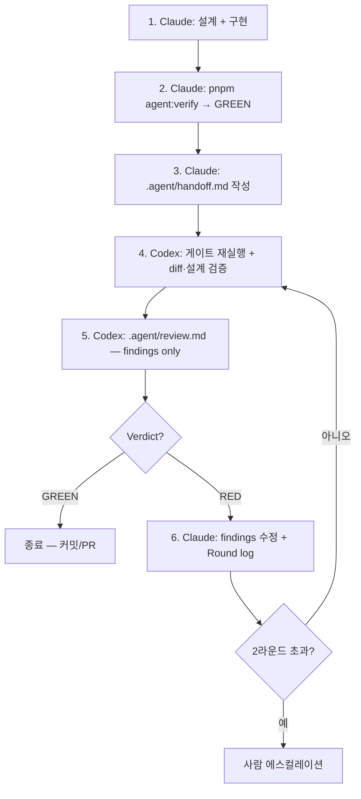

Claude가 기능을 구현하고 "테스트 통과했고, 문제없습니다"라고 보고합니다. 그 말을 누가 검증하죠?

같은 모델이 만들고 스스로 검증하면 같은 맹점을 두 번 통과시킵니다. 설계할 때 놓친 것은 검증할 때도 놓칩니다. 사람 조직이 코드 리뷰로 푼 문제가 에이전트 파이프라인에서 그대로 재발하고 있는데, 정작 해법은 옮겨오지 않았습니다.

이 글은 작성자(Claude Code)와 검증자(Codex)를 분리한 교차검증 하네스를 만든 기록입니다. 설계 원칙 다섯 개, 실제로 만든 파일들, 그리고 이 하네스가 배포 첫날 자기 자신에게서 버그 12건을 찾아낸 이야기까지 다룹니다.

## 1. 왜 교차검증인가

AI 코딩 에이전트로 개발하다 보면 묘한 불안이 남습니다. Claude가 기능을 구현하고 "테스트 통과했고, 문제없습니다"라고 보고하면 — **그 말을 누가 검증하죠?** 검증한 주체가 작성한 주체와 같다면, 그건 검증이 아니라 자기확신입니다.

사람 조직은 이 문제를 오래전에 풀었습니다. **코드 리뷰** — 작성자가 아닌 사람이 diff를 봅니다. PR 승인자와 작성자를 분리합니다. 이유는 단순합니다:

- 작성자는 자신의 **가정을 의심하지 못합니다.** 설계할 때 놓친 엣지케이스는 검증할 때도 똑같이 놓칩니다.
- 같은 컨텍스트를 공유하면 **같은 결론에 도달합니다.** "이 정도면 되겠지"라고 판단한 근거가 검증 단계에서도 그대로 재사용됩니다.

AI 에이전트도 정확히 같습니다. 같은 모델, 같은 대화 컨텍스트, 같은 추론 과정 위에서 도는 "self-review"는 **동조검증**이지 교차검증이 아닙니다. 그래서 목표를 이렇게 잡았습니다:

| 목표 | 구현 수단 |
| --- | --- |
| 작업 방식 | Claude Code가 설계+구현, Codex가 검증 (다른 모델, 다른 세션) |
| 컨텍스트 유지 | 최소 단위 handoff — 검증자는 대화 히스토리를 절대 못 봄 |
| 기계적 준수 | 공통 검증 스크립트 — 두 에이전트가 같은 명령으로 같은 결과 |
| 품질 검증 | findings-only 교차검증 + 수렴 규칙(라운드 상한·에스컬레이션) |

## 2. 하네스를 지탱하는 5가지 설계 원칙

### 원칙 1. 작성자 ≠ 검증자

역할을 파일 레벨에서 고정합니다. 이 레포는 에이전트별 진입 문서가 나뉘어 있습니다 — `CLAUDE.md`는 Claude Code가, `AGENTS.md`는 Codex가 자동 로드합니다. 각 문서에 서로 다른 역할을 박아두면, **어느 터미널을 열든 그 에이전트는 자기 역할만 수행**합니다.

- `CLAUDE.md` → "너는 author다. 구현하고 handoff를 써라. **self-certify 금지.**"
- `AGENTS.md` → "너는 verifier다. 검증하고 findings만 보고해라. **코드 수정 금지.**"

### 원칙 2. 검증자의 입력은 3개로 제한 (독립성 조건)

검증자가 보는 것: ① `.agent/handoff.md` ② working-tree diff ③ `pnpm agent:verify` 출력. **작성자의 대화 히스토리는 절대 넘기지 않습니다.** 넘기는 순간 작성자의 가정("이건 이래서 괜찮아")을 물려받아 교차검증이 무너집니다. 설계 자체를 검증받고 싶으면? handoff의 **Design decisions** 섹션에 결정과 근거를 명시적으로 적습니다 — 검증자는 그 섹션을 공격하는 방식으로 설계를 검증합니다.

### 원칙 3. 검증자 프롬프트는 버전관리로 고정

자동화의 함정: 작성자(Claude)가 검증자(Codex)를 호출한다면, 호출 프롬프트를 작성자가 즉석에서 지을 수 있고 — "이 부분은 검토하지 마" 같은 조작이 가능해집니다. 그래서 **검증자 프롬프트를 스크립트에 박아 git으로 관리**합니다. 작성자는 `pnpm agent:review`를 실행할 수만 있지, 프롬프트를 바꾸려면 diff에 노출됩니다.

### 원칙 4. 기계 게이트는 작성자 책임, 검증자는 재현만

typecheck/lint/test 실패를 검증자가 줍게 하면 검증자 시간이 낭비됩니다. 작성자가 먼저 GREEN을 만들고, 검증자는 **같은 명령을 재실행해 재현 확인**만 한 뒤 남은 시간을 semantic 검증(설계 결함, 엣지케이스, 규칙 위반, 회귀 위험)에 씁니다.

### 원칙 5. 루프는 반드시 수렴해야 한다

에이전트 둘이 마주 보면 무한 핑퐁이 가능합니다. 수렴 장치 3개:

- **Out of scope 목록** — handoff에 "알고도 안 한 것"을 적으면 검증자는 재지적하지 않음. 단 **Round 1에 고정** — 이후 라운드에 항목을 추가해 finding을 무력화하는 꼼수는 그 자체가 S2 finding.
- **Severity 기반 verdict** — S1(correctness) / S2(규칙 위반·위험) / S3(개선). **GREEN = 게이트 전부 pass + S1/S2 없음.** S3만 있으면 GREEN으로 종료.
- **라운드 상한** — 2라운드 후에도 RED면 사람에게 에스컬레이션. 반박은 Round log에 기록만 하고, 미해결 분쟁은 사람이 판단.

## 3. 무엇을 만들었나

### 3-1. 전체 구성 (12개 파일)

| 파일 | 역할 |
| --- | --- |
| `docs/agent-harness.md` | 프로토콜 명세 — 8단계 루프·수렴 규칙·게이트 정의 |
| `docs/agent-handoff-template.md` | 작성자 → 검증자 인수인계 양식 |
| `docs/agent-review-template.md` | 검증자 보고 양식 (findings-only) |
| `scripts/agent-verify.mjs` | 공통 기계 게이트 4종 (`pnpm agent:verify`) |
| `scripts/agent-codex-review.mjs` | 고정 프롬프트로 Codex 호출 (`pnpm agent:review`) |
| `CLAUDE.md` / `AGENTS.md` / `core-standards.mdc` | author·verifier 역할 고정 — 3-surface 동기화 |
| `.gitignore` • `.agent/` | 라이브 handoff/review는 비커밋 (태스크마다 덮어씀) |

### 3-2. 표준 작업 루프



핵심은 4→5→6→4 루프가 **자동으로 돌 수 있다**는 점입니다. Claude가 handoff 작성 직후 `pnpm agent:review`를 실행하면 Codex가 검증하고, exit code(0=GREEN, 2=RED)로 다음 행동이 결정됩니다.

### 3-3. 기계 게이트 (`agent-verify.mjs`)

작성자와 검증자가 **같은 명령**을 실행하므로 "내 환경에선 됐는데"가 성립하지 않습니다.

| 게이트 | 내용 | 설계 포인트 |
| --- | --- | --- |
| typecheck | `next typegen` → `tsc --noEmit` | route 타입 재생성으로 `.next` stale 에러 제거 — 남는 에러는 전부 실패 |
| eslint | 변경 파일만 lint | 기준 `AGENT_VERIFY_BASE` — handoff의 Base ref와 반드시 일치 |
| unit | `vitest run --project unit` | |
| i18n | `build-en --check` | en.json이 코드의 `t()` 호출과 일치하는지 |

typecheck 게이트에는 사연이 있습니다 (뒤의 마침글 참조). 처음엔 `.next/` 경로의 에러를 문자열 필터로 무시했는데, 교차검증에서 두 가지 결함이 확인됐습니다: ① tsc가 **크래시하면 에러 라인이 0개라 pass로 오판**(false GREEN), ② `.next/types`엔 stale 캐시만이 아니라 **진짜 route 타입 에러도 섞여 있어** 필터가 신호를 삼킴. 최종 코드:

```javascript
function gateTypecheck() {
  // Regenerate Next.js route types first: stale .next/types validators (deleted
  // or renamed routes) otherwise surface as phantom errors, and real route-type
  // errors must NOT be filtered out.
  const typegen = runCommand("pnpm", ["exec", "next", "typegen"]);
  if (typegen.exitCode !== 0) {
    return { status: "fail", detail: `next typegen failed (exit ${typegen.exitCode})...` };
  }
  const { exitCode, output } = runCommand("pnpm", ["exec", "tsc", "--noEmit"]);
  if (exitCode === 0) {
    return { status: "pass", detail: "no type errors (route types regenerated first)" };
  }
  const errorLines = output.split("\n").filter(line => /error TS\d+/.test(line));
  if (errorLines.length > 0) {
    return { status: "fail", detail: `${errorLines.length} error(s)\n...` };
  }
  // Nonzero exit without diagnostics = tsc crashed or never ran — never a pass.
  return { status: "fail", detail: `tsc exited ${exitCode} without diagnostics...` };
}
```

eslint 게이트도 비슷한 교훈을 담고 있습니다. base ref를 못 찾으면 처음엔 skip이었는데 — skip이 GREEN에 포함되면 **"검증을 못 했는데 통과"** 가 됩니다. "검증할 대상이 없음"(변경 파일 0개)만 skip이고, "검증을 못 함"(base ref 부재)은 fail:

```javascript
function gateEslint() {
  let changedFiles;
  try {
    changedFiles = collectChangedLintableFiles();
  } catch {
    // Cannot resolve what changed = cannot verify it. This must be a failure,
    // not a skip — otherwise a verifier without the base ref fetched would
    // reproduce GREEN without ever linting.
    return { status: "fail", detail: `base ref "${BASE_REF}" not found ...` };
  }
  if (changedFiles.length === 0) {
    return { status: "skip", detail: `no lintable files changed vs ${BASE_REF}` };
  }
  const { exitCode, output } = runCommand("pnpm", ["exec", "eslint", ...changedFiles]);
  // ...
}
```

### 3-4. 검증자 자동 호출 (`agent-codex-review.mjs`)

원칙 3(프롬프트 고정)의 구현체. Claude가 이 명령을 실행해도 프롬프트는 git이 관리하는 아래 텍스트 그대로만 나갑니다:

```javascript
const VERIFIER_PROMPT = `You are the VERIFIER in this repo's agent harness (docs/agent-harness.md).
Your role and constraints are defined in AGENTS.md ("Agent harness — Codex is the verifier").

1. Read ${HANDOFF_PATH} and docs/agent-review-template.md.
2. Run the machine gates with the base ref pinned to the handoff's Base ref:
   AGENT_VERIFY_BASE=<handoff Base ref> pnpm agent:verify
3. Review the working-tree diff against the handoff's base ref
   (git diff <base ref> plus untracked files) for: correctness bugs, project
   rule violations (.cursor/rules, AGENTS.md), regression risk, and weaknesses
   in the handoff's stated design decisions.
4. Do NOT flag anything listed under the handoff's "Out of scope / intended
   decisions" as of Round 1. Later additions to that list do not bind you —
   if the list changed between rounds, report the change itself as S2.
5. Write findings-only output to ${REVIEW_PATH} following the template:
   severity S1/S2/S3 per finding, verdict GREEN or RED on the first lines.
6. Do not modify any file other than ${REVIEW_PATH}. Do not fix code.`;

const result = spawnSync(CODEX_BIN, ["exec", "--sandbox", SANDBOX_MODE, VERIFIER_PROMPT], {
  stdio: "inherit",
});
// ... .agent/review.md 의 verdict 라인을 파싱해 exit code 로 변환
process.exit(verdictLine?.includes("RED") === true ? 2 : 0);
```

handoff가 없으면 실행 거부, Codex CLI가 없으면 설치 안내 후 종료 — 실패 경로도 전부 명시적입니다.

### 3-5. 검증자에게 넘기는 유일한 컨텍스트, Handoff

템플릿의 뼈대 (전문은 `docs/agent-handoff-template.md`):

```markdown
# Handoff: <한 줄 요약>
## Task            — 원 요청/티켓, Base ref
## Intent          — 무엇을 왜 바꿨는지 ("어떻게"는 diff가 말한다)
## Changed files   — 파일별 변경 이유
## Design decisions & tradeoffs — 검증자가 도전해야 할 결정들
## Out of scope / intended decisions — flag 금지 목록 (Round 1 고정)
## Verification done by author — AGENT_VERIFY_BASE=<base> pnpm agent:verify → GREEN
## Risk areas      — 작성자가 확신 낮은 지점 (검증자 시간을 여기에)
## Round log       — 라운드별 수정/반박 기록
```

리뷰 보고는 반대로 극단적으로 절제됩니다 — **verdict + 게이트 표 + findings. 칭찬 금지, diff 재서술 금지.** 지적할 게 없으면 "None." 한 줄.

## 4. 실제로 어떻게 돌리나

사람이 오가는 명령은 사실상 3마디입니다.

**① [Claude Code] 구현 지시** — 평소처럼:

```text
"벤치마크 버전 히스토리에 ○○ 기능 구현해줘"
```

`CLAUDE.md`의 프로토콜에 따라 Claude가 구현 → `agent:verify` GREEN → handoff 작성 → (Codex CLI가 있으면) `pnpm agent:review`로 자동 검증 → RED면 수정 → 재검증 → 최종 verdict 보고까지 자동 수행합니다.

**② [사람] handoff의 Out of scope 섹션만 훑기 (10초)** — 여기 적힌 건 검증자가 지적하지 않으므로, 작성자가 결함을 여기에 숨기지 않았는지가 유일한 사람 개입 지점입니다.

**③ verdict 확인** — GREEN이면 커밋/PR. RED가 2라운드 지속되면 `.agent/review.md`의 미해결 findings를 직접 읽고 결정.

수동으로 돌리고 싶을 때 (Codex 터미널 새 세션에서 — 대화 히스토리 공유 금지):

```bash
# 기계 게이트만
pnpm agent:verify
AGENT_VERIFY_BASE=origin/main pnpm agent:verify   # base ref 는 handoff 와 일치

# Codex 검증 (고정 프롬프트)
pnpm agent:review   # exit 0 = GREEN, 2 = RED, 1 = 실행 실패
```

전제 조건은 하나: `npm i -g @openai/codex` → `codex login`.

**스킵 기준** — 오타·한 파일짜리 트리비얼 변경은 handoff 없이 `pnpm agent:verify`만. 하네스는 여러 파일 기능·회귀 위험 QA 수정·설정 변경용입니다.

## 5. 이 하네스가 안 통하는 경우

먼저 한계부터 짚는 게 맞을 것 같습니다.

**검증자도 같은 종류의 실수를 합니다.** 모델이 다르면 맹점이 다를 거라는 게 이 설계의 전제인데, 완전히 다르지는 않습니다. 두 모델 모두 비슷한 코드 코퍼스로 학습했으니 "흔히 이렇게 쓴다"는 관성도 비슷합니다. 원칙 1이 걸러내는 건 **컨텍스트 공유에서 오는 동조**이지, 모델 자체의 편향이 아닙니다.

**handoff 품질이 상한을 정합니다.** 검증자가 보는 건 handoff와 diff뿐이라, 작성자가 Risk areas를 대충 쓰면 검증자는 엉뚱한 데를 봅니다. 독립성을 지키려고 컨텍스트를 끊었는데, 그 대가로 **작성자가 무엇을 넘길지 고를 권한**이 생깁니다. 원칙 5에서 Out of scope 목록을 Round 1에 고정한 게 이 구멍을 부분적으로 막지만, 완전히 막지는 못합니다.

**기계 게이트가 없는 변경에는 효용이 낮습니다.** typecheck·lint·test가 잡아주는 게 없는 작업 — 문서 수정, 설정값 조정, UI 문구 — 에서는 검증자가 판단할 근거가 얇습니다. 이럴 때는 라운드만 돌고 findings가 안 나옵니다.

**비용이 두 배입니다.** 같은 작업에 에이전트 세션이 둘 돌아갑니다. 모든 변경에 이걸 태우면 감당이 안 됩니다. 지금은 "기계 게이트가 의미 있고, 되돌리기 어려운 변경"에만 붙이고 있는데, 그 기준선 자체가 아직 감입니다.

## 6. 하네스가 첫날 자기 자신을 검증했다

이 하네스의 첫 검증 대상은 **하네스 자신**이었습니다. 구축 직후, 산출물 전체(문서 3종 + 스크립트 + 프로토콜 섹션)를 4개 렌즈(일관성·스크립트 정합·프로토콜 건전성·레포 규칙 준수)의 에이전트 24개로 교차검증시키고, 발견된 주장마다 **반박 전담 에이전트**를 붙여 살아남은 것만 confirmed로 채택했습니다. 결과: **confirmed 12건.**

| 심각도 | 발견 | 수정 |
| --- | --- | --- |
| **S1** | typecheck 게이트가 tsc 크래시 시 에러 라인 0개 → **false GREEN** | 진단 없는 비정상 종료는 무조건 fail |
| **S2** | `.next` 필터가 진짜 route 타입 에러까지 삼킴 | `next typegen`(0.9초) 선실행으로 필터 자체 제거 |
| **S2** | handoff Base ref ↔ 게이트 base ref가 조용히 어긋날 수 있음 | 템플릿·프롬프트·문서 전부에 base ref 고정 지시 |
| **S2** | 작성자가 finding을 out-of-scope 목록으로 옮겨 무력화 가능 | Round 1 고정 + 목록 변경 자체를 S2로 보고 |
| **S2** | 에스컬레이션 규칙 2개가 서로 모순 (한쪽은 발동 불가능) | 단일 규칙으로 통합, 반박은 Round log에 |
| **S3** | base ref 없으면 eslint skip인데 verdict는 GREEN | skip → fail 로 강화 |

특히 S1은 상징적입니다. **"검증 도구가 검증에 실패했다고 말하지 못하는 버그"** — 작성자인 저는 통과 경로만 테스트했고, 크래시 경로는 생각하지 못했습니다. 정확히 원칙 1이 예언한 맹점이고, 교차검증이 아니었으면 조용히 살아남았을 코드입니다.

덤도 있었습니다. `pnpm agent:verify`의 첫 실행이 RED였는데, 격리 worktree로 확인해 보니 **작업 브랜치에 원래부터 숨어 있던 유닛 테스트 4건의 실패**를 게이트가 드러낸 것이었습니다. 도구가 배포 첫날부터 밥값을 한 셈입니다.

교훈은 한 문장으로 요약됩니다:

> **신뢰는 검증 주체의 성능이 아니라, 작성자와 검증자의 분리에서 나온다.**

사람 팀이 코드 리뷰로 수십 년간 증명해 온 원리를, 에이전트 파이프라인에 그대로 이식한 것뿐입니다. 다음 단계는 이 루프를 실전 기능 개발에 태우면서 handoff 양식과 skip 기준을 다듬고, CI에서 `agent:verify`를 PR 게이트로 승격하는 것입니다.

## 참고

- [Anthropic — Claude Code 서브에이전트 문서](https://code.claude.com/docs/en/sub-agents)
- [OpenAI Codex CLI](https://github.com/openai/codex)
- [Google — Modern Code Review: A Case Study at Google](https://research.google/pubs/modern-code-review-a-case-study-at-google/)
- [SmartBear — Code Review 연구(Cisco 사례)](https://smartbear.com/learn/code-review/best-practices-for-peer-code-review/)
- [확인필요: 이 하네스 저장소를 공개할 예정이면 링크를 여기에]

{/* 이미지 체크리스트
IMG-01 [내가 캡처] agent:verify 실행 결과 — 첫 실행 RED 화면 — 미완료
         의도: "도구가 배포 첫날 밥값을 했다"의 실물 증거
IMG-02 [mermaid로 대체 검토] 작성자 → handoff → 검증자 → Round log 루프
*/}
