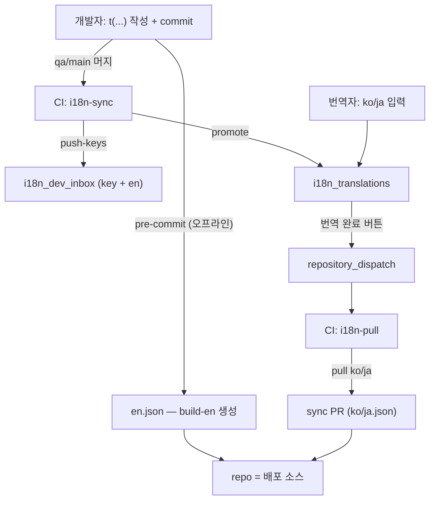

문구 한 줄 바꾸는 데 온 팀이 움직였습니다. 개발자가 JSON 세 개를 손보고, TSV에도 반영하고, 시트에 올립니다. 번역자가 ko/ja를 채우고, 다시 내려받아 빌드합니다. 그 와중에 번역이 어긋나고, 영어가 ko/ja 자리로 흘러들어갔습니다.

한동안은 "원래 번거로운 일"이라고 생각했습니다. 그런데 계속 곱씹다 보니 문제가 손이 많이 가는 게 아니었습니다. **한 값에 주인이 둘**이라는 것이었습니다. `en`은 코드도 쓰고 시트에서도 편집됐고, 그래서 merge할 때마다 누가 이기는지가 운에 달려 있었습니다.

이 글은 그 플로우를 `컬럼 단위 소유권` 원칙 하나로 다시 설계한 기록입니다. 화려한 기술은 없습니다. 누가 무엇의 주인인지를 한 번 분명히 긋고, 나머지를 기계에 넘긴 이야기입니다. (next-intl · en/ko/ja 3개 로케일)

---

## 1. 무엇이 문제였나 — 손이 많이 갔고, 영어가 새어 나왔다

i18n 자체는 이미 붙어 있었습니다. next-intl로 `t()`를 부르면 화면에 다국어가 나오긴 했습니다. 그런데 딱 거기까지였습니다.

문구 하나를 넣으려면 개발자가 `messages/en.json`·`ko.json`·`ja.json`에 키를 **직접** 써넣고, 같은 걸 `translations.tsv`에도 반영하고, TSV를 구글 스프레드시트로 push해야 했습니다. 그러면 번역자가 시트에서 ko/ja를 채우고, 다시 TSV로 내려받아 `en/ko/ja.json`으로 build했습니다. **문구 한 줄에 여러 파일을 오가야 했고**, 그 와중에 번역이 어긋나거나 키가 안 맞는 일도 잦았습니다.

본격적으로 고치기 전에, 그릇이 어떤 상태였는지 한 장으로 정리하면 이렇습니다.

| 영역 | 처음 상태 |
| --- | --- |
| 신규 문구 반영 | `t()`로 감싸도 자동 반영 X — 개발자가 `en/ko/ja.json` · `translations.tsv`를 **직접** 수동 편집 |
| 소유권 경계 | `en`을 **코드도 쓰고 시트에서도 편집** — 주인이 둘 |
| 영어 역류 | merge/pull에서 영어가 ko/ja로 흘러들어감 → 되돌리는 **응급 스크립트까지** 존재 |
| 개발자 공수 | 문구 하나에 여러 파일 — 과함 |

표의 마지막 두 줄이 진짜 문제입니다. 불편한 건 참으면 그만이지만, **`en`의 주인이 둘**이라는 건 성격이 다른 결함이었습니다. `en`은 개발자(코드)도 쓰고 시트에서도 편집됐고, `ko/ja`는 번역자가 쓰는데 merge/pull 과정에서 영어가 슬그머니 흘러들어갔습니다. 실제로 레포에는 "draft merge 후 ko/ja가 영어로 회귀한 걸 되돌리는" **응급 스크립트**까지 있었습니다.

그러니 문제의 뿌리는 "손이 많이 간다"가 아니라 **"한 값에 주인이 둘"** 이라는 데 있었습니다. 그럼 주인을 어떻게 하나로 정할 수 있을까요? 여기서부터가 본론입니다.

---

## 2. 실마리 — 충돌은 '락'이 아니라 '소유권'으로 푼다

충돌을 없애는 방법은 보통 락이나 머지 전략을 떠올리게 됩니다. 하지만 그건 충돌이 *난 뒤에* 수습하는 방식입니다. 저는 한 발 앞에서, **한 셀에 주인을 하나만** 두어 충돌이 애초에 생기지 않게 하고 싶었습니다.

| 컬럼 | 주인 | 흐름 |
| --- | --- | --- |
| **key + en** | **코드** (leaf = 영어 원문 = Figma 카피) | 코드 → 시트 (단방향) |
| **ko / ja** | **번역자** (시트) | 시트 → 코드 (단방향) |

이 표 한 장이 설계의 씨앗입니다. 세 가지가 따라 나옵니다.

- `en.json`은 코드에서 **자동으로** 생성됩니다. 사람이 손대지 않습니다.
- `ko.json`·`ja.json`은 **진짜 번역된 키만** 담습니다. 미번역 키는 런타임에 영어로 폴백되므로 화면이 깨지지 않습니다.
- `pull`은 **ko/ja만** 가져옵니다. `en`은 시트에서 역류하지 않으므로, 영어가 ko/ja로 흘러드는 사고가 **구조적으로 불가능**해집니다. 앞서 본 응급 스크립트가 통째로 필요 없어지는 지점입니다.

이 모든 것을 가능하게 한 키 컨벤션은 **leaf 세그먼트를 곧 영어 원문으로** 두는 것입니다 (`eval.dashboard.evaluation run metric` → en = `evaluation run metric`). leaf가 영어이니 `en.json`은 사람이 관리할 게 아니라 코드에서 생성하면 되고, 영어를 뺀 나머지 언어만 번역자가 시트에서 관리하면 됩니다.

원칙은 정했습니다. 이제 이 씨앗이 실제 파이프라인으로 어떻게 자라는지 — 큰 그림부터 보겠습니다.

---

## 3. 큰 그림 — 세 주인, 그리고 그 사이를 잇는 CI

이 플로우에 등장하는 주체는 셋뿐입니다. **개발자, 번역자, 그리고 그 사이를 잇는 CI.** 각자 자기 컬럼만 만지고, 나머지는 기계가 나릅니다. 뒤에 나올 내용이 복잡해 보여도, 결국 이 표 한 장으로 묶입니다.

| 주체 | 무엇의 주인인가 | 하는 일 |
| --- | --- | --- |
| **개발자** | `key` • `en` (코드) | `t("...")` 쓰고 커밋 |
| **번역자** | `ko` · `ja` (시트) | 시트 채우고 "번역 완료" 버튼 |
| **CI · 스크립트** | 그 사이 전부 | 키 추출 · 시트 동기화 · PR 생성 |

파이프라인 전체를 그림으로 보면 이렇습니다.



여기서 한 가지 원칙이 중요합니다. **커밋과 시트 push는 다릅니다.** 커밋은 로컬 `en.json`만 갱신하고(오프라인), 시트로의 push·promote는 qa·main 머지 때 CI가, pull은 "번역 완료" 버튼이나 수동으로 돌립니다. 빌드·배포는 항상 **커밋된 JSON만** 사용합니다. 라이브 fetch가 없으니 빌드가 언제나 결정적입니다.

그리고 시트는 **탭 두 개로** 나눴습니다. 번역자의 작업 공간과, 기계가 쏟아내는 신규 키를 섞지 않기 위해서입니다.

- **`i18n_dev_inbox`** — 기계 전용입니다. `push-keys`가 코드의 키 + en을 upsert합니다. 번역자는 이 탭을 보지 않습니다.
- **`i18n_translations`** — 번역자의 작업 공간이자 ko/ja 정본입니다. `promote`가 신규 키만 여기로 append하고, `pull`은 여기서 ko/ja만 읽습니다.

헤더 1행은 `key` + 로케일 컬럼(`en` `ko` `ja`, 순서 무관)이고, 탭 이름은 환경변수 `GOOGLE_SHEETS_DEV_TAB` / `GOOGLE_SHEETS_TRANSLATIONS_TAB`로 지정합니다.

그럼 세 주인이 각자 무엇을 하는지, 하나씩 보겠습니다. 먼저 개발자입니다.

---

## 4. 개발자 — `t()` 쓰고 커밋, 끝

`t("...")` 작성 → 저장 → 커밋. 끝입니다. `pnpm dev` 중이라면 저장할 때마다 `en.json`이 자동으로 갱신되므로(dev watcher), `build-en`을 손으로 돌릴 필요도 없습니다.

**첫째, 화면 문구는 반드시 next-intl `t()`로 감쌉니다.**

```typescript
const t = useTranslations("LlmEval.Dashboard.Chart");
<button>{t("Edit chart")}</button>   // key: LlmEval.Dashboard.Chart.Edit chart
```

**둘째, `en.json`은 저장할 때 자동으로 채워집니다.** `pnpm dev`가 dev 전용 watcher(`instrumentation.ts` → `build-en --watch`)를 함께 띄워, `t("New copy")`를 저장하면 `en.json`에 바로 들어갑니다. 혹은 `pnpm i18n:build-en`을 수동으로 실행할 수도 있고, 커밋 시 pre-commit이 한 번 더 보정해 줍니다.

**셋째, 리치 텍스트(`t.rich`)나 leaf가 영어가 아닌 시맨틱 키**는 호출 바로 위에 영어 원문을 `// i18n-en:` 주석으로 답니다(일반 키는 leaf가 곧 영어라 주석이 필요 없습니다). 아래 예시에서 `AddToWorkspaceRoleInfoBanner`는 영어가 아닌 짧은 시맨틱 ID이고, 영어 원문은 그 위 주석에 있습니다.

```typescript
// key "AddToWorkspaceRoleInfoBanner" 는 영어가 아닌 짧은 시맨틱 ID(t.rich)
// → 영어 원문은 아래 // i18n-en: 주석으로 준다 (build-en 이 이 주석을 en 값으로 사용)
// i18n-en: Users added <emphasized>for the first time are WS Admin.</emphasized>
{t.rich("AddToWorkspaceRoleInfoBanner", { emphasized: c => <b>{c}</b> })}
```

`en`·`ko`·`ja.json`과 TSV 수동 편집, 시트 접근, 키를 시트에 올리는 작업 — 이 전부는 CI에 연동해 두어서 **개발자가 하지 않아도 됩니다.** 다음은 번역자입니다.

---

## 5. 번역자 — ko/ja 채우고 버튼, 끝

번역자 쪽은 더 단순합니다. 스프레드시트 탭에서 ko/ja를 채우고 "번역 완료" 버튼을 누르면 끝입니다.

1. **`i18n_translations` 탭**에서만 작업합니다.
2. `en` 컬럼을 참고해 **`ko` / `ja` 컬럼만** 채웁니다. `key`와 `en`은 건드리지 않습니다.
3. 비워 두면 화면에는 영어로 나옵니다. 채운 것만 번역으로 반영됩니다.
4. 작업이 끝나면 시트 상단의 **🌐 i18n → 번역 완료, PR 생성** 버튼(또는 메뉴)을 누릅니다. 잠시 뒤 GitHub에 sync PR이 올라옵니다.

리치 텍스트 키는 `<emphasized>…</emphasized>`, `<br></br>` 같은 **태그 이름을 그대로 유지**하고, 그 안의 단어와 어순만 번역합니다. 다음은 이 모든 세팅을 준비하는 관리자입니다.

---

## 6. 관리자(나) — 세팅과 검수

1. **초기 1회:** 시트에 `i18n_dev_inbox` / `i18n_translations` 탭을 만들고, repo의 현재 번역으로 시드하고, env를 설정합니다.
2. **GitHub 설정 1회:** Settings → Actions에서 "Allow GitHub Actions to create and approve pull requests"를 켜고 write 권한을 부여합니다(sync PR용). Secrets에 `GOOGLE_SHEETS_SPREADSHEET_ID`, `GOOGLE_APPLICATION_CREDENTIALS`를 등록합니다.
3. **상시:** "번역 완료" 버튼이 올린 **sync PR을 검수한 뒤 머지**합니다. 급하면 GitHub Actions에서 `i18n pull` 워크플로를 수동으로 실행합니다.
4. Figma의 영어 원문을 `t()`로 코드에 넣는 주체이기도 합니다.

여기까지가 "누가 무엇을 하는가"입니다. 이제 그 사이를 잇는 기계 — 스크립트와 CI를 들여다볼 차례입니다.

---

## 7. 엔진 ① — 코드가 키를 나른다 (스크립트)

세 주인의 역할이 이렇게까지 가벼워진 건, 사람이 하던 일을 스크립트가 대신 가져갔기 때문입니다. 모든 명령은 `pnpm i18n:*` / `pnpm messages:*`이고, 시트에 쓰는 명령은 해당 탭 env가 없으면 **skip**됩니다(기본 시트 오염 방지).

### `scripts/i18n/lib/extract-keys.mjs` — 키 추출

`src/**`의 `t()` / `t.rich()` 호출을 긁어 `{ key, en }` 목록을 만듭니다. 정확도가 핵심이라 단순 위치 기반이 아닙니다.

- **변수 바인딩 기반 네임스페이스**: `const t = useTranslations("A")` / `const tForgot = useTranslations("B")`를 추적해, 각 호출이 쓴 변수의 네임스페이스를 정확히 매칭합니다(한 파일에 네임스페이스가 여러 개여도 정확합니다 — 파일의 30%가 그렇습니다).
- **`t.rich` 포함**, **`// i18n-en:` 주석** 파싱(시맨틱 키의 영어 원문).
- **따옴표·이스케이프 처리**: `t("Don't…")`, `t("… \"x\" …")` 같은 문자열도 잘리지 않게 정규식으로 정확히 캡처합니다.

3단계로 동작합니다 — 바인딩 수집 → 리터럴 호출 수집 → 각 호출을 "직전 바인딩"의 네임스페이스로 매칭.

```javascript
// ── 3종 정규식으로 스캔 (읽기용 단순화; 실제는 따옴표·이스케이프까지 처리) ──
// ① 바인딩:  const t = useTranslations("NS")  → { 변수명, 네임스페이스 }
// ② 리터럴:  t("Edit chart") / t.rich("…")     (obj.t(…) 은 제외)
// ③ 동적:    t(변수)  → 그 네임스페이스를 "동적"으로 표시(prune 이 통째 보호)

// 파일마다: bindings[] 수집 → calls[]·annotations[] 수집 → 아래처럼 매칭
for (const call of calls) {
  // 이 호출의 네임스페이스 = "같은 변수의 직전(위치) 바인딩"
  // (한 파일에 const t=…, const tErr=… 여러 개여도 정확)
  let binding = null;
  for (const b of bindings) {
    if (b.name === call.name && b.pos < call.pos) {
      if (binding == null || b.pos > binding.pos) binding = b;
    }
  }
  const key = binding.ns === "" ? call.arg : `${binding.ns}.${call.arg}`;
  // en: 호출 바로 윗줄 `// i18n-en:` 주석이 있으면 그 값, 없으면 leaf(=영어 원문)
  const en = annotated ? annotation.text : leafOf(key);
  entries.push({ key, en, annotated }); // → build-en 이 이 목록으로 en.json 생성
}
```

### `scripts/i18n/build-en.mjs` — 코드 → en.json

```javascript
pnpm i18n:build-en           # en.json 갱신
pnpm i18n:build-en --check   # 누락만 검사(쓰기 X) — CI 게이트
pnpm i18n:build-en --watch   # 파일 저장 감지 → 자동 갱신 (dev watcher 가 이걸 띄움)
pnpm i18n:build-en --prune   # ⚠️ raw prune: orphan 전부 삭제 → 동적 키까지 날림. 직접 쓰지 말 것(안전판은 아래 i18n:prune)
```

동작 원칙은 다음과 같습니다.

- 신규 키는 leaf(또는 주석)로 시드합니다.
- **기존 값은 보존**합니다. `Loading` → `Loading...`처럼 다듬어진 값은 덮지 않습니다.
- 주석이 있으면 그 값이 우선입니다.
- **write-if-changed**: 내용이 같으면 파일을 쓰지 않아, watcher가 dev 서버를 불필요하게 리로드하지 않습니다.
- orphan(코드에 없는 키)은 **기본적으로 보존**합니다(9장 참고).

```javascript
// src/ 전체를 돌면서 파일마다 extractEntriesFromText를 호출하고, 결과를 key 기준으로 합쳐 dedupe한 뒤 정렬해서 반환하는 함수
export async function extractTranslationEntriesFromSrc() {
  const files = await collectSourceFiles(SRC);
  /** @type {Map<string, { key: string; en: string; annotated: boolean }>} */
  const byKey = new Map();
  for (const file of files) {
    const text = await readFile(file, "utf-8");
    for (const entry of extractEntriesFromText(text)) {
      const existing = byKey.get(entry.key);
      if (existing == null) {
        byKey.set(entry.key, entry);
        continue;
      }
      if (!existing.annotated && entry.annotated) {
        byKey.set(entry.key, entry);
      }
    }
  }
  return Array.from(byKey.values()).sort((a, b) => a.key.localeCompare(b.key));
}

export function flattenMessages(obj, prefix = "") {
  /** @type {Record<string, string>} */
  const out = {};
  for (const [segment, value] of Object.entries(obj)) {
    const key = prefix === "" ? segment : `${prefix}.${segment}`;
    if (typeof value === "object" && value !== null && !Array.isArray(value)) {
      Object.assign(out, flattenMessages(value, key));
      continue;
    }
    out[key] = value == null ? "" : String(value);
  }
  return out;
}
/*
{
  "LlmEval": {
    "CriteriaBenchmark": {
      "VersionHistory": {
        "Edit Description": "Edit Description",
        "Restore": "Restore"
      }
    }
  }
->
{
  "LlmEval.CriteriaBenchmark.VersionHistory.Edit Description": "Edit Description",
  "LlmEval.CriteriaBenchmark.VersionHistory.Restore": "Restore",
}
*/

async function collectSourceFiles(dir, out = []) {
  const entries = await readdir(dir, { withFileTypes: true });
  for (const e of entries) {
    const full = path.join(dir, e.name);
    if (e.isDirectory()) {
      if (SKIP_DIR.has(e.name)) {
        continue;
      }
      await collectSourceFiles(full, out);
    } else if (
      e.isFile() &&
      /\.(tsx|ts)$/.test(e.name) &&
      !/\.test\.(tsx|ts)$/.test(e.name)
    ) {
      out.push(full);
    }
  }
  return out;
}
```

아래 `buildOnce`가 그 핵심입니다 — 기존 값 보존 + 신규 시드 + 내용이 바뀔 때만 쓰기.

```javascript
async function buildOnce({ prune }) {
  const entries   = await extractTranslationEntriesFromSrc(); // 코드의 {key,en,annotated}
  const codeByKey = new Map(entries.map(e => [e.key, e]));
  const existing  = await readEnFlat();                       // 기존 en.json(평탄화)

  const result = [];
  // 1) 기존 키: 순서·값 보존. annotated 면 주석 값 우선. prune 이면 orphan 은 버림
  for (const [key, value] of Object.entries(existing)) {
    const code = codeByKey.get(key);
    if (code == null) { if (!prune) result.push({ key, en: value }); continue; }
    result.push({ key, en: code.annotated ? code.en : value });
  }
  // 2) 신규 키: leaf(또는 주석)로 시드
  for (const e of entries) if (!(e.key in existing)) result.push({ key: e.key, en: e.en });

  // 3) 내용이 바뀔 때만 쓴다 (write-if-changed → dev 불필요 리로드 방지)
  const next = stringifyMessages(rowsToNestedObjects(result, ["en"]).en);
  if (next !== await readFile(EN_PATH, "utf-8").catch(() => "")) {
    await writeFile(EN_PATH, next, "utf-8");
  }
}

// --watch: src/ 변경 감지 → 300ms 디바운스 후 buildOnce 재실행 (dev watcher 가 띄움)
watch(srcDir, { recursive: true }, (_event, filename) => {
  if (!/\.(tsx|ts)$/.test(String(filename))) return;
  clearTimeout(timer);
  timer = setTimeout(() => buildOnce({ prune }), 300);
});

/*
input: const t = useTranslations("LlmEval.Criteria");
// i18n-en: Cancel
<button>{t("Cancel")}</button>
{t("Save")}

output: Promise<{ key: string; en: string; annotated: boolean }[]>
*/
```

### `scripts/i18n/prune-unused-keys.mjs` — dev junk만 안전 제거 (`i18n:prune`)

`build-en --prune`(전부 삭제)와 달리 **안 쓰는 키만** 골라냅니다. pre-commit에서 자동으로 실행되며, 삭제하려면 아래 4조건을 **모두** 만족해야 합니다.

- 현재 `en.json`에 있고 **AND** 코드에 리터럴 `t()`로 안 쓰고
- **base(`origin/qa`, `I18N_PRUNE_BASE`로 변경)의 en.json에 없고**(=이번 브랜치가 새로 넣은 것) **AND**
- **동적 네임스페이스가 아님** — `t(변수)` 호출이 있는 네임스페이스(예: `VersionHistory`) 하위는 통째로 보호합니다.

`--dry-run`으로 제거 후보만 미리 볼 수 있고, base를 못 읽으면 skip합니다(커밋을 막지 않습니다). base(origin/qa)는 원격을 찌르는 게 아니라 git 로컬 ref에서 그냥 읽으므로 네트워크를 타지 않습니다.

```javascript
// base(origin/qa) 의 en.json 키 — git 로컬 ref 에서 읽음
function baseEnKeys() {
  try {
    const raw = execFileSync("git", ["show", `${BASE_REF}:messages/en.json`]);
    return new Set(Object.keys(flattenMessages(JSON.parse(raw))));
  } catch { return null; } // ref 없으면 null → prune 자체 skip(커밋 안 막음)
}

const currentFlat = flattenMessages(JSON.parse(await readFile(EN_PATH)));
const codeKeys    = new Set(await extractTranslationKeysFromSrc());    // 코드 리터럴 t("…")
const baseKeys    = baseEnKeys();                                      // origin/qa
const dynamicNs   = [...(await extractDynamicNamespacesFromSrc())];    // t(변수) 있는 방
const isDynamic   = key => dynamicNs.some(ns => key === ns || key.startsWith(`${ns}.`));

// 제거 대상 = 4조건 전부: en.json에 있음 ∧ 코드에 없음 ∧ base에 없음 ∧ 동적 방 아님
const targets = Object.keys(currentFlat).filter(
  key => !codeKeys.has(key) && !baseKeys.has(key) && !isDynamic(key),
);
// dry-run 이면 targets 목록만 출력, 아니면 targets 를 뺀 나머지로 en.json 재작성
```

### `scripts/i18n/push-keys-to-sheet.mjs` — 코드 → Dev Inbox

신규 키를 `(key, en)`으로 `i18n_dev_inbox`에 append합니다. en 컬럼에 원문을 시드하고 ko/ja는 빈칸으로 둡니다. **add-only**라 기존 행은 건드리지 않고, `GOOGLE_SHEETS_DEV_TAB`이 없으면 skip합니다. 값은 `RAW`로 써서 `+ Add Data` 같은 게 수식으로 오인되지 않게 합니다.

```javascript
const entries  = await extractTranslationEntriesFromSrc();          // 코드의 {key, en}
const existing = new Set(dataRows.map(r => String(r[0]).trim()));   // 시트의 기존 key
const toAdd    = entries.filter(e => !existing.has(e.key));         // 새 키만

const rows = toAdd.map(e => {
  const row = new Array(header.length).fill(""); // 헤더 폭에 맞춘 빈 행
  row[0] = e.key;                                // key 컬럼
  if (enIndex > 0) row[enIndex] = e.en;          // en 컬럼만 시드 (ko/ja 는 빈칸)
  return row;
});

await sheets.spreadsheets.values.append({
  spreadsheetId, range,
  valueInputOption: "RAW",           // "+ Add Data" 같은 선행 +,=,- 가 수식으로 안 읽히게
  insertDataOption: "INSERT_ROWS",
  requestBody: { values: rows },
});
```

### `scripts/i18n/promote-keys-to-translations.mjs` — Dev Inbox → Translations

Dev Inbox에 있고 Translations에 없는 키만 `i18n_translations`로 append합니다(헤더명 기준 매핑). 번역자에게는 "할 일"만 깔끔히 노출됩니다. 두 탭의 컬럼 순서가 다를 수 있어서, 위치가 아니라 헤더 이름으로 맞춰 재배열합니다.

```javascript
const translationKeys = new Set(trans.dataRows.map(r => String(r[0]).trim()));

// Dev Inbox 행 → 헤더명 기준 레코드 → Translations 에 없는 key 만
const newRecords = dev.dataRows
  .map(r => headerAndCellsToRecord(dev.header, padRowCells(r, dev.header.length)))
  .filter(rec => rec.key !== "" && !translationKeys.has(rec.key));

// 각 레코드를 Translations "헤더 순서"에 맞춰 정렬 (두 탭 컬럼 순서 달라도 OK)
const rows = newRecords.map(rec =>
  trans.header.map((col, i) => (i === 0 ? rec.key : rec[normalizeHeaderCell(col)] ?? "")),
);
await sheets.spreadsheets.values.append({
  spreadsheetId, range: transRange, valueInputOption: "RAW",
  insertDataOption: "INSERT_ROWS", requestBody: { values: rows },
});
```

### `scripts/i18n/pull-sheet-to-messages.mjs` — Translations → ko/ja.json

`i18n_translations`의 **ko/ja만**(빈 셀 제외) 읽어 `ko.json`·`ja.json`을 생성하고, `translations.tsv`는 en(코드) + ko/ja(시트) 합본 스냅샷으로 재생성합니다. `en`은 코드가 주인이라 여기선 절대 쓰지 않습니다. 빈 칸은 런타임에 영어로 폴백되니 굳이 넣지 않습니다.

```javascript
// ko/ja.json — 비어있지 않은 셀만 (미번역 키는 생략 → 런타임에 en 폴백)
for (const locale of translatedLocales) {            // ["ko", "ja"] (en 제외)
  const rows = records
    .filter(r => String(r[locale] ?? "").trim() !== "")
    .map(r => ({ key: r.key, [locale]: r[locale] }));
  const nested = rowsToNestedObjects(rows, [locale])[locale];
  await writeFile(`messages/${locale}.json`, stringifyMessages(nested));
}
// en.json 은 절대 안 씀(코드 소유). tsv 는 en(코드)+ko/ja(시트) 스냅샷으로 재생성.
```

### `src/i18n/request.ts` — 런타임 en 폴백

```typescript
// 비-기본 로케일이면 en 위에 locale 을 deep-merge → 미번역 키는 영어로 표시
messages: mergeWithFallback(baseMessages /* en */, localeMessages /* ko|ja */)
```

미번역 ko/ja 키에서 raw key가 노출되거나 화면이 비는 것을 막아 줍니다.

### 보조 lib

- `lib/google-sheets-auth.mjs` — 시트 인증 + `getTabRange(env)`(탭 env 없으면 null → skip).
- `lib/translation-tabular.mjs` — 헤더·행 파싱(헤더명 기준, 컬럼 순서 무관).
- `lib/tsv-from-records.mjs` — TSV 직렬화 + 중복 key dedupe.
- `lib/messages-json.mjs` — flatten / nested 변환.
- `lib/load-env.mjs` — `.env.local` 로드(기존 env는 덮지 않음).

### `scripts/i18n/audit-dynamic-namespaces.mjs` — 혼재 동적 네임스페이스 감시 (`i18n:audit-dynamic-ns`)

`t(변수)`가 있는 네임스페이스를 전부 나열하고, 정적 라벨이 섞인 방(⚠️ MIXED)과 dispatch 호출 위치(file:line)를 보여줍니다. 혼재된 방은 dispatch를 전용 하위 네임스페이스로 분리하라는 신호입니다(9장 · `next-intl.mdc`). 상시 위생 점검용이라 CI를 막지 않습니다(advisory).

### `src/instrumentation.ts` + `src/instrumentation-i18n-watch.ts` — dev 저장 자동 반영

`pnpm dev`로 서버가 뜰 때 Next의 `register()` 훅이 **dev + Node 런타임일 때만** watcher 모듈을 동적 import합니다. node 전용 코드(`node:child_process`)를 **별도 모듈로 분리**한 이유는, `instrumentation.ts`가 Edge 런타임용으로도 번들되는데 node API를 직접 두면 Edge 빌드가 깨지기 때문입니다(Sentry가 `sentry.server.config`를 동적 import하는 패턴과 동일합니다).

```typescript
// instrumentation.ts — dev+node 에서만 watcher 를 동적 import (Edge 안전)
export async function register() {
  if (process.env.NEXT_RUNTIME === "nodejs") {
    await import("../sentry.server.config");
    if (process.env.NODE_ENV === "development") {
      await import("./instrumentation-i18n-watch");
    }
  }
  if (process.env.NEXT_RUNTIME === "edge") await import("../sentry.edge.config");
}
```

```typescript
// instrumentation-i18n-watch.ts — build-en --watch 를 dev 서버의 자식으로 실행
import { spawn } from "node:child_process";
const g = globalThis as typeof globalThis & { __i18nBuildEnWatcher?: boolean };
if (!g.__i18nBuildEnWatcher) {            // 중복 spawn 방지 (HMR 재실행 대비)
  g.__i18nBuildEnWatcher = true;
  const child = spawn(process.execPath, ["scripts/i18n/build-en.mjs", "--watch"], {
    stdio: "inherit", cwd: process.cwd(),
  });
  const stop = () => child.kill();        // dev 서버 죽으면 같이 종료
  process.once("exit", stop);
  process.once("SIGINT", () => { stop(); process.exit(0); });
  process.once("SIGTERM", () => { stop(); process.exit(0); });
}
```

정리하면 `t("New copy")` 저장 → watcher가 `en.json` 갱신 → dev 서버 hot-reload로 이어지고, prod·edge에서는 no-op입니다. 스크립트가 이렇게 손을 대신하니, 남은 건 이 스크립트들을 알맞은 시점에 자동으로 굴리는 일입니다.

---

## 8. 엔진 ② — 전 과정을 자동화한다 (CI + 버튼)

사람이 기억해서 돌려야 하는 명령이 하나라도 남으면, 언젠가 빠뜨립니다. 그래서 각 시점마다 무엇이 도는지를 못 박아 두었습니다.

| 시점 | 동작 | 네트워크 |
| --- | --- | --- |
| 저장 (dev) | watcher `build-en --watch` → en.json (자동) | ❌ 오프라인 |
| 커밋 | pre-commit `build-en` → `prune`(dev junk 제거) → en.json | ❌ 오프라인 |
| qa / main 머지 | `i18n-sync.yml`: push-keys → promote | ✅ secret은 CI |
| 번역 완료 버튼 | `i18n-pull.yml`: pull → sync PR | ✅ |
| PR(CI) | `ci.yml`: `build-en --check` 게이트 | ❌ |
| 빌드/배포 | 커밋된 JSON 사용 | ❌ |

### 워크플로

- **`.github/workflows/i18n-sync.yml`** — `main`/`qa`로의 `push`(paths: src, en.json, scripts/i18n)에서 `push-keys` + `promote`를 돌립니다. 탭 이름은 `vars.* || 'i18n_dev_inbox'`가 기본값입니다.
- **`.github/workflows/i18n-pull.yml`** — `repository_dispatch: i18n-translations-ready` + `workflow_dispatch`에서 `pull` 후 `peter-evans/create-pull-request`로 PR을 냅니다. 브랜치 `i18n/sync-translations`를 재사용하므로 버튼을 중복 클릭해도 같은 PR이 갱신됩니다.
- **`ci.yml`** — 기존 라이브 pull을 없애고 `i18n:build-en --check`로 교체했습니다(커밋된 `en.json`이 코드와 맞는지 검증).

### "번역 완료" 버튼 (Apps Script)

시트의 도형·메뉴에 `notifyTranslationsReady()`를 연결해 GitHub `repository_dispatch`를 호출합니다. 토큰(fine-grained PAT, contents:write)은 Script Properties `GH_TOKEN`에 보관하며, 설정은 레포의 `docs/i18n-translation-button.md`를 참고합니다.

> **[IMG-01]** fine-grained PAT에 Contents read/write 권한을 부여하는 화면
> - 유형: 스크린샷 / 담당: **내가 캡처**
> - 의도: 어떤 권한까지만 주면 되는지 (최소 권한)
> - 대체텍스트: GitHub fine-grained PAT 권한 설정 화면, Contents가 read/write로 지정됨

> **[IMG-02]** Apps Script에 `notifyTranslationsReady()`를 작성한 화면
> - 유형: 스크린샷 / 담당: **내가 캡처**
> - 의도: 번역자가 누르는 버튼이 실제로 무엇을 호출하는지
> - 대체텍스트: Google Apps Script 편집기에 notifyTranslationsReady 함수가 작성된 화면

### Slack 알림

sync PR이 열리면 Slack 채널로 알림을 받습니다. **GitHub Slack 앱**이면 코드가 필요 없습니다. 알림 받을 채널에서 다음만 실행하면 됩니다.

```bash
/invite @GitHub                          # 봇 초대 (1회)
/github signin                           # GitHub 계정 연결 (1회)
/github subscribe <org>/<repo> pulls +label:"i18n"
```

`+label:"i18n"` 필터 덕에 **번역 sync PR만** 옵니다(create-pull-request가 PR에 `i18n` 라벨을 붙입니다).

### 시트 헬퍼 (Apps Script) — 미번역/PascalCase 강조

번역자가 시트에서 바로 확인하도록, "번역 완료" 버튼과 같은 Apps Script 프로젝트에 헬퍼 메뉴를 달아 두었습니다. **헤더명(`key`/`ko`/`ja`) 기준**이라 컬럼 순서와 무관하고, 현재 보는 탭에 적용됩니다.

- **미번역(빈칸) 강조** → 빈 `ko`/`ja` 셀을 노란색으로 (무엇을 번역해야 하는지 한눈에)
- **PascalCase 키 강조** → leaf가 영어가 아닌 키(PascalCase/camel/SCREAMING)를 빨간색으로 (코드 쪽 `pnpm i18n:audit-keys`의 시트 버전)
- **강조 지우기**

```javascript
function onOpen() {
  SpreadsheetApp.getUi().createMenu("🌐 i18n")
    .addItem("번역 완료 → PR 생성", "notifyTranslationsReady")
    .addSeparator()
    .addItem("미번역(빈칸) 강조", "highlightUntranslated")
    .addItem("PascalCase 키 강조", "highlightPascalKeys")
    .addItem("강조 지우기", "clearI18nHighlights")
    .addToUi();
}

function i18nColumns_(sheet) {
  const header = sheet.getRange(1, 1, 1, sheet.getLastColumn()).getValues()[0];
  const idx = name => header.findIndex(h => String(h).trim().toLowerCase() === name) + 1;
  return { key: idx("key"), en: idx("en"), ko: idx("ko"), ja: idx("ja") };
}

function highlightUntranslated() {
  const sheet = SpreadsheetApp.getActiveSheet();
  const cols = i18nColumns_(sheet);
  const lastRow = sheet.getLastRow();
  if (lastRow < 2) return;
  for (const col of [cols.ko, cols.ja]) {
    if (col < 1) continue;
    const range = sheet.getRange(2, col, lastRow - 1, 1);
    const bg = range.getValues().map(([v]) => [String(v ?? "").trim() === "" ? "#fff3cd" : null]);
    range.setBackgrounds(bg);
  }
}

function looksLikeNonEnglishLeaf_(key) {
  const s = String(key);
  const leaf = s.includes(".") ? s.split(".").pop() : s;
  if (leaf.indexOf(" ") !== -1) return false;
  return /[a-z][A-Z]/.test(leaf) || leaf.indexOf("_") !== -1 || /^[A-Z][A-Z0-9]{3,}$/.test(leaf);
}

function highlightPascalKeys() {
  const sheet = SpreadsheetApp.getActiveSheet();
  const cols = i18nColumns_(sheet);
  const lastRow = sheet.getLastRow();
  if (lastRow < 2 || cols.key < 1) return;
  const range = sheet.getRange(2, cols.key, lastRow - 1, 1);
  const bg = range.getValues().map(([v]) => [looksLikeNonEnglishLeaf_(v) ? "#f8d7da" : null]);
  range.setBackgrounds(bg);
}

function clearI18nHighlights() {
  const sheet = SpreadsheetApp.getActiveSheet();
  const lastRow = sheet.getLastRow();
  if (lastRow < 2) return;
  sheet.getRange(2, 1, lastRow - 1, sheet.getLastColumn()).setBackground(null);
}
```

### CI 감사 (코드 쪽)

`pnpm i18n:audit-keys`는 `src/`의 리터럴 `t()` 호출 중 leaf가 영어가 아닌 것(+ `// i18n-en:`이 없는 것)을 file:line으로 보고합니다. CI advisory 잡에서 **non-blocking**으로 돌아 신규 위반을 PR에서 노출시킵니다(빌드는 막지 않습니다).

### 인증 — 서비스 계정은 GCP Secret Manager에

서비스 계정 JSON은 repo에 커밋하지 않고 GCP Secret Manager에 둡니다.

```bash
# 로컬: gcloud 로 받아 .env.local
gcloud auth login && gcloud config set project <gcp-project>
pnpm i18n:fetch-service-account -- --env
```

```javascript
GOOGLE_SHEETS_SPREADSHEET_ID=...
GOOGLE_SERVICE_ACCOUNT_JSON_B64=...
GOOGLE_SHEETS_DEV_TAB=i18n_dev_inbox
GOOGLE_SHEETS_TRANSLATIONS_TAB=i18n_translations
```

새 시트를 시드할 때(초기 1회)는 이렇게 합니다.

```bash
# 탭 2개 생성 후
pnpm messages:sync-tsv
GOOGLE_SHEETS_TAB_NAME=i18n_translations pnpm i18n:push-tsv   # Translations 시드
pnpm i18n:push-keys                                          # Dev Inbox 시드
```

CI는 repo secret(`GOOGLE_SHEETS_SPREADSHEET_ID`, `GOOGLE_APPLICATION_CREDENTIALS`)을 사용합니다. 여기까지가 자동화입니다. 그런데 이 설계에는, 곱게 넘어가지 않았던 복병이 하나 있었습니다.

---

## 9. 복병 — 정적 추출이 못 보는 키

코드가 더 이상 안 쓰는데 `en.json`·시트에 남은 키를 orphan이라 부릅니다. 그런데 orphan이라고 다 같은 게 아닙니다. 진짜 죽은 키도 있지만, **정적 추출이 못 볼 뿐 멀쩡히 살아 있는 키**도 orphan처럼 보입니다. 이 둘을 구분하지 못하면, 청소하려다 살아 있는 키를 지워 화면을 깨뜨립니다.

갈림길은 네임스페이스(= `useTranslations("...")`에 넘기는 접두사)의 성격입니다.

- **일반(정적) 네임스페이스** — 키가 항상 리터럴(`t("Edit chart")`)입니다. 추출기가 소스만 읽어도 쓰는 키를 100% 다 보므로, 여기의 orphan은 **진짜 죽은 키**입니다.
- **동적 네임스페이스** — `t(변수)` 호출이 하나라도 있습니다. 값은 `SourceTypeEdited` 같은 **enum 식별자**이거나, `t(LABEL_KEY[x])`처럼 **맵으로 푸는 영어 구문**(`Average score`, 페이지 헤더 제목·메트릭 라벨 등)입니다. 추출기는 `t(변수)`만 볼 뿐 어떤 키로 풀리는지 못 보므로, 이 네임스페이스의 orphan은 **살아 있을 수 있습니다**(그래서 통째로 보호합니다).

> **원시 `build-en --prune`을 함부로 쓰지 마세요.** 동적 호출의 키(예: `SELF_EVALUATION`, `SourceTypeEdited`)는 정적 추출이 못 봅니다. "추출기가 못 찾음 ≠ 죽은 키"입니다. 전부 삭제하면 살아 있는 동적 키가 날아가 화면이 깨집니다.

그래서 pre-commit에는 **dev junk만** 안전하게 발라내는 `i18n:prune`을 연결했습니다. 삭제하려면 앞서 본 4조건을 **모두** 만족해야 합니다 — ① 현재 `en.json`에 있고, ② 코드 리터럴에 없고, ③ **base(origin/qa)에 없고**(이번 브랜치가 새로 넣은 것), ④ **동적 네임스페이스가 아님**(그 방 전체 보호). 그 결과, 개발 중에 넣었다 지운 순수 junk만 사라지고 기존 키·동적 네임스페이스 키는 절대 건드리지 않습니다.

> 처음에는 "동적 방이라도 다중 단어면 제거" 같은 휴리스틱을 넣었다가, `PageHeaders` 제목·`Metrics` 라벨처럼 **맵으로 푸는 살아 있는 다중 단어 키**가 지워질 수 있어 철회했습니다. 동적 방은 shape로 구분이 불가능하니, 통째 보호가 정답이었습니다.

> **위험이 실제로 드러난 사례.** 처음엔 안전판을 ③(base diff)만 뒀는데, `--dry-run`을 돌리니 제거 후보에 `SourceTypeEdited` / `SourceTypeFileUploaded`(동적 `t(variant.messageKey)` 키)가 떴습니다. base(origin/qa)엔 아직 없던 신규 동적 키라 base diff를 통과해 버린 것입니다. 그대로 지웠으면 버전 히스토리 태그가 깨졌을 겁니다. 그래서 ④ **동적 네임스페이스 보호**를 추가해, `t(변수)`가 있는 네임스페이스는 통째로 제외하는 이중 안전판을 걸었습니다.

여기서 얻은 **권장 사항**이 하나 있습니다. 동적 dispatch는 전용 네임스페이스에 두는 것입니다. `t(변수)`를 정적 라벨과 같은 방에 두면 그 방 전체가 보호돼 죽은 정적 키가 쌓입니다. dispatch를 좁은 하위 네임스페이스(`…VersionHistory.Source`)로 분리하면 보호 범위가 그 방으로 좁혀지고 나머지는 자동 정리됩니다(커서·클로드 룰 `next-intl.mdc`에 MUST로 명시했습니다).

참고로 orphan은 UI를 깨뜨리지 않습니다(영어 폴백). `i18n:prune`이 못 지우는 건 ① 동적 네임스페이스 안의 죽은 키(안전상 보존), ② base에 이미 있던 오래된 죽은 키뿐이고, 이건 **진짜 죽은 것만 수동으로 제거**합니다(en.json 키 삭제 → tsv 재생성 → 시트 행 삭제).

---

## 10. 개선 후 달라진 모습들

- **문구가 저절로 흘러갑니다.** 개발자가 `t("...")`만 써도 저장 순간 `en.json`이 자동으로 채워집니다(dev watcher). 손으로 JSON 세 개를 만질 일이 사라졌습니다.
- **번역자는 시트만 봅니다.** `i18n_translations` 탭에서 ko/ja를 채우고 "번역 완료" 버튼을 누르면 잠시 뒤 sync PR이 올라옵니다.
- **충돌이 구조적으로 0입니다.** 한 셀의 주인이 하나뿐이라 락도 머지 전략도 필요 없습니다.
- **영어가 ko/ja로 역류하는 사고가 불가능합니다.** `pull`은 ko/ja만 가져오고 `en`은 시트에서 내려오지 않기 때문입니다. "영어 회귀를 되돌리는 응급 스크립트"는 이제 필요 없습니다.
- **화면이 깨지지 않습니다.** 미번역 키는 런타임에 영어로 폴백되고, 배포는 라이브 fetch 없이 커밋된 JSON만 써서 빌드가 결정적입니다.

## 11. 이 설계가 치른 대가

여기까지가 무엇을 만들었는지입니다. 이제 그 대가를 짚겠습니다.

**leaf = 영어 원문 컨벤션이 가장 비쌉니다.** 2절의 그 씨앗이 파이프라인 전체를 가능하게 했지만, 대가가 하나 딸려 옵니다. **키가 곧 영어 문장이라, 영어를 고치면 키가 바뀝니다.** `Save changes`를 `Save`로 줄이는 순간 그건 새 키이고, 기존 ko/ja 번역은 옛 키에 붙은 채 고아가 됩니다. 화면은 안 깨집니다(영어 폴백). 대신 조용히 영어로 돌아갑니다.

카피를 자주 다듬는 팀이라면 이건 결정적인 비용입니다. 반대로 문구가 안정적이라면 거의 안 드러납니다. **이 설계는 "영어 원문이 자주 안 바뀐다"에 베팅한 것**입니다. 그 전제가 깨지면 키를 의미 기반 ID(`btn.save`)로 바꾸고 `en.json`도 사람이 관리하는, 훨씬 평범한 구조로 돌아가야 합니다.

**동적 네임스페이스 통째 보호는 죽은 키를 영구히 남깁니다.** 9절에서 `t(변수)`가 하나라도 있는 방은 전체를 보호하기로 했는데, 그 방 안의 진짜 죽은 키는 자동으로는 절대 안 지워집니다. 안전을 택한 대신 쓰레기가 쌓이는 구조입니다. 지금은 수동 제거로 버티고 있지만, 방이 커지면 이 방식이 감당이 안 될 겁니다. 그래서 dispatch를 좁은 하위 네임스페이스로 분리하라는 규칙을 MUST로 박아뒀는데, 이건 **규칙을 지키는 사람에게 의존하는 안전판**입니다. 구조적 해결이 아닙니다.

**시트가 단일 장애점입니다.** 번역 흐름 전체가 스프레드시트 하나와 Apps Script에 걸려 있습니다. 시트 권한이 꼬이거나 Apps Script가 죽으면 번역자는 아무것도 못 합니다. 개발자 쪽은 시트 없이도 `t()`만으로 돌아가니 반쪽은 살아 있지만, 그건 설계가 좋아서가 아니라 소유권을 나눠둔 부수 효과입니다.

## 12. 그냥 번역 관리 SaaS를 쓰면 되지 않나

당연히 나올 질문이고, 대부분의 경우 맞는 말입니다. Crowdin이나 Lokalise 같은 도구는 여기서 직접 만든 것 — 키 추출, 시트 동기화, 번역 완료 알림, 미번역 폴백 — 을 전부 제품으로 제공합니다.

직접 만들어 얻은 게 있다면 이 정도입니다.

| 직접 구축 | 번역 SaaS |
| --- | --- |
| 키 컨벤션을 우리 코드에 맞게 정함 | 도구의 키 모델을 따라야 함 |
| 동적 네임스페이스 보호 같은 우리만의 규칙을 넣을 수 있음 | 도구가 지원하는 범위 안에서만 |
| 비용 0 (시트 + Actions) | 좌석·키 개수 기반 과금 |
| 파이프라인이 깨지면 내가 고쳐야 함 | 벤더가 고침 |
| 번역자가 익숙한 스프레드시트를 그대로 씀 | 번역자가 새 도구를 배워야 함 |

개인적인 의견이지만, 갈림길은 **번역자가 누구인가**라고 봅니다. 전문 번역 벤더가 붙는다면 SaaS 쪽이 압도적입니다. TM(번역 메모리), 용어집, 리뷰 워크플로 같은 걸 직접 만들 이유가 없으니까요. 반대로 사내 인원이 스프레드시트로 채우는 규모라면, 도구를 새로 배우게 하는 비용이 만드는 비용보다 클 수 있습니다.

[확인필요: 당시 번역 SaaS를 검토했다면 왜 안 골랐는지 한 문단 넣으면 이 절이 훨씬 강해집니다. 검토 안 했으면 "검토하지 않았다"고 적는 게 정직합니다]

## 13. 마치며

작업하고 나서 생각이 바뀐 게 하나 있습니다.

처음에는 이걸 i18n 문제라고 생각했습니다. 다국어를 어떻게 잘 관리하느냐. 그런데 끝내고 보니 **소유권 문제**였습니다. 락도, 머지 전략도, 응급 복구 스크립트도 전부 "두 주체가 같은 값을 쓴다"는 전제 위에서 사후 수습하는 도구입니다. 전제를 바꾸니 도구가 전부 필요 없어졌습니다.

같은 모양을 다른 데서도 봅니다. 캐시 무효화가 어려운 건 원본과 사본에 주인이 둘이기 때문이고, 머지 충돌이 잦은 건 한 파일에 여러 사람이 쓰기 때문입니다. 해결책이 늘 소유권 분리인 건 아니지만, **"이걸 어떻게 잘 합칠까" 대신 "애초에 왜 둘이 쓰지"를 한 번 물어볼 가치**는 있다고 생각합니다.

이번 경우엔 그 질문 하나가 스크립트 한 뭉치를 지웠습니다.

남은 일은 운영하며 규칙을 다듬는 것입니다. 특히 11절에서 짚은 leaf 컨벤션의 비용이 실제로 얼마나 아픈지, 카피를 몇 번 고쳐보면 알게 될 것 같습니다.

## 참고

- [next-intl 공식 문서](https://next-intl.dev/)
- [Google Apps Script — Web Apps](https://developers.google.com/apps-script/guides/web)
- [GitHub — repository_dispatch 이벤트로 워크플로 트리거](https://docs.github.com/en/actions/reference/events-that-trigger-workflows#repository_dispatch)
- [GitHub — fine-grained personal access token](https://docs.github.com/en/authentication/keeping-your-account-secure/managing-your-personal-access-tokens)
- [Mozilla L10n — 번역 키 명명 가이드](https://mozilla-l10n.github.io/documentation/localization/dev_best_practices.html)

---

## 부록 — 흔한 실패

- **`translations.tsv` 머지 충돌** → 손으로 맞추지 말고 **JSON에서 재생성**합니다. `en/ko/ja.json`이 깨끗이 머지됐다면 TSV는 결과물이므로, `messages:sync-tsv`(또는 동등 재생성) 후 `git add`면 끝입니다(실제 qa 머지 때 이렇게 해결했습니다).
- **시트에 의도치 않은 키가 잔뜩 올라감** → push-keys가 기본 시트로 가지 않도록 `GOOGLE_SHEETS_DEV_TAB`을 필수로 두고, pre-commit에서는 push-keys를 빼서(오프라인 build-en만) 막았습니다.
- **`PERMISSION_DENIED`** → 서비스 계정 `client_email`을 스프레드시트에 편집자로 공유했는지 확인합니다.
- **번역이 화면에 안 보임** → 아직 ko/ja에 없는 키입니다(정상, 영어 폴백). 번역 후 pull하면 반영됩니다.
