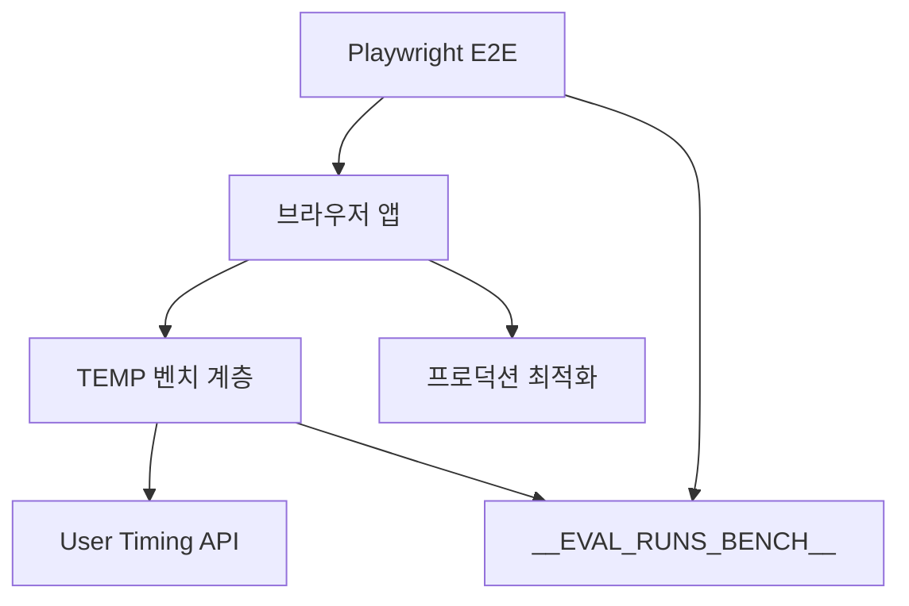
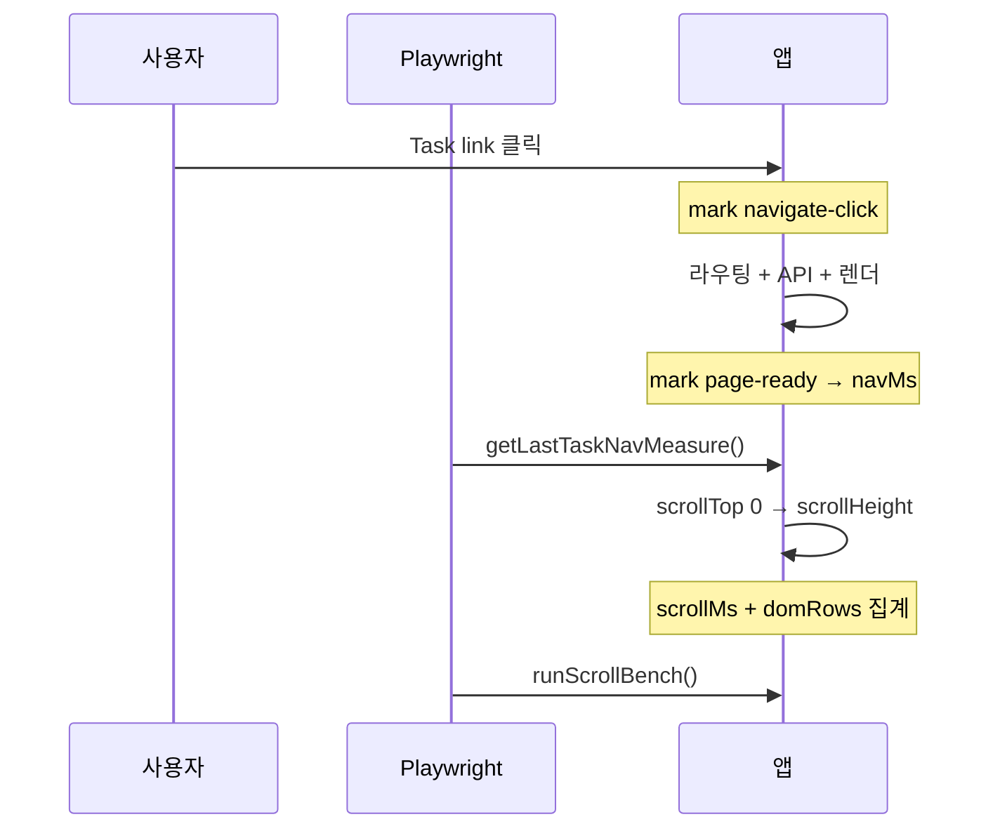

> **테이블 성능 측정 시리즈**
> - [1편 — 무엇을 알아냈고, 무엇이 틀렸나](./table-performance-optimization): 결과와 재측정, 그리고 철회
> - **2편 (이 글)** — 측정 하네스를 어떻게 만들었나

"Prefetch를 켜면 얼마나 빨라지나"를 재려면 켠 상태와 끈 상태를 비교해야 합니다. 그런데 브랜치를 두 개 파서 각각 측정하면 빌드가 달라지고, 손으로 스톱워치를 누르면 재현이 안 됩니다.

그래서 하네스를 만들었습니다. 같은 빌드에서 URL 플래그로 네 조합을 순회하고, 앱 안에서 User Timing 마크를 찍고, Playwright가 그 값을 읽어가는 구조입니다. 로그인까지 포함해 케이스당 5회씩 총 80샘플이 9.4분에 돕니다.

이 글은 그 하네스의 코드입니다. 무엇을 지표로 삼을지 정하는 데서 시작해 앱 계측, Playwright 드라이버까지 순서대로 봅니다. **측정 결과와 거기서 제가 틀린 부분은 [1편](./table-performance-optimization)에 있습니다.**

아래 코드 중 측정 전용(TEMP 표시)은 측정이 끝난 뒤 전부 제거했습니다. 프로덕션 최적화 코드만 남아 있습니다. 지우기 전에 구조를 기록해둔 것이 이 글입니다.

## 1. 전체 아키텍처



| 계층 | 파일 | 역할 | 상태 |
| --- | --- | --- | --- |
| 프로덕션 | `EvalRunsList.tsx`, `EvalRunListItem.tsx` | Run detail hover prefetch | ✅ 유지 |
| 프로덕션 | `tasks/[taskId]/page.tsx` | SSR prefetch + HydrationBoundary | ✅ 유지 |
| 프로덕션 | `TaskResultsTable.tsx` | `Table` `virtualize` | ✅ 유지 |
| TEMP | `eval-runs-prefetch-bench-temp.ts` | 플래그, User Timing, scroll bench | 🗑️ 제거 |
| TEMP | `eval-runs-perf-bench.spec.ts` | 4-way 자동 측정 + median | 🗑️ 제거 |
| TEMP | `e2e-auth.ts`, `load-e2e-env.ts` | 로그인 헬퍼, `.env.local` 로드 | 🗑️ 제거 |

## 2. 무엇을 지표로 삼을까



| 지표 | 무엇을 재는가 | 시작 ~ 끝 | 주로 영향 | 수집 API |
| --- | --- | --- | --- | --- |
| **navMs** | Task 페이지 **진입~표시** 구간 시간 | task row/link **클릭** (`eval-run-task-navigate-click`) → task results **data 로드 후 1회 measure** (`eval-run-task-page-ready`) | **Prefetch** (hover prefetch, SSR `HydrationBoundary`) · API 응답 시간 · React 렌더 | `performance.measure` → `getLastTaskNavMeasure()` |
| **scrollMs** | Results 테이블 **세로 스크롤 1회** 시간 | `scrollTop = 0` (2× rAF) → `scrollTop = scrollHeight` (2× rAF) 사이 `performance.now()` 차이 | DOM 행 수 · layout/paint · virtualize 유무 (행 많을수록 차이 커짐) | `runScrollBench()` → `durationMs` |
| **domRows** | 스크롤 **직후** DOM에 남아 있는 데이터 행 수 | `[data-testid="eval-run-task-results-table"] tbody tr` 개수 (스크롤 후 재카운트) | **Virtualize** — ON: viewport+overscan만 (예: 18행) · OFF: 전체 행 (예: 46행) | `runScrollBench()` → `visibleRowCount` |

**집계:** 케이스당 5회 측정 → **median** → 표의 `navMs` / `scrollMs` / `domRows` (평균 행의 `navMedianMs` 등은 4 URL median의 다시 평균).

## 3. 1샘플이 도는 절차

| # | 동작 | 수집 지표 |
| --- | --- | --- |
| 1 | `browser.newContext()` — 캐시·쿠키 격리 | — |
| 2 | E2E 로그인 → `/eval-runs?benchPrefetch=&benchVirtualize=` | — |
| 3 | Run expand — prefetch ON이면 chevron **hover 1초** 후 click | — (이후 **navMs**에 간접 영향) |
| 4 | Task link click — prefetch ON이면 link **hover 1초** 후 click → `markEvalRunTaskNavigateClick` | **navMs** 시작점 |
| 5 | Task Results 페이지 로드 · 테이블 visible → `measureEvalRunTaskPageReady` | **navMs** 종료점 |
| 6 | `getLastTaskNavMeasure()` → 숫자 저장 | **navMs** |
| 7 | `runScrollBench()` — 맨 위→맨 아래 스크롤 + tbody `tr` 카운트 | **scrollMs**, **domRows** |
| 8 | `context.close()` — 같은 시나리오 **5회** 반복 후 median | 3지표 median |

**4-way 플래그**

| benchPrefetch | benchVirtualize | 의미 |
| --- | --- | --- |
| 1 | 1 | prefetch ON + virtualize ON |
| 1 | 0 | prefetch ON + virtualize OFF |
| 0 | 1 | prefetch OFF + virtualize ON |
| 0 | 0 | baseline (OFF + OFF) |

## 4. 앱 쪽 계측 코드

### Step 1 — Run hover prefetch (`EvalRunsList` / `EvalRunListItem`)

```typescript
void queryClient.prefetchQuery({
  queryKey: evalRunsQueryKeys.detail(applicationId, runId),
  queryFn: () => getEvalRunDetail(applicationId, runId),
});
onPointerEnter={() => { if (!isOpen) onPrefetchIntent(); }}
```

`benchPrefetch=0`이면 prefetch guard로 baseline 측정.

### Step 2 — Task link prefetch (측정 당시 `EvalRunDetailTable`)

Task hover 시 task results·filter options `prefetchQuery`. Playwright: `a[href*="/tasks/{taskId}"]`.

### Step 3 — SSR prefetch + hydration (`tasks/[taskId]/page.tsx`)

```typescript
await Promise.all([detail, filterOptions, taskResults].map(q => queryClient.prefetchQuery(q)));
return <HydrationBoundary state={dehydrate(queryClient)}>...</HydrationBoundary>;
```

### Step 4a — 호출부 (`TaskResultsTable.tsx`)

```typescript
<Table<EvalTaskResultRow>
  scroll="both"
  fixedLayout
  columns={columns}
  data={data.contents}
  headerHeight={38}
  rowHeight={38}
  virtualize
  getRowKey={row => row.benchmarkDataId}
  onRowClick={(row, _rowIndex, event) => { /* open detail */ }}
/>
```

`virtualize`는 `maxHeight` 또는 `scroll="vertical"|"both"`와 함께 켜야 body 가상화 분기가 동작합니다. 측정 당시 TEMP 플래그 `benchVirtualize=0`으로 OFF 비교 후 domRows 집계.

### Step 4b — Table 분기 (`src/shared/ui/Table/Table.tsx`)

```typescript
// Props (발췌)
virtualize?: boolean;
estimateRowSize?: number;  // default: rowHeight
overscan?: number;         // viewport 위·아래 추가 렌더 행 수

// render path
if (virtualize && hasVerticalScroll) {
  return (
    <VirtualizedTable
      estimateRowSize={estimateRowSize ?? rowHeight}
      overscan={overscan}
      /* ... */
    />
  );
}
// OFF: StickyHeaderScrollTable 또는 일반 tbody — rowModelRows 전체 map
```

### Step 4c — VirtualizedTable 내부 (`Table.tsx` · `@tanstack/react-virtual`)

```typescript
import { useVirtualizer } from "@tanstack/react-virtual";

const scrollRef = useRef<HTMLDivElement>(null);
const rows = table.getRowModel().rows;

const virtualizer = useVirtualizer({
  count: rows.length,
  getScrollElement: () => scrollRef.current,
  estimateSize: () => estimateRowSize,
  overscan,
  getItemKey: i => rows[i]?.id ?? i,
});

const virtualRows = virtualizer.getVirtualItems();
const totalSize = virtualizer.getTotalSize();

// 고정 thead + 스크롤 tbody
<TableVerticalScrollViewport verticalScrollRef={scrollRef}>
  <div style={{ height: totalSize, position: "relative" }}>
    <ShadcnTable
      style={{
        position: "absolute",
        top: 0,
        left: 0,
        right: 0,
        transform: `translateY(${virtualRows[0]?.start ?? 0}px)`,
      }}
    >
      <TableBody>
        {virtualRows.map(vItem => {
          const row = rows[vItem.index]!;
          return (
            <TableRow
              key={vItem.key}
              data-index={vItem.index}
              ref={el => virtualizer.measureElement(el)}
              style={{ minHeight: rowHeight }}
            >
              {row.getVisibleCells().map(cell => /* TableCell */)}
            </TableRow>
          );
        })}
      </TableBody>
    </ShadcnTable>
  </div>
</TableVerticalScrollViewport>
```

**동작 요약:** 전체 행 높이(`totalSize`) spacer 안에서 viewport 근처 `virtualRows`만 DOM에 유지 → `domRows`는 OFF(전체) vs ON(viewport+overscan)로 차이 발생. `measureElement`로 실측 높이 보정.

### Step 5 — navMs 측정 (`eval-runs-prefetch-bench-temp.ts` · TEMP)

**1) 클릭 시 mark** (`EvalRunDetailTable` → task row/link click)

```typescript
export function markEvalRunTaskNavigateClick(taskId: number): void {
  if (process.env.NODE_ENV !== "development") return;
  performance.mark(`eval-run-task-navigate-click:${taskId}`);
}
```

**2) 페이지 ready 시 measure** (`EvalRunTaskResultsView` — task results data 로드 후 1회)

```typescript
const TASK_NAVIGATE_CLICK_MARK_PREFIX = "eval-run-task-navigate-click";
const TASK_PAGE_READY_MARK_PREFIX = "eval-run-task-page-ready";
export const EVAL_RUN_TASK_NAV_TO_READY_MEASURE = "eval-run-task-navigate-to-ready";

export function measureEvalRunTaskPageReady(taskId: number): void {
  if (process.env.NODE_ENV !== "development") return;

  const flags = getEvalRunsBenchFlags();
  const startMark = `${TASK_NAVIGATE_CLICK_MARK_PREFIX}:${taskId}`;
  const endMark = `${TASK_PAGE_READY_MARK_PREFIX}:${taskId}`;
  performance.mark(endMark);

  try {
    performance.measure(EVAL_RUN_TASK_NAV_TO_READY_MEASURE, startMark, endMark);
  } catch {
    return; // start mark 없으면 skip (직접 URL 진입 등)
  }

  const entry = performance
    .getEntriesByName(EVAL_RUN_TASK_NAV_TO_READY_MEASURE, "measure")
    .at(-1);
  if (entry == null) return;

  console.info(
    `[eval-runs bench] task ${taskId} navigate→ready: ${entry.duration.toFixed(1)} ms`,
    { prefetchEnabled: flags.prefetch, virtualizeEnabled: flags.virtualize, durationMs: Math.round(entry.duration) },
  );
}
```

**측정 구간:** task link/row click (`navigate-click`) → task results 테이블 data ready (`page-ready`).

### Step 5b — `getLastTaskNavMeasure()` 내부 (Playwright가 읽는 API)

```typescript
export function getLastTaskNavMeasureMs(): number | null {
  if (process.env.NODE_ENV !== "development") return null;

  const entry = performance
    .getEntriesByName("eval-run-task-navigate-to-ready", "measure")
    .at(-1);
  return entry != null ? Math.round(entry.duration) : null;
}

export function installEvalRunsBenchGlobal(): void {
  if (process.env.NODE_ENV !== "development" || typeof window === "undefined") return;

  window.__EVAL_RUNS_BENCH__ = {
    getFlags: getEvalRunsBenchFlags,
    getLastTaskNavMeasure: getLastTaskNavMeasureMs,
    runScrollBench: runEvalRunsTaskTableScrollBench,
  };
}

// EvalRunTaskResultsView mount 시 1회 호출
useEffect(() => {
  syncEvalRunsBenchFlagsFromUrl();
  installEvalRunsBenchGlobal();
}, []);
```

Playwright:

```typescript
const navMs = await page.evaluate(() => window.__EVAL_RUNS_BENCH__!.getLastTaskNavMeasure()!);
```

### Step 6 — `runScrollBench()` 내부 (scrollMs + domRows)

```typescript
export type EvalRunsScrollBenchResult = {
  durationMs: number;      // → scrollMedianMs
  visibleRowCount: number; // → domRows (스크롤 후 tbody tr 수)
  totalRowCount: number;
  virtualizeEnabled: boolean;
};

export async function runEvalRunsTaskTableScrollBench(): Promise<EvalRunsScrollBenchResult | null> {
  if (process.env.NODE_ENV !== "development" || typeof document === "undefined") return null;

  const root = document.querySelector('[data-testid="eval-run-task-results-table"]');
  if (root == null) return null;

  const scrollEl =
    root.querySelector<HTMLElement>(".shared-data-table-scroll-overlay") ??
    root.querySelector<HTMLElement>('[class*="overflow-y-auto"]');
  if (scrollEl == null) return null;

  const totalRowCount = root.querySelectorAll("tbody tr").length;

  // 1) scrollTop 0으로 리셋 → 2× rAF 대기
  scrollEl.scrollTop = 0;
  await new Promise<void>(resolve => {
    requestAnimationFrame(() => requestAnimationFrame(() => resolve()));
  });

  // 2) 맨 아래로 스크롤 → 구간 시간 측정
  const start = performance.now();
  scrollEl.scrollTop = scrollEl.scrollHeight;
  await new Promise<void>(resolve => {
    requestAnimationFrame(() => requestAnimationFrame(() => resolve()));
  });
  const durationMs = Math.round(performance.now() - start);

  const visibleRowCount = root.querySelectorAll("tbody tr").length;

  return {
    durationMs,
    visibleRowCount,
    totalRowCount,
    virtualizeEnabled: getEvalRunsBenchFlags().virtualize,
  };
}
```

Playwright:

```typescript
const scroll = await page.evaluate(async () => {
  const bench = window.__EVAL_RUNS_BENCH__!;
  return await bench.runScrollBench();
});
// scroll.durationMs → scrollMs, scroll.visibleRowCount → domRows
```

**domRows 해석:** virtualize ON이면 viewport+overscan만 DOM에 남아 `visibleRowCount`가 작음. OFF면 전체 행이 렌더되어 `케이스 A`에서 46행 등으로 측정됨.

### Step 7 — 4-way 플래그 (`?benchPrefetch=&benchVirtualize=`)

```typescript
export function getEvalRunsBenchFlags(): EvalRunsBenchFlags {
  // URL ?benchPrefetch=0|1&benchVirtualize=0|1
  // → sessionStorage에 persist (task page client nav 유지)
  // → isEvalRunsPrefetchOnIntentEnabled() / isEvalRunsTableVirtualizeEnabled()
}

// TaskResultsTable (TEMP)
<Table virtualize={isEvalRunsTableVirtualizeEnabled()} ... />
```

## 5. Playwright 쪽 코드

### 사전 준비

```bash
pnpm install
pnpm exec playwright install --with-deps chromium   # 최초 1회 (CI와 동일)
pnpm dev                                            # 별도 터미널, baseURL 기본 localhost:3000
```

**공통 env** (`.env.local` 또는 셸 export)

| 변수 | 용도 |
| --- | --- |
| `E2E_LOGIN_EMAIL` / `E2E_LOGIN_PASSWORD` | 로그인 E2E · AI Tools E2E |
| `E2E_BASE_URL` | 기본 `http://localhost:3000` (선택) |
| `E2E_BENCHMARK_PATH` | Benchmark Set Detail 경로 (AI Tools 패널) |
| `E2E_HEADLESS=false` | 브라우저 UI 표시 (headed) |
| `E2E_SLOWMO=50` | headed 시 동작 지연 ms (선택) |
| `E2E_PAUSE_AT_END=true` | headed + login spec 종료 시 `page.pause()` |

### `playwright.config.ts` (발췌)

```typescript
export default defineConfig({
  testDir: "tests/e2e",
  timeout: 120_000,
  expect: { timeout: 15_000 },
  retries: process.env.CI ? 1 : 0,
  fullyParallel: true,
  use: {
    baseURL: process.env.E2E_BASE_URL ?? "http://localhost:3000",
    headless: /* E2E_HEADLESS=0|false 이면 false */,
    trace: "retain-on-failure",
    screenshot: "only-on-failure",
  },
  projects: [{ name: "chromium", use: { ...devices["Desktop Chrome"] } }],
});
```

### 현재 레포 E2E 실행 (프로덕션 스펙)

```bash
# 로그인 플로우 (headless)
E2E_LOGIN_EMAIL=you@example.com E2E_LOGIN_PASSWORD=secret \
  pnpm e2e:login

# 로그인 플로우 (브라우저 표시)
E2E_LOGIN_EMAIL=you@example.com E2E_LOGIN_PASSWORD=secret \
  pnpm e2e:login:headed

# AI Tools 패널 (benchmark 페이지 필요)
E2E_LOGIN_EMAIL=... E2E_LOGIN_PASSWORD=... \
  E2E_BENCHMARK_PATH=/application/{appId}/criteria/task/.../benchmark \
  pnpm exec playwright test tests/e2e/ai-tools-panel.spec.ts --reporter=line

# 파일·케이스 지정
pnpm exec playwright test tests/e2e/login.spec.ts -g "TC-LOGIN-01"
pnpm exec playwright test tests/e2e --reporter=dot

# UI 모드 / 디버그
pnpm exec playwright test --ui
pnpm exec playwright test tests/e2e/login.spec.ts --debug
```

```json
// package.json scripts
"e2e:login": "playwright test tests/e2e/login.spec.ts --reporter=dot",
"e2e:login:headed": "E2E_HEADLESS=false playwright test tests/e2e/login.spec.ts --reporter=dot"
```

**CI** (`.github/workflows/ci.yml` advisory job): `pnpm exec playwright install --with-deps chromium` 후 Storybook test 등 — E2E 스펙은 로컬·수동 실행 기준.

### 당시 성능 측정 전용

```bash
pnpm dev
pnpm e2e:eval-runs-perf   # 당시 스크립트 — 재측정 시 스펙 복원 필요
```

```json
"e2e:eval-runs-perf": "playwright test tests/e2e/eval-runs-perf-bench.spec.ts --reporter=line"
```

**perf bench spec 설정 (당시)**

```typescript
test.describe.configure({ mode: "serial", timeout: 600_000 });
test.use({ trace: "off", screenshot: "off" });
```

### 로그인 E2E (`tests/e2e/login.spec.ts` · 현재 유지)

```typescript
import { expect, test } from "playwright/test";
import { E2E_ENV_KEYS, E2E_TEST_DATA, SELECTORS, TEXT } from "./e2e-constants";

test("TC-LOGIN-01: 성공 로그인 및 대시보드 진입", async ({ page }) => {
  test.skip(!E2E.loginEmail || !E2E.loginPassword, "E2E 로그인 계정이 필요합니다.");

  await page.goto("/sign-in");
  await page.locator(SELECTORS.signInEmail).fill(E2E.loginEmail ?? "");
  await page.locator(SELECTORS.signInPassword).fill(E2E.loginPassword ?? "");
  await page.getByRole("button", { name: TEXT.logInButton }).click();

  await expect(page.getByRole("heading", { name: TEXT.dashboardHeading })).toBeVisible();
});
```

### AI Tools 패널 E2E (`tests/e2e/ai-tools-panel.spec.ts` · 현재 유지)

```typescript
test.skip(requiresEnv, "E2E_LOGIN_EMAIL / E2E_LOGIN_PASSWORD / E2E_BENCHMARK_PATH 가 필요합니다.");

test.beforeEach(async ({ page }) => {
  await login(page);  // sign-in → dashboard heading
});

test("TC-AITOOLS-01: AI Tools 버튼으로 패널을 열고 네 가지 도구가 노출된다", async ({ page }) => {
  const panel = await openAiToolsPanel(page);
  await expect(panel.getByRole("button", { name: /Generator/ })).toBeVisible();
  await expect(panel.getByRole("button", { name: /Validator/ })).toBeVisible();
});
```

### 로그인 헬퍼 (`e2e-auth.ts` · 당시 perf bench 전용, 제거됨)

```typescript
export async function loginWithE2eCredentials(page: Page) {
  await page.goto("/sign-in");
  await page.locator("#sign-in-email").fill(email);
  await page.locator("#sign-in-password").fill(password);
  await page.getByRole("button", { name: "Log in" }).click();
  await waitForLoginSuccess(page); // Criteria setting heading
}
```

### runSingleSample() — Playwright 핵심 측정 함수 (TEMP · `eval-runs-perf-bench.spec.ts`)

```typescript
async function runSingleSample(
  page: Page,
  benchCase: EvalRunsBenchCase,
  prefetchEnabled: boolean,
  benchQuery: string, // e.g. "benchPrefetch=1&benchVirtualize=0"
): Promise<BenchSample> {
  await page.evaluate(() => {
    sessionStorage.clear();
    performance.clearMarks();
    performance.clearMeasures();
  });

  await page.goto(`${listPath}?${benchQuery}`);
  await page.locator('[data-testid="eval-runs-list"]').waitFor({ state: "visible" });

  const run = page.locator(`[data-run-id="${benchCase.runId}"]`);
  const expandButton = run.locator("button[aria-expanded]").first();

  if ((await expandButton.getAttribute("aria-expanded")) !== "true") {
    if (prefetchEnabled) {
      await expandButton.hover();
      await page.waitForTimeout(1_000);
    }
    await expandButton.click();
    await run.locator('[data-testid="eval-run-detail-table"]').waitFor({ state: "visible" });
  }

  const taskLink = run.locator(`a[href*="/tasks/${benchCase.taskId}"]`).first();
  if (prefetchEnabled) {
    await taskLink.hover();
    await page.waitForTimeout(1_000);
  }

  await Promise.all([
    page.waitForURL(new RegExp(`/eval-runs/${benchCase.runId}/tasks/${benchCase.taskId}`)),
    taskLink.click(),
  ]);

  await page.locator('[data-testid="eval-run-task-results-table"]').waitFor({ state: "visible" });

  // measureEvalRunTaskPageReady() 완료 대기
  await page.waitForFunction(
    () => window.__EVAL_RUNS_BENCH__?.getLastTaskNavMeasure() != null,
    undefined,
    { timeout: 60_000 },
  );

  const navMs = await page.evaluate(() => {
    const value = window.__EVAL_RUNS_BENCH__!.getLastTaskNavMeasure();
    if (value == null) throw new Error("Missing task navigate measure.");
    return value;
  });

  const scrollResult = await page.evaluate(async () => {
    return await window.__EVAL_RUNS_BENCH__!.runScrollBench();
  });
  if (scrollResult == null) throw new Error("Task table scroll bench failed.");

  return {
    navMs,
    scrollMs: scrollResult.durationMs,
    domRows: scrollResult.visibleRowCount,
    totalRows: scrollResult.totalRowCount,
  };
}
```

**케이스당 5회:** `browser.newContext()` → login → `runSingleSample` → `context.close()` → `median()` 집계.

**median 집계:** 4 시나리오 × 4 URL × 5회 → median → 16행 JSON + `console.table`

**env** — `E2E_LOGIN_EMAIL`, `E2E_LOGIN_PASSWORD`, `E2E_EVAL_RUNS_LIST_PATH`, `E2E_BENCH_ITERATIONS=5`

**E2E 셀렉터:** `eval-runs-list` · `eval-run-detail-table` · `eval-run-task-results-table` · `data-run-id`

---

## 6. 설계에서 갈렸던 지점들

코드를 다 봤으니, 그중 판단이 필요했던 지점을 짚겠습니다.

**타이밍을 왜 앱 안에서 찍나.** Playwright에서 `click()` 직전과 `waitFor()` 직후에 `Date.now()`를 찍으면 훨씬 간단합니다. 그런데 그 값에는 CDP 왕복과 드라이버 폴링 간격이 섞입니다. 수백 ms를 재는데 수십 ms의 계측 오차가 끼면 비교가 무의미해집니다. User Timing 마크는 브라우저 안에서 찍히므로 그 오차가 없습니다.

대가는 **프로덕션 코드에 측정 코드가 들어간다는 것**입니다. `performance.mark`를 컴포넌트 안에 심어야 하고, 측정이 끝나면 지워야 합니다. 지우는 걸 잊으면 그대로 배포됩니다. 실제로 이 글의 코드 중 TEMP 표시된 것들은 측정 후 제거했는데, **"제거해야 하는 코드를 넣는다"는 게 이 설계의 구조적 약점**입니다. 상시로 둘 거면 마크를 남기고 샘플링으로 수집하는 RUM 쪽으로 가는 게 맞습니다.

**URL 플래그로 조합을 가른 것.** `?benchPrefetch=&benchVirtualize=`는 빌드를 하나로 묶어주는 대신, **분기 코드가 프로덕션 번들에 남습니다.** 4-way를 지원하려면 앱 코드 곳곳에 `if (benchFlags.virtualize)`가 들어갑니다. 측정이 끝나고 이걸 걷어내는 것도 일이고, 걷어내다 실수하면 기능이 깨집니다.

대안은 환경변수로 빌드를 나누는 것이었는데, 그러면 빌드가 4개가 되고 **빌드 간 차이가 측정에 섞일 가능성**이 생깁니다. 어느 쪽이든 대가가 있고, 저는 "같은 빌드"를 우선했습니다. 측정 목적이 두 기능의 상대 비교였기 때문입니다.

**케이스당 5회 median.** 이게 가장 아쉬운 선택입니다. 5회는 이상치 하나에 median이 흔들리기 충분합니다. 1편에서 "prefetch OFF가 더 빠른 반례"가 몇 건 나왔는데, 그게 진짜 warm 캐시 효과인지 표본이 작아서인지 이 데이터로는 구분이 안 됩니다.

왜 5회였냐면 **총 소요 시간 때문**이었습니다. 4시나리오 × 4케이스 × 5회 = 80샘플에 9.4분입니다. 15회로 올리면 30분이 되고, 그러면 "돌려놓고 다른 일 하다 확인"하는 흐름이 깨집니다. 반복 실행이 쉬워야 자주 재게 되고, 자주 재야 회귀를 잡습니다. **정확도와 반복 가능성을 맞바꾼 셈**인데, 지금 다시 하라면 자주 도는 5회 스모크와 가끔 도는 15회 정밀 측정을 나눌 것 같습니다.

**실서비스 데이터로 잰 것.** 이게 1편에서 발목을 잡았습니다. QA API에 있는 데이터로 재니 행 수를 원하는 만큼 올릴 수 없었고, 그래서 46행이 "가장 큰 케이스"가 됐습니다. 손익분기점이 그 위인지 아래인지 확인할 방법이 없는 채로 결론을 냈습니다.

실서비스 데이터의 장점은 분명합니다. 실제 셀 렌더러, 실제 payload 분포, 실제 네트워크. 합성 데이터는 그걸 다 잃습니다. 대신 **변수를 원하는 만큼 밀어볼 수 있습니다.** 1편의 재측정에서 5만 행까지 올릴 수 있었던 건 합성 데이터였기 때문입니다.

| | 실서비스 데이터 | 합성 데이터 |
| --- | --- | --- |
| 답하는 질문 | 지금 우리 사용자는 얼마나 기다리나 | 이 기법은 어느 구간부터 이기나 |
| 변수 통제 | 불가 (데이터에 묶임) | 자유 |
| 셀 렌더러 비용 | 포함 | 빠짐 |
| 인증·네트워크 | 포함 | 없음 |
| 못 하는 것 | 손익분기점 탐색 | "우리 경우"에 대한 답 |

**둘은 대체재가 아니라 순서입니다.** 합성 데이터로 손익분기점을 먼저 찾고, 실서비스 측정으로 우리가 그 선의 어느 쪽에 있는지 확인하는 게 맞는 순서였습니다. 저는 반대로 했고, 그래서 1편에서 틀렸습니다.

## 7. 마치며 — 측정 코드도 코드다

이 하네스를 만들면서 계속 든 생각이 있습니다. **측정 코드는 검증받지 않습니다.**

프로덕션 코드는 리뷰를 거치고 테스트가 붙습니다. 측정 코드는 그냥 돌아가면 됩니다. 숫자가 나오면 그 숫자가 맞다고 가정합니다. 그런데 측정 코드도 버그가 있고, 설계 결함이 있고, 무엇보다 **틀려도 조용히 틀립니다.** 5,000행 비가상화에서 `querySelectorAll('*')`이 측정 코드를 먼저 죽였던 것처럼, 실패가 눈에 보이면 차라리 낫습니다. 문제는 그럴듯한 숫자가 나오는 경우입니다.

1편에서 제가 틀린 것도 측정 자체는 정상 동작했습니다. `domRows` 46 → 18은 정확한 값입니다. 틀린 건 **그 지표를 고른 판단**이었습니다. 측정 코드는 "무엇을 재라"는 지시를 그대로 따랐을 뿐입니다.

그래서 하네스를 만들 때 코드보다 앞서는 게 지표 선정이라고 생각하게 됐습니다. 2장에서 지표 세 개를 정의하는 데 든 시간이 4·5장 코드를 짜는 시간보다 짧았는데, 순서가 반대였어야 했습니다. **"이 숫자가 나빠지면 사용자가 무엇을 느끼는가"**에 답이 안 나오는 지표는 애초에 재지 말았어야 합니다.

지금 이 하네스는 지웠습니다. 프로덕션에 측정 코드를 남길 수 없어서였는데, 다시 재야 할 때마다 되살리는 비용이 듭니다. 다음에는 Storybook 위에서 컴포넌트만 띄우고 재는 방식 — 1편의 재측정에서 쓴 그 방식 — 을 상시로 두려고 합니다. 프로덕션 코드를 안 건드리니 지울 이유가 없고, 변수를 밀어볼 수도 있습니다.

## 참고

- [Playwright 공식 문서](https://playwright.dev/)
- [Playwright — `CDPSession`으로 성능 지표 수집](https://playwright.dev/docs/api/class-cdpsession)
- [MDN — User Timing API](https://developer.mozilla.org/en-US/docs/Web/API/Performance_API/User_timing)
- [MDN — `PerformanceObserver`와 long task](https://developer.mozilla.org/en-US/docs/Web/API/PerformanceLongTaskTiming)
- [web.dev — 실험실 측정과 실사용자 측정의 차이](https://web.dev/articles/lab-and-field-data-differences)
- [TanStack Virtual — 측정 시 주의점](https://tanstack.com/virtual/latest/docs/introduction)

<!-- 이미지 체크리스트
IMG-01 [내가 캡처] 하네스 실행 로그 — 80샘플이 도는 터미널 화면 — 미완료
         의도: "9.4분에 80샘플"이 실제로 어떤 모습인지
IMG-02 [내가 캡처] DevTools Performance 패널의 User Timing 트랙 (mark 2개) — 미완료
         의도: 2장. 앱 안에서 찍은 마크가 어디에 나타나는지
IMG-03 [mermaid로 대체됨] 드라이버 → 앱 → 마크 → 판정 흐름
-->
