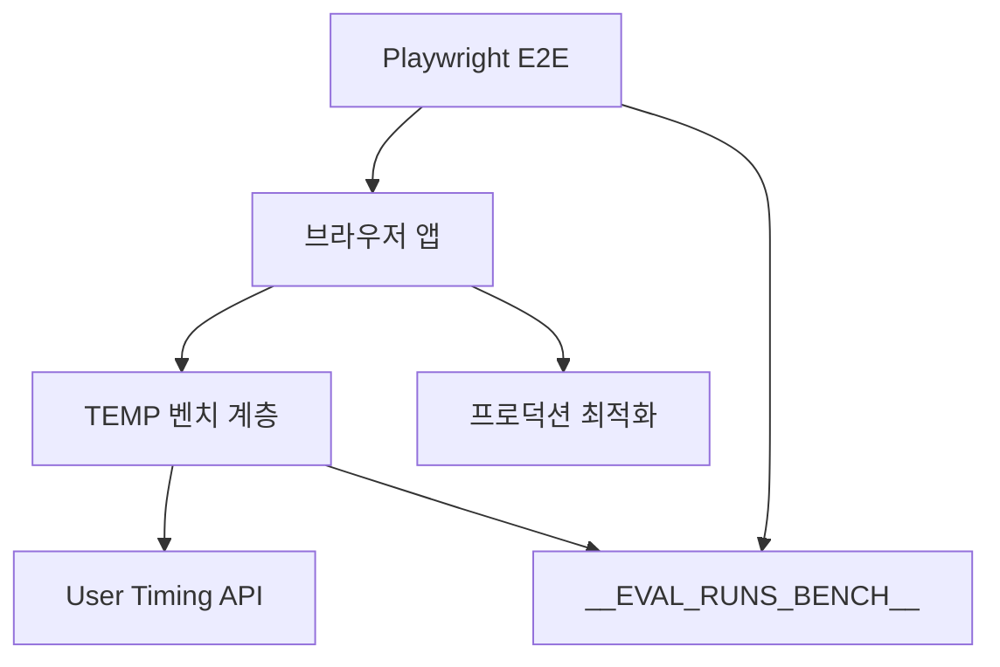
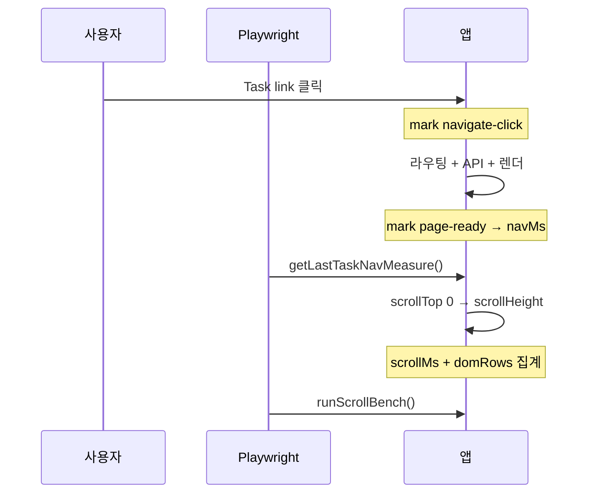

> 📊 **측정 일자:** 2026-06-17 · **환경:** [localhost:3000](http://localhost:3000) → QA API · **도구:** Playwright E2E + User Timing API
>
> **반복:** 케이스당 5회 median · 총 80샘플 · **소요:** 약 9.4분

---

## 1. 측정 목적

우리 서비스에는 LLM 성능 측정을 위한 평가 데이터를 볼 수 있는 **평가 디테일 페이지**가 있습니다. 적게는 수십 개에서 많게는 수백 개의 컬럼으로 이루어진 테이블이고, 여러 단계로 깊게 중첩된(depth가 큰) 데이터 구조를 가지고 있습니다.

이런 데이터를 테이블로 그대로 그리면, 첫 진입 시점이나 스크롤할 때 병목이 걸릴 수 있습니다. 그렇다면 이를 어떻게 풀어야 할까요? 저는 **TanStack Query의 Prefetch**와 **TanStack Table의 가상화(Virtualization)** 를 적용했습니다. 이 글은 그 두 가지가 정말 체감 성능에 영향을 주는지 수치로 측정한 기록입니다.

구체적으로는 목록에서 **Run 확장 → Task 클릭 → Task Results 테이블 준비 완료**까지의 체감 성능을 비교했습니다.

**비교 축**

- **Prefetch ON/OFF** — Run expand / Task link hover 시 React Query prefetch
- **Virtualize ON/OFF** — Task Results 테이블 가상 스크롤 (TanStack Table)

**배경** — 평가 Run 1건을 조회하려면 7-way 조인이 필요해 목록·상세 응답이 느렸고, lazy load + prefetch + virtualize로 개선한 뒤 수치로 검증했습니다.

**핵심 지표 3가지** (1샘플당 Playwright가 수집)

| 지표 | 한 줄 정의 | 유저 관점 |
| --- | --- | --- |
| **navMs** | Task 클릭 → Results 테이블 준비 완료까지 ms | "Task 눌렀을 때 얼마나 빨리 표가 뜨나?" — **진입 체감 속도** |
| **scrollMs** | 테이블 맨 위→맨 아래 1회 스크롤 소요 ms | "긴 표를 끝까지 내릴 때 버벅이나?" — **스크롤 반응성** |
| **domRows** | 스크롤 후 DOM에 실제로 그려진 `tbody tr` 개수 | 직접 체감 지표는 아니고, **virtualize가 DOM을 얼마나 줄였는지** 확인용 |

---

## 2. 측정 요약

> ✅ **최적 조합 (4케이스 평균):** prefetch ON + virtualize ON → nav **323ms** (baseline 472ms 대비 **약 32%↓**)
>
> **Virtualize 효과:** rule-based-math DOM **46행 → 18행** (약 61%↓)
>
> **Prefetch 최대 개선:** llm-as-judge nav **623ms → 148ms** (OFF+OFF vs ON+ON)

### 시나리오별 평균 (4 URL median 평균)

표의 **navMs**는 prefetch 효과(데이터 미리 받기)를, **domRows**는 virtualize 효과(DOM 행 수)를 읽을 때 봅니다. **scrollMs**는 행이 적을 때 virtualize ON이 오히려 높게 나올 수 있습니다(아래 §5 참고).

| **시나리오** | **Prefetch** | **Virtualize** | **평균 navMs** | **평균 scrollMs** | **한줄 요약** |
| --- | --- | --- | --- | --- | --- |
| prefetch-on_virtualize-on | ON | ON | **323** | 35 | 평균 nav 최저 · DOM 절감 |
| prefetch-on_virtualize-off | ON | OFF | 393 | **17** | scroll 최저 · DOM 최대 |
| prefetch-off_virtualize-on | OFF | ON | 422 | 30 | 중간 |
| prefetch-off_virtualize-off | OFF | OFF | 472 | **17** | baseline · nav 최고 |

---

## 3. 측정 방법 및 코드

> ⚠️ **TEMP 벤치 코드는 측정 완료 후 제거됨** (프로덕션 최적화 코드는 유지). 아래는 당시 측정에 사용한 구조 문서.

### 3.1 전체 아키텍처



| 계층 | 파일 | 역할 | 상태 |
| --- | --- | --- | --- |
| 프로덕션 | `EvalRunsList.tsx`, `EvalRunListItem.tsx` | Run detail hover prefetch | ✅ 유지 |
| 프로덕션 | `tasks/[taskId]/page.tsx` | SSR prefetch + HydrationBoundary | ✅ 유지 |
| 프로덕션 | `TaskResultsTable.tsx` | `Table` `virtualize` | ✅ 유지 |
| TEMP | `eval-runs-prefetch-bench-temp.ts` | 플래그, User Timing, scroll bench | 🗑️ 제거 |
| TEMP | `eval-runs-perf-bench.spec.ts` | 4-way 자동 측정 + median | 🗑️ 제거 |
| TEMP | `e2e-auth.ts`, `load-e2e-env.ts` | 로그인 헬퍼, `.env.local` 로드 | 🗑️ 제거 |

### 3.2 지표 정의



| 지표 | 무엇을 재는가 | 시작 ~ 끝 | 주로 영향 | 수집 API |
| --- | --- | --- | --- | --- |
| **navMs** | Task 페이지 **진입~표시** 구간 시간 | task row/link **클릭** (`eval-run-task-navigate-click`) → task results **data 로드 후 1회 measure** (`eval-run-task-page-ready`) | **Prefetch** (hover prefetch, SSR `HydrationBoundary`) · API 응답 시간 · React 렌더 | `performance.measure` → `getLastTaskNavMeasure()` |
| **scrollMs** | Results 테이블 **세로 스크롤 1회** 시간 | `scrollTop = 0` (2× rAF) → `scrollTop = scrollHeight` (2× rAF) 사이 `performance.now()` 차이 | DOM 행 수 · layout/paint · virtualize 유무 (행 많을수록 차이 커짐) | `runScrollBench()` → `durationMs` |
| **domRows** | 스크롤 **직후** DOM에 남아 있는 데이터 행 수 | `[data-testid="eval-run-task-results-table"] tbody tr` 개수 (스크롤 후 재카운트) | **Virtualize** — ON: viewport+overscan만 (예: 18행) · OFF: 전체 행 (예: 46행) | `runScrollBench()` → `visibleRowCount` |

**집계:** 케이스당 5회 측정 → **median** → 표의 `navMs` / `scrollMs` / `domRows` (평균 행의 `navMedianMs` 등은 4 URL median의 다시 평균).

### 3.3 E2E 자동화 절차 (1샘플)

| # | 동작 | 수집 지표 |
| --- | --- | --- |
| 1 | `browser.newContext()` — 캐시·쿠키 격리 | — |
| 2 | E2E 로그인 → `/eval-runs?benchPrefetch=&benchVirtualize=` | — |
| 3 | Run expand — prefetch ON이면 chevron **hover 1초** 후 click | — (이후 **navMs**에 간접 영향) |
| 4 | Task link click — prefetch ON이면 link **hover 1초** 후 click → `markEvalRunTaskNavigateClick` | **navMs** 시작점 |
| 5 | Task Results 페이지 로드 · 테이블 visible → `measureEvalRunTaskPageReady` | **navMs** 종료점 |
| 6 | `getLastTaskNavMeasure()` → 숫자 저장 | **navMs** |
| 7 | `runScrollBench()` — 맨 위→맨 아래 스크롤 + tbody `tr` 카운트 | **scrollMs**, **domRows** |
| 8 | `context.close()` — 같은 시나리오 **5회** 반복 후 median | 3지표 median |

**4-way 플래그**

| benchPrefetch | benchVirtualize | 의미 |
| --- | --- | --- |
| 1 | 1 | prefetch ON + virtualize ON |
| 1 | 0 | prefetch ON + virtualize OFF |
| 0 | 1 | prefetch OFF + virtualize ON |
| 0 | 0 | baseline (OFF + OFF) |

### 3.4 앱 측정 코드 (단계별)

#### Step 1 — Run hover prefetch (`EvalRunsList` / `EvalRunListItem`)

```typescript
void queryClient.prefetchQuery({
  queryKey: evalRunsQueryKeys.detail(applicationId, runId),
  queryFn: () => getEvalRunDetail(applicationId, runId),
});
onPointerEnter={() => { if (!isOpen) onPrefetchIntent(); }}
```

`benchPrefetch=0`이면 prefetch guard로 baseline 측정.

#### Step 2 — Task link prefetch (측정 당시 `EvalRunDetailTable`)

Task hover 시 task results·filter options `prefetchQuery`. Playwright: `a[href*="/tasks/{taskId}"]`.

#### Step 3 — SSR prefetch + hydration (`tasks/[taskId]/page.tsx`)

```typescript
await Promise.all([detail, filterOptions, taskResults].map(q => queryClient.prefetchQuery(q)));
return <HydrationBoundary state={dehydrate(queryClient)}>...</HydrationBoundary>;
```

#### Step 4a — 호출부 (`TaskResultsTable.tsx`)

```typescript
<Table<EvalTaskResultRow>
  scroll="both"
  fixedLayout
  columns={columns}
  data={data.contents}
  headerHeight={38}
  rowHeight={38}
  virtualize
  getRowKey={row => row.benchmarkDataId}
  onRowClick={(row, _rowIndex, event) => { /* open detail */ }}
/>
```

`virtualize`는 `maxHeight` 또는 `scroll="vertical"|"both"`와 함께 켜야 body 가상화 분기가 동작합니다. 측정 당시 TEMP 플래그 `benchVirtualize=0`으로 OFF 비교 후 domRows 집계.

#### Step 4b — Table 분기 (`src/shared/ui/Table/Table.tsx`)

```typescript
// Props (발췌)
virtualize?: boolean;
estimateRowSize?: number;  // default: rowHeight
overscan?: number;         // viewport 위·아래 추가 렌더 행 수

// render path
if (virtualize && hasVerticalScroll) {
  return (
    <VirtualizedTable
      estimateRowSize={estimateRowSize ?? rowHeight}
      overscan={overscan}
      /* ... */
    />
  );
}
// OFF: StickyHeaderScrollTable 또는 일반 tbody — rowModelRows 전체 map
```

#### Step 4c — VirtualizedTable 내부 (`Table.tsx` · `@tanstack/react-virtual`)

```typescript
import { useVirtualizer } from "@tanstack/react-virtual";

const scrollRef = useRef<HTMLDivElement>(null);
const rows = table.getRowModel().rows;

const virtualizer = useVirtualizer({
  count: rows.length,
  getScrollElement: () => scrollRef.current,
  estimateSize: () => estimateRowSize,
  overscan,
  getItemKey: i => rows[i]?.id ?? i,
});

const virtualRows = virtualizer.getVirtualItems();
const totalSize = virtualizer.getTotalSize();

// 고정 thead + 스크롤 tbody
<TableVerticalScrollViewport verticalScrollRef={scrollRef}>
  <div style={{ height: totalSize, position: "relative" }}>
    <ShadcnTable
      style={{
        position: "absolute",
        top: 0,
        left: 0,
        right: 0,
        transform: `translateY(${virtualRows[0]?.start ?? 0}px)`,
      }}
    >
      <TableBody>
        {virtualRows.map(vItem => {
          const row = rows[vItem.index]!;
          return (
            <TableRow
              key={vItem.key}
              data-index={vItem.index}
              ref={el => virtualizer.measureElement(el)}
              style={{ minHeight: rowHeight }}
            >
              {row.getVisibleCells().map(cell => /* TableCell */)}
            </TableRow>
          );
        })}
      </TableBody>
    </ShadcnTable>
  </div>
</TableVerticalScrollViewport>
```

**동작 요약:** 전체 행 높이(`totalSize`) spacer 안에서 viewport 근처 `virtualRows`만 DOM에 유지 → `domRows`는 OFF(전체) vs ON(viewport+overscan)로 차이 발생. `measureElement`로 실측 높이 보정.

#### Step 5 — navMs 측정 (`eval-runs-prefetch-bench-temp.ts` · TEMP)

**1) 클릭 시 mark** (`EvalRunDetailTable` → task row/link click)

```typescript
export function markEvalRunTaskNavigateClick(taskId: number): void {
  if (process.env.NODE_ENV !== "development") return;
  performance.mark(`eval-run-task-navigate-click:${taskId}`);
}
```

**2) 페이지 ready 시 measure** (`EvalRunTaskResultsView` — task results data 로드 후 1회)

```typescript
const TASK_NAVIGATE_CLICK_MARK_PREFIX = "eval-run-task-navigate-click";
const TASK_PAGE_READY_MARK_PREFIX = "eval-run-task-page-ready";
export const EVAL_RUN_TASK_NAV_TO_READY_MEASURE = "eval-run-task-navigate-to-ready";

export function measureEvalRunTaskPageReady(taskId: number): void {
  if (process.env.NODE_ENV !== "development") return;

  const flags = getEvalRunsBenchFlags();
  const startMark = `${TASK_NAVIGATE_CLICK_MARK_PREFIX}:${taskId}`;
  const endMark = `${TASK_PAGE_READY_MARK_PREFIX}:${taskId}`;
  performance.mark(endMark);

  try {
    performance.measure(EVAL_RUN_TASK_NAV_TO_READY_MEASURE, startMark, endMark);
  } catch {
    return; // start mark 없으면 skip (직접 URL 진입 등)
  }

  const entry = performance
    .getEntriesByName(EVAL_RUN_TASK_NAV_TO_READY_MEASURE, "measure")
    .at(-1);
  if (entry == null) return;

  console.info(
    `[eval-runs bench] task ${taskId} navigate→ready: ${entry.duration.toFixed(1)} ms`,
    { prefetchEnabled: flags.prefetch, virtualizeEnabled: flags.virtualize, durationMs: Math.round(entry.duration) },
  );
}
```

**측정 구간:** task link/row click (`navigate-click`) → task results 테이블 data ready (`page-ready`).

#### Step 5b — `getLastTaskNavMeasure()` 내부 (Playwright가 읽는 API)

```typescript
export function getLastTaskNavMeasureMs(): number | null {
  if (process.env.NODE_ENV !== "development") return null;

  const entry = performance
    .getEntriesByName("eval-run-task-navigate-to-ready", "measure")
    .at(-1);
  return entry != null ? Math.round(entry.duration) : null;
}

export function installEvalRunsBenchGlobal(): void {
  if (process.env.NODE_ENV !== "development" || typeof window === "undefined") return;

  window.__EVAL_RUNS_BENCH__ = {
    getFlags: getEvalRunsBenchFlags,
    getLastTaskNavMeasure: getLastTaskNavMeasureMs,
    runScrollBench: runEvalRunsTaskTableScrollBench,
  };
}

// EvalRunTaskResultsView mount 시 1회 호출
useEffect(() => {
  syncEvalRunsBenchFlagsFromUrl();
  installEvalRunsBenchGlobal();
}, []);
```

Playwright:

```typescript
const navMs = await page.evaluate(() => window.__EVAL_RUNS_BENCH__!.getLastTaskNavMeasure()!);
```

#### Step 6 — `runScrollBench()` 내부 (scrollMs + domRows)

```typescript
export type EvalRunsScrollBenchResult = {
  durationMs: number;      // → scrollMedianMs
  visibleRowCount: number; // → domRows (스크롤 후 tbody tr 수)
  totalRowCount: number;
  virtualizeEnabled: boolean;
};

export async function runEvalRunsTaskTableScrollBench(): Promise<EvalRunsScrollBenchResult | null> {
  if (process.env.NODE_ENV !== "development" || typeof document === "undefined") return null;

  const root = document.querySelector('[data-testid="eval-run-task-results-table"]');
  if (root == null) return null;

  const scrollEl =
    root.querySelector<HTMLElement>(".shared-data-table-scroll-overlay") ??
    root.querySelector<HTMLElement>('[class*="overflow-y-auto"]');
  if (scrollEl == null) return null;

  const totalRowCount = root.querySelectorAll("tbody tr").length;

  // 1) scrollTop 0으로 리셋 → 2× rAF 대기
  scrollEl.scrollTop = 0;
  await new Promise<void>(resolve => {
    requestAnimationFrame(() => requestAnimationFrame(() => resolve()));
  });

  // 2) 맨 아래로 스크롤 → 구간 시간 측정
  const start = performance.now();
  scrollEl.scrollTop = scrollEl.scrollHeight;
  await new Promise<void>(resolve => {
    requestAnimationFrame(() => requestAnimationFrame(() => resolve()));
  });
  const durationMs = Math.round(performance.now() - start);

  const visibleRowCount = root.querySelectorAll("tbody tr").length;

  return {
    durationMs,
    visibleRowCount,
    totalRowCount,
    virtualizeEnabled: getEvalRunsBenchFlags().virtualize,
  };
}
```

Playwright:

```typescript
const scroll = await page.evaluate(async () => {
  const bench = window.__EVAL_RUNS_BENCH__!;
  return await bench.runScrollBench();
});
// scroll.durationMs → scrollMs, scroll.visibleRowCount → domRows
```

**domRows 해석:** virtualize ON이면 viewport+overscan만 DOM에 남아 `visibleRowCount`가 작음. OFF면 전체 행이 렌더되어 `rule-based-math`에서 46행 등으로 측정됨.

#### Step 7 — 4-way 플래그 (`?benchPrefetch=&benchVirtualize=`)

```typescript
export function getEvalRunsBenchFlags(): EvalRunsBenchFlags {
  // URL ?benchPrefetch=0|1&benchVirtualize=0|1
  // → sessionStorage에 persist (task page client nav 유지)
  // → isEvalRunsPrefetchOnIntentEnabled() / isEvalRunsTableVirtualizeEnabled()
}

// TaskResultsTable (TEMP)
<Table virtualize={isEvalRunsTableVirtualizeEnabled()} ... />
```

### 3.5 Playwright 코드

#### 사전 준비

```bash
pnpm install
pnpm exec playwright install --with-deps chromium   # 최초 1회 (CI와 동일)
pnpm dev                                            # 별도 터미널, baseURL 기본 localhost:3000
```

**공통 env** (`.env.local` 또는 셸 export)

| 변수 | 용도 |
| --- | --- |
| `E2E_LOGIN_EMAIL` / `E2E_LOGIN_PASSWORD` | 로그인 E2E · AI Tools E2E |
| `E2E_BASE_URL` | 기본 `http://localhost:3000` (선택) |
| `E2E_BENCHMARK_PATH` | Benchmark Set Detail 경로 (AI Tools 패널) |
| `E2E_HEADLESS=false` | 브라우저 UI 표시 (headed) |
| `E2E_SLOWMO=50` | headed 시 동작 지연 ms (선택) |
| `E2E_PAUSE_AT_END=true` | headed + login spec 종료 시 `page.pause()` |

#### `playwright.config.ts` (발췌)

```typescript
export default defineConfig({
  testDir: "tests/e2e",
  timeout: 120_000,
  expect: { timeout: 15_000 },
  retries: process.env.CI ? 1 : 0,
  fullyParallel: true,
  use: {
    baseURL: process.env.E2E_BASE_URL ?? "http://localhost:3000",
    headless: /* E2E_HEADLESS=0|false 이면 false */,
    trace: "retain-on-failure",
    screenshot: "only-on-failure",
  },
  projects: [{ name: "chromium", use: { ...devices["Desktop Chrome"] } }],
});
```

#### 현재 레포 E2E 실행 (프로덕션 스펙)

```bash
# 로그인 플로우 (headless)
E2E_LOGIN_EMAIL=you@example.com E2E_LOGIN_PASSWORD=secret \
  pnpm e2e:login

# 로그인 플로우 (브라우저 표시)
E2E_LOGIN_EMAIL=you@example.com E2E_LOGIN_PASSWORD=secret \
  pnpm e2e:login:headed

# AI Tools 패널 (benchmark 페이지 필요)
E2E_LOGIN_EMAIL=... E2E_LOGIN_PASSWORD=... \
  E2E_BENCHMARK_PATH=/application/156/criteria/task/.../benchmark \
  pnpm exec playwright test tests/e2e/ai-tools-panel.spec.ts --reporter=line

# 파일·케이스 지정
pnpm exec playwright test tests/e2e/login.spec.ts -g "TC-LOGIN-01"
pnpm exec playwright test tests/e2e --reporter=dot

# UI 모드 / 디버그
pnpm exec playwright test --ui
pnpm exec playwright test tests/e2e/login.spec.ts --debug
```

```json
// package.json scripts
"e2e:login": "playwright test tests/e2e/login.spec.ts --reporter=dot",
"e2e:login:headed": "E2E_HEADLESS=false playwright test tests/e2e/login.spec.ts --reporter=dot"
```

**CI** (`.github/workflows/ci.yml` advisory job): `pnpm exec playwright install --with-deps chromium` 후 Storybook test 등 — E2E 스펙은 로컬·수동 실행 기준.

#### 당시 성능 측정 전용

```bash
pnpm dev
pnpm e2e:eval-runs-perf   # 당시 스크립트 — 재측정 시 스펙 복원 필요
```

```json
"e2e:eval-runs-perf": "playwright test tests/e2e/eval-runs-perf-bench.spec.ts --reporter=line"
```

**perf bench spec 설정 (당시)**

```typescript
test.describe.configure({ mode: "serial", timeout: 600_000 });
test.use({ trace: "off", screenshot: "off" });
```

#### 로그인 E2E (`tests/e2e/login.spec.ts` · 현재 유지)

```typescript
import { expect, test } from "playwright/test";
import { E2E_ENV_KEYS, E2E_TEST_DATA, SELECTORS, TEXT } from "./e2e-constants";

test("TC-LOGIN-01: 성공 로그인 및 대시보드 진입", async ({ page }) => {
  test.skip(!E2E.loginEmail || !E2E.loginPassword, "E2E 로그인 계정이 필요합니다.");

  await page.goto("/sign-in");
  await page.locator(SELECTORS.signInEmail).fill(E2E.loginEmail ?? "");
  await page.locator(SELECTORS.signInPassword).fill(E2E.loginPassword ?? "");
  await page.getByRole("button", { name: TEXT.logInButton }).click();

  await expect(page.getByRole("heading", { name: TEXT.dashboardHeading })).toBeVisible();
});
```

#### AI Tools 패널 E2E (`tests/e2e/ai-tools-panel.spec.ts` · 현재 유지)

```typescript
test.skip(requiresEnv, "E2E_LOGIN_EMAIL / E2E_LOGIN_PASSWORD / E2E_BENCHMARK_PATH 가 필요합니다.");

test.beforeEach(async ({ page }) => {
  await login(page);  // sign-in → dashboard heading
});

test("TC-AITOOLS-01: AI Tools 버튼으로 패널을 열고 네 가지 도구가 노출된다", async ({ page }) => {
  const panel = await openAiToolsPanel(page);
  await expect(panel.getByRole("button", { name: /Generator/ })).toBeVisible();
  await expect(panel.getByRole("button", { name: /Validator/ })).toBeVisible();
});
```

#### 로그인 헬퍼 (`e2e-auth.ts` · 당시 perf bench 전용, 제거됨)

```typescript
export async function loginWithE2eCredentials(page: Page) {
  await page.goto("/sign-in");
  await page.locator("#sign-in-email").fill(email);
  await page.locator("#sign-in-password").fill(password);
  await page.getByRole("button", { name: "Log in" }).click();
  await waitForLoginSuccess(page); // Criteria setting heading
}
```

#### runSingleSample() — Playwright 핵심 측정 함수 (TEMP · `eval-runs-perf-bench.spec.ts`)

```typescript
async function runSingleSample(
  page: Page,
  benchCase: EvalRunsBenchCase,
  prefetchEnabled: boolean,
  benchQuery: string, // e.g. "benchPrefetch=1&benchVirtualize=0"
): Promise<BenchSample> {
  await page.evaluate(() => {
    sessionStorage.clear();
    performance.clearMarks();
    performance.clearMeasures();
  });

  await page.goto(`${listPath}?${benchQuery}`);
  await page.locator('[data-testid="eval-runs-list"]').waitFor({ state: "visible" });

  const run = page.locator(`[data-run-id="${benchCase.runId}"]`);
  const expandButton = run.locator("button[aria-expanded]").first();

  if ((await expandButton.getAttribute("aria-expanded")) !== "true") {
    if (prefetchEnabled) {
      await expandButton.hover();
      await page.waitForTimeout(1_000);
    }
    await expandButton.click();
    await run.locator('[data-testid="eval-run-detail-table"]').waitFor({ state: "visible" });
  }

  const taskLink = run.locator(`a[href*="/tasks/${benchCase.taskId}"]`).first();
  if (prefetchEnabled) {
    await taskLink.hover();
    await page.waitForTimeout(1_000);
  }

  await Promise.all([
    page.waitForURL(new RegExp(`/eval-runs/${benchCase.runId}/tasks/${benchCase.taskId}`)),
    taskLink.click(),
  ]);

  await page.locator('[data-testid="eval-run-task-results-table"]').waitFor({ state: "visible" });

  // measureEvalRunTaskPageReady() 완료 대기
  await page.waitForFunction(
    () => window.__EVAL_RUNS_BENCH__?.getLastTaskNavMeasure() != null,
    undefined,
    { timeout: 60_000 },
  );

  const navMs = await page.evaluate(() => {
    const value = window.__EVAL_RUNS_BENCH__!.getLastTaskNavMeasure();
    if (value == null) throw new Error("Missing task navigate measure.");
    return value;
  });

  const scrollResult = await page.evaluate(async () => {
    return await window.__EVAL_RUNS_BENCH__!.runScrollBench();
  });
  if (scrollResult == null) throw new Error("Task table scroll bench failed.");

  return {
    navMs,
    scrollMs: scrollResult.durationMs,
    domRows: scrollResult.visibleRowCount,
    totalRows: scrollResult.totalRowCount,
  };
}
```

**케이스당 5회:** `browser.newContext()` → login → `runSingleSample` → `context.close()` → `median()` 집계.

**median 집계:** 4 시나리오 × 4 URL × 5회 → median → 16행 JSON + `console.table`

**env** — `E2E_LOGIN_EMAIL`, `E2E_LOGIN_PASSWORD`, `E2E_EVAL_RUNS_LIST_PATH`, `E2E_BENCH_ITERATIONS=5`

**E2E 셀렉터:** `eval-runs-list` · `eval-run-detail-table` · `eval-run-task-results-table` · `data-run-id`

---

## 4. 측정 결과 (상세)

### 4.1 테스트 대상 URL

| caseLabel | Run / Task | URL |
| --- | --- | --- |
| augmenter-dataset-0 | 435 / 3387 | `/application/156/eval-runs/435/tasks/3387?task=Augmenter&child=dataset+0` |
| llm-as-judge-metric-type | 385 / 3151 | `/application/156/eval-runs/385/tasks/3151?task=LLM_as++a+Judge&child=Metric+Type` |
| rule-based-math | 384 / 3149 | `/application/156/eval-runs/384/tasks/3149?task=Rule-based_Math&child=Metric+Type` |
| self-harm-safety3 | 343 / 3247 | `/application/156/eval-runs/343/tasks/3247?task=Self-Harm+…&child=Safety3` |

### 4.2 시나리오 × 케이스 전체 (median, ms)

**열 읽는 법**

- **navMs** ↓ = Task 클릭 후 표가 더 빨리 준비됨 → prefetch·SSR 효과 비교
- **scrollMs** ↓ = 스크롤 한 번이 더 가벼움 (단, 행 수가 적으면 virtualize ON이 더 높을 수 있음)
- **domRows** ↓ = virtualize ON일 때 DOM에 남는 행이 적음 (같은 케이스에서 virtualize OFF 열과 비교)

| **시나리오** | **케이스** | **Prefetch** | **Virtualize** | **navMs** | **scrollMs** | **domRows** |
| --- | --- | --- | --- | --- | --- | --- |
| prefetch-on_virtualize-on | augmenter-dataset-0 | ON | ON | 369 | 27 | 17 |
| prefetch-on_virtualize-on | llm-as-judge-metric-type | ON | ON | 148 | 42 | 19 |
| prefetch-on_virtualize-on | rule-based-math | ON | ON | 353 | 52 | 18 |
| prefetch-on_virtualize-on | self-harm-safety3 | ON | ON | 423 | 17 | 10 |
| prefetch-on_virtualize-off | augmenter-dataset-0 | ON | OFF | 372 | 17 | 17 |
| prefetch-on_virtualize-off | llm-as-judge-metric-type | ON | OFF | 449 | 16 | 30 |
| prefetch-on_virtualize-off | rule-based-math | ON | OFF | 301 | 17 | 46 |
| prefetch-on_virtualize-off | self-harm-safety3 | ON | OFF | 451 | 17 | 10 |
| prefetch-off_virtualize-on | augmenter-dataset-0 | OFF | ON | 458 | 24 | 17 |
| prefetch-off_virtualize-on | llm-as-judge-metric-type | OFF | ON | 497 | 41 | 19 |
| prefetch-off_virtualize-on | rule-based-math | OFF | ON | 224 | 39 | 18 |
| prefetch-off_virtualize-on | self-harm-safety3 | OFF | ON | 508 | 17 | 10 |
| prefetch-off_virtualize-off | augmenter-dataset-0 | OFF | OFF | 249 | 17 | 17 |
| prefetch-off_virtualize-off | llm-as-judge-metric-type | OFF | OFF | 623 | 17 | 30 |
| prefetch-off_virtualize-off | rule-based-math | OFF | OFF | 664 | 17 | 46 |
| prefetch-off_virtualize-off | self-harm-safety3 | OFF | OFF | 351 | 17 | 10 |

---

## 5. 정리

### 지표별 해석

| 지표 | 이번 측정에서 본 것 | 판단 |
| --- | --- | --- |
| **navMs** | 4케이스 평균 **472ms → 323ms** (prefetch ON + virtualize ON). llm-as-judge **623ms → 148ms** | Prefetch + hydration이 **진입 체감**에 가장 큰 기여. 케이스·캐시 상태에 따라 편차 있음 |
| **scrollMs** | 대부분 **17ms 전후** (virtualize OFF). ON은 **27~52ms** (행 많은 케이스) | 현재 데이터 규모에선 scroll 자체는 빠름. virtualize ON은 스크롤 벤치에 약간의 오버헤드가 있을 수 있으나 **domRows 절감**과 트레이드오프 |
| **domRows** | rule-based-math **46 → 18** (61%↓), llm-as-judge **30 → 19** | Virtualize의 **직접 증거**. 행 10~17개 소형 테이블은 ON/OFF 차이 작음 |

### Virtualize

- **rule-based-math:** DOM **46행 → 18행** (61%↓) — 대용량 테이블에서 효과 명확
- **llm-as-judge:** **30행 → 19행**
- **10~17행** 소형 테이블은 차이 미미 · scrollMs는 현재 규모에선 OFF가 더 낮게 측정

### Prefetch

- 4케이스 평균 nav: **472ms → 323ms** (prefetch ON + virtualize ON)
- llm-as-judge 최대 개선 **623ms → 148ms** · 케이스별 편차 있음

### 결론 — 무엇을 유지할 것인가

1. **Virtualize ON 유지** — 행 수가 많은 Task Results에서 DOM을 절반 이하로 줄여 줍니다(rule-based-math 46→18행). 소형 테이블(10~17행)에선 이득이 작지만 손해도 없으니 켜 둡니다.
2. **Prefetch 유지** — hover prefetch + SSR hydration으로 진입 체감(navMs) 평균을 약 32% 낮췄습니다(472→323ms, llm-as-judge 623→148ms).

### 이 측정의 한계

- **Prefetch가 항상 이기지는 않습니다.** 상세 표를 보면 warm 캐시로 추정되는 케이스에서 OFF가 더 빠른 반례가 있습니다 — augmenter는 OFF+OFF **249ms** < ON **369ms**, rule-based-math는 OFF+ON **224ms**가 오히려 최저였습니다. 평균은 개선을 보여 주지만 케이스별 편차(캐시 상태·네트워크 흔들림)가 큽니다.
- **샘플이 케이스당 5회**라 이상치에 민감합니다. median으로 완화했지만 표본이 작습니다.
- **측정 절차상 prefetch ON은 hover를 1초 기다린 뒤 클릭**하므로, "hover할 새도 없이 바로 누르는" 빠른 클릭 시나리오의 이득은 이 수치에 잡히지 않습니다. 실제 이득의 상한에 가깝게 봐야 합니다.

### 다음에 볼 것

- 캐시 cold/warm을 명시적으로 분리한 재측정, 케이스당 샘플 수 상향(예: 15회).
- 행 수가 훨씬 큰 테이블(수백 행)에서 virtualize의 scrollMs 이득이 역전되는 지점 확인.
