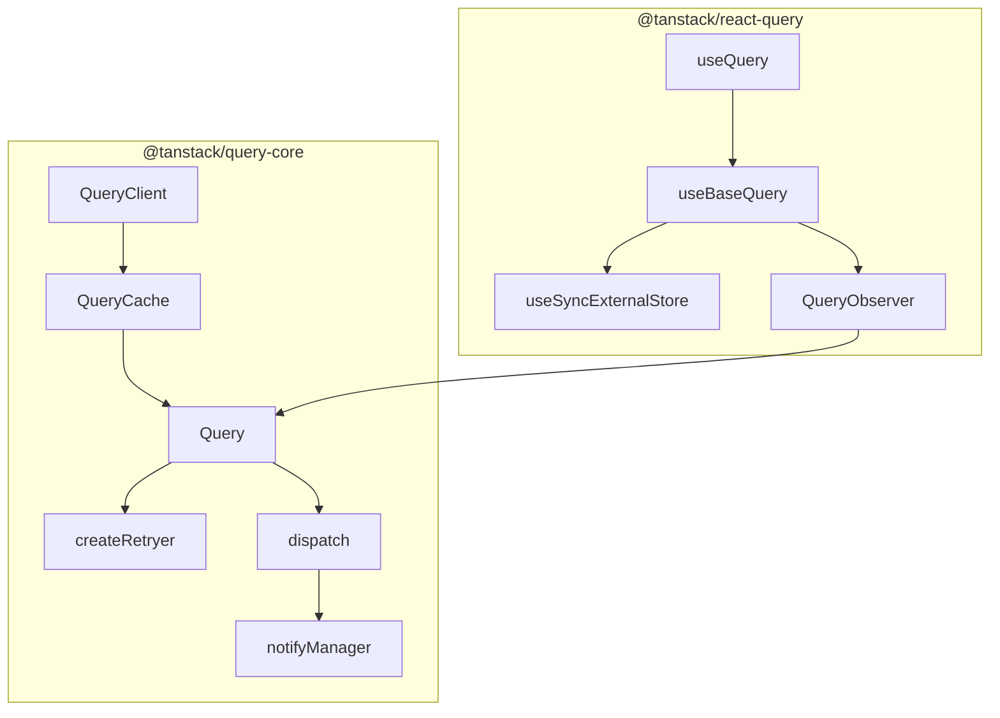
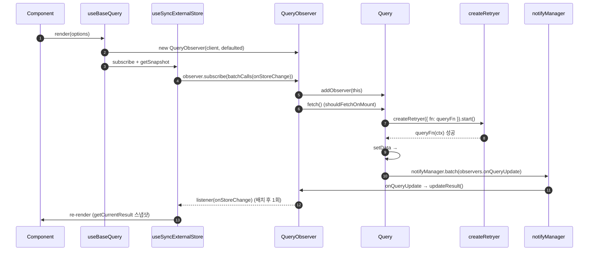

## 개요

**TanStack Query**는 React 앱에서 **서버 상태(Server State)** 를 관리하기 위한 비동기 데이터 라이브러리입니다.

- **버전**: v5 (`@tanstack/react-query`)
- **공식 문서**: [https://tanstack.com/query/latest](https://tanstack.com/query/latest)
- **소스**: [https://github.com/TanStack/query](https://github.com/TanStack/query)

> 🧭 **이 글 읽는 법** — 분량이 길어서, 목적에 따라 갈라 읽으시길 권합니다.
> - **빨리 쓰고 싶다** → 1~3장(소개·사용법·옵션)만 봐도 실무는 충분합니다.
> - **내부가 궁금하다** → 4장 딥다이브로 갑니다. 막히면 먼저 🍽️ 식당 비유와 🧒 "아주 쉽게 4문장"부터 보세요.
> - **용어에서 멈칫한다** → 맨 끝 FAQ를 펼쳐 보세요.

## 1. 소개와 목적

### TanStack Query가 해결하는 문제

| 문제 | TanStack Query의 답 |
| --- | --- |
| 같은 API를 여러 컴포넌트에서 중복 호출 | **queryKey** 기반 캐시 + 요청 dedupe |
| 로딩/에러/성공 UI 분기 반복 | `isPending`, `isError`, `data` 등 **표준화된 result** |
| stale 데이터 vs fresh 데이터 | `staleTime`, `gcTime`, background refetch |
| mutation 후 목록 갱신 | `invalidateQueries`, `setQueryData` |
| 탭 포커스·네트워크 복구 시 재요청 | `focusManager`, `onlineManager` |

### fetch, axios vs TanStack Query

**TanStack Query는 "서버 상태 관리" 전체를 푸는 도구입니다.**

#### 1. 캐싱 + 자동 중복 제거

```javascript
// axios만 쓸 때
function UserBadge() { useEffect(() => { axios.get('/users/1')... }, []) }
function UserProfile() { useEffect(() => { axios.get('/users/1')... }, []) }
function UserMenu() { useEffect(() => { axios.get('/users/1')... }, []) }
// → 네트워크 요청 3번
```

TanStack Query에서는 셋이 모두 `useQuery({ queryKey: ['user', 1] })`로 호출해도 **실제 fetch는 한 번만** 일어나고, 두 번째 호출부터는 캐시에서 즉시 반환합니다. 컴포넌트가 마운트·언마운트되면서 같은 요청이 반복되는 문제를 직접 풀려면, 결국 모듈 스코프 캐시 + 키 정규화 + 진행 중 Promise 공유까지 손수 만들게 됩니다.

#### 2. stale-while-revalidate 모델

axios만 쓰면 데이터 신선도를 직접 관리해야 합니다. "포커스가 돌아왔을 때 다시 가져오기", "5분이 지나면 stale로 표시하고 백그라운드 refetch", "네트워크 재연결 시 자동 재시도" — 이 모든 것을 직접 짜야 합니다. TanStack Query는 `staleTime`, `gcTime`, `refetchOnWindowFocus`, `refetchOnReconnect` 같은 옵션으로 간단히 설정할 수 있습니다.

#### 3. 상태 표현의 일관성

```javascript
// axios 직접 사용
const [data, setData] = useState(null);
const [isLoading, setIsLoading] = useState(true);
const [error, setError] = useState(null);
const [isRefetching, setIsRefetching] = useState(false);

useEffect(() => {
  const controller = new AbortController();
  setIsLoading(true);
  axios.get('/api', { signal: controller.signal })
    .then(res => setData(res.data))
    .catch(err => {
      if (err.name === 'CanceledError') return;
      setError(err);
    })
    .finally(() => setIsLoading(false));
  return () => controller.abort();
}, []);
```

```javascript
// TanStack Query
const { data, isLoading, error, isFetching } = useQuery({
  queryKey: ['data'],
  queryFn: ({ signal }) => axios.get('/api', { signal }).then(r => r.data)
});
```

### 아키텍처 (2-layer)



- **`@tanstack/query-core`**: 프레임워크에 무관한 엔진입니다(캐시·fetch·retry·invalidate).
- **`@tanstack/react-query`**: React 훅 어댑터입니다(`useSyncExternalStore`로 구독).

**📍 플로우차트 노드 한 줄 설명 — react-query (React 어댑터)**

| 노드 | 한 줄 역할 |
| --- | --- |
| `useQuery` | 공개 훅. 타입 오버로드 + `useBaseQuery`에 `QueryObserver`를 넘겨 위임 |
| `useBaseQuery` | React ↔ core 연결 본체. observer 생성·구독·suspense/error 처리 |
| `useSyncExternalStore` | React 18 내장 훅. 외부 스토어(observer) 스냅샷을 tearing 없이 구독 |
| `QueryObserver` | 컴포넌트당 1개. fetch/stale 판단, `result` 조립, 읽은 prop만 리렌더(Proxy). 옵션이 바뀌면 다시 fetch할지 판단, staleTime·refetch 타이밍 계산, QueryCache에서 데이터 꺼내오기, 데이터가 바뀌면 **구독자에게 알림**(`notify`) |

```javascript
function useBaseQuery(options, ObserverClass) {
  const client = useQueryClient();
  const observerRef = useRef();
  observerRef.current ??= new ObserverClass(client, options);
  observerRef.current.setOptions(options);

  useSyncExternalStore(
    (cb) => observerRef.current.subscribe(cb),   // 구독
    () => observerRef.current.getCurrentResult() // 현재값
  );

  return observerRef.current.getCurrentResult();
}
```

서버 응답이 오면 → **QueryCache**가 업데이트되고 → **QueryObserver**가 이를 감지해 구독자에게 통보하고 → `useSyncExternalStore`가 React에 "리렌더링하라"는 신호를 보내고 → **useBaseQuery**가 새 결과를 반환하고 → **useQuery**가 그대로 컴포넌트에 전달합니다.

**query-core (엔진)**

| 노드 | 한 줄 역할 |
| --- | --- |
| `QueryClient` | 최상위 오케스트레이터. 캐시 보유 + invalidate/refetch/prefetch API, focus·online 구독 |
| `QueryCache` | queryHash→Query Map 저장소. `build()`로 get-or-create (같은 키 = 같은 인스턴스 공유) |
| `Query` | queryKey 1개 = 캐시 엔트리 1개. `state` · `fetch()` 파이프라인 보유 |
| `createRetryer` | fetch 실행 루프. 재시도(지수 백오프)·일시정지(offline)·취소 담당 |
| `dispatch` | `Query.#dispatch` reducer. action으로 `state` 갱신 후 모든 observer에 알림 |
| `notifyManager` | 알림 배치 스케줄러. 여러 `state` 변경을 1 tick 리렌더로 묶음 |

---

## 2. 간단한 사용법

### v5 API 형태 (객체 only)

v5부터는 **모든 옵션을 객체 하나**로 전달합니다.

```typescript
import { useQuery } from "@tanstack/react-query";

function UserProfile({ userId }: { userId: number }) {
  const { data, isPending, isError, error } = useQuery({
    queryKey: ["user", userId],
    queryFn: () => fetchUser(userId),
    enabled: userId > 0,
  });

  if (isPending) return <Spinner />;
  if (isError) return <Error message={error.message} />;
  return <div>{data.name}</div>;
}
```

### Query Key Factory (권장 패턴)

```typescript
export const userQueryKeys = {
  all: () => ["users"] as const,
  lists: () => [...userQueryKeys.all(), "list"] as const,
  list: (filters: { role?: string; page?: number }) =>
    [...userQueryKeys.lists(), filters] as const,
  details: () => [...userQueryKeys.all(), "detail"] as const,
  detail: (userId: number) => [...userQueryKeys.details(), userId] as const,
};
```

- `invalidateQueries({ queryKey: userQueryKeys.all() })` → 모든 user 관련 쿼리 무효화
- `invalidateQueries({ queryKey: userQueryKeys.detail(userId) })` → 특정 user만 무효화

### useMutation 기본

```typescript
const queryClient = useQueryClient();

const mutation = useMutation({
  mutationFn: (body: { name: string }) => updateUser(userId, body),
  onSuccess: () => {
    void queryClient.invalidateQueries({
      queryKey: userQueryKeys.detail(userId),
    });
  },
});
```

### 커스텀 훅

```typescript
// hooks/useUserQuery.ts
export function useUserQuery(userId: number, enabled = true) {
  return useQuery({
    queryKey: userQueryKeys.detail(userId),
    queryFn: () => fetchUser(userId),
    enabled: userId > 0 && enabled,
    staleTime: 60_000,
  });
}
```

---

## 3. 주요 옵션 정리

### useQuery 핵심 옵션

| 옵션 | 역할 | 일반적인 예시 |
| --- | --- | --- |
| `queryKey` | 캐시 식별자. 인자가 바뀌면 다른 캐시 엔트리 | `userQueryKeys.detail(userId)` |
| `queryFn` | 실제 fetch 함수. `signal`(AbortSignal) 제공 | `() => fetchUser(userId)` |
| `enabled` | `false`면 fetch 안 함 | `userId > 0` |
| `staleTime` | 이 시간 동안 "fresh" → 자동 refetch 억제 | 목록 30s, 상세 60s |
| `gcTime` | observer 0개일 때 캐시 유지 시간 (구 cacheTime) | 기본 5분 |
| `retry` | 실패 시 재시도 횟수/함수 | 401이면 `false`, 그 외 3회 |
| `refetchOnWindowFocus` | 탭 포커스 시 refetch | 대시보드: `true`, 설정: `false` |
| `refetchInterval` | 주기적 polling (숫자 또는 함수) | 온라인 상태: 10초 |
| `placeholderData` | 이전 데이터 유지 (`keepPreviousData`) | 페이지네이션 user 목록 |
| `select` | 캐시 데이터 → 컴포넌트용 변환 | `select: (user) => user.name` |

### status, fetchStatus

| 축 | 값 | 의미 |
| --- | --- | --- |
| `status` | `pending` / `success` / `error` | 데이터 존재 여부 (결과 상태) |
| `fetchStatus` | `idle` / `fetching` / `paused` | 현재 네트워크 요청 진행 여부 |

- `isLoading` = `isPending && isFetching` (첫 로딩)
- `isRefetching` = `isFetching && !isPending` (백그라운드 재요청)

> 💬 **쉽게:** `status`는 "**데이터 있어?**"(결과), `fetchStatus`는 "**지금 네트워크 돌아?**"(과정)를 뜻합니다. 둘은 독립 축이라 — *데이터는 있는데(success) 동시에 백그라운드로 새로 받는 중(fetching)* 같은 조합이 자연스럽습니다.

#### 두 축의 질문

- **status**: "나, **데이터** 있어?" (결과의 축)
- **fetchStatus**: "나, **지금 일하고 있어**?" (활동의 축)

| | `fetchStatus: idle` | `fetchStatus: fetching` | `fetchStatus: paused` |
| --- | --- | --- | --- |
| **`status: pending`** | 아직 한 번도 못 받음, 쉬는 중 (드묾) | **첫 로딩 중** ⏳ | 첫 로딩하려는데 오프라인 |
| **`status: success`** | 데이터 있고 가만히 있음 ✅ | 데이터 있지만 **백그라운드 refetch** 🔄 | 데이터 있고, refetch 대기 중 |
| **`status: error`** | 실패한 채로 가만히 있음 ❌ | 실패했지만 **재시도 중** | 재시도하려는데 오프라인 |

### QueryClient 메서드

QueryClient는 캐시(QueryCache)를 제어합니다.

#### 1. 캐시 직접 읽기/쓰기 (네트워크 안 탐)

| 메서드 | 하는 일 |
| --- | --- |
| `getQueryData(key)` | 캐시에 있는 **데이터** 꺼내기 (없으면 undefined) |
| `setQueryData(key, updater)` | 캐시에 데이터 **직접 주입/갱신** |
| `getQueryState(key)` | 데이터뿐 아니라 status, error, updatedAt 등 **상태 전체** |
| `setQueriesData(filters, updater)` | 필터에 걸리는 **여러 쿼리를 한 번에** 갱신 |

```typescript
// optimistic update의 단골 패턴
queryClient.setQueryData(['todos'], (old) => [...old, newTodo]);
```

#### 2. 페치 트리거 (네트워크 탐)

| 메서드 | 하는 일 | 반환 |
| --- | --- | --- |
| `fetchQuery(options)` | 데이터 가져오기. 캐시 있고 fresh면 그것 반환 | `Promise<data>` |
| `prefetchQuery(options)` | 백그라운드로 **미리 채워두기**. 에러 던지지 않음 | `Promise<void>` |
| `ensureQueryData(options)` | 캐시 있으면 그것, 없으면 fetch | `Promise<data>` |
| `refetchQueries(filters)` | 필터 걸리는 쿼리 **강제 재요청** | `Promise<void>` |

```typescript
// Next.js 서버 컴포넌트에서 미리 채우기
await queryClient.prefetchQuery({ queryKey: ['user', id], queryFn });
```

셋의 차이가 헷갈릴 때는 이렇게 구분하면 됩니다. `fetchQuery`는 *데이터가 필요해서 직접 받아 쓸 때*, `prefetchQuery`는 *나중에 useQuery가 쓸 것을 미리 준비할 때*, `ensureQueryData`는 *있으면 쓰고 없으면 받을 때* 씁니다.

#### 3. 무효화 · 취소 · 제거 (생명주기 조작)

| 메서드 | 하는 일 |
| --- | --- |
| `invalidateQueries(filters)` | **stale로 표시 + 활성 쿼리는 즉시 refetch** (가장 자주 씀) |
| `cancelQueries(filters)` | 진행 중인 요청 abort. optimistic update 직전에 호출 |
| `removeQueries(filters)` | 캐시에서 **완전 삭제** (구독자도 다 떨어져 나감) |
| `resetQueries(filters)` | 초기 상태로 **리셋** + 활성이면 refetch |

```typescript
// mutation 성공 후 단골
onSuccess: () => queryClient.invalidateQueries({ queryKey: ['todos'] });
```

`invalidate`와 `reset`의 차이는 이렇습니다. `invalidate`는 *기존 데이터를 유지하면서 stale로 표시*하므로 refetch 동안에도 화면에 데이터가 남아 있고, `reset`은 *데이터까지 초기 상태로* 되돌리므로 스켈레톤이 다시 뜹니다.

#### 4. Mutation 관련

| 메서드 | 하는 일 |
| --- | --- |
| `isMutating(filters?)` | 진행 중인 mutation **개수** 반환 (전역 로딩 표시용) |
| `setMutationDefaults(key, options)` | 특정 mutation key에 기본 옵션 설정 |
| `getMutationDefaults(key)` | 그 기본값 조회 |
| `resumePausedMutations()` | 오프라인에서 멈췄던 mutation 재개 |

#### 5. 무한 스크롤 전용

| 메서드 | 하는 일 |
| --- | --- |
| `fetchInfiniteQuery(options)` | `useInfiniteQuery`용 fetch |
| `prefetchInfiniteQuery(options)` | 무한 쿼리 prefetch |

일반 버전과 동일한 패턴이고, 페이지네이션 구조만 다릅니다.

#### 6. 전역 설정 / 캐시 접근

| 메서드 | 하는 일 |
| --- | --- |
| `getQueryCache()` | QueryCache **인스턴스 직접** 받기 (고급 용도) |
| `getMutationCache()` | MutationCache 인스턴스 |
| `setDefaultOptions(options)` | 전역 기본 옵션 변경 (런타임) |
| `getDefaultOptions()` | 현재 전역 기본값 |
| `setQueryDefaults(key, options)` | **특정 key 패턴**에만 기본값 적용 |
| `clear()` | 모든 쿼리·mutation **완전 삭제** (로그아웃 시) |

가장 자주 쓰는 다섯 가지만 다시 추리면 이렇습니다.

| 메서드 | 역할 |
| --- | --- |
| `fetchQuery` | 즉시 fetch + Promise 반환 |
| `prefetchQuery` | 백그라운드 캐시 워밍 (hover, RSC) |
| `setQueryData` | 캐시 직접 수정 (optimistic) |
| `invalidateQueries` | `isInvalidated=true` · active 쿼리 refetch |
| `cancelQueries` | 진행 중 fetch 취소 (AbortSignal) |

---

## 4. 내부 소스 Deep Dive — 단계별 흐름 (v5.95.0)

```text
node_modules/.pnpm/@tanstack+react-query@5.95.0_.../node_modules/@tanstack/
├── query-core/src/     ← 핵심 엔진 (QueryClient / QueryCache / Query / retryer / notifyManager)
└── react-query/src/    ← React 훅 (useQuery / useBaseQuery) — 단, QueryObserver는 query-core
```

### 전체 흐름

```text
useQuery → useBaseQuery → QueryObserver 구독 → QueryCache(Query 확보) → Query.fetch
         → createRetryer(queryFn 실행) → #dispatch → notifyManager → React 리렌더
```

**🟢 마운트(첫 렌더) — 데이터를 처음 가져올 때까지**

1. **`useQuery(options)` 호출** → 곧바로 내부의 `useBaseQuery`가 실행됩니다. *(STEP 1·2)*
2. **`new QueryObserver` 생성 후 `useSyncExternalStore`로 구독** → "이 쿼리가 바뀌면 이 컴포넌트를 다시 그려줘"를 React에 등록합니다. *(STEP 2·3)*
3. **구독되는 순간 `observer.onSubscribe()` 실행** → `QueryCache.build()`가 `queryKey`에 맞는 `Query`를 *있으면 가져오고 없으면 새로 만듭니다*(get-or-create). → **같은 키를 쓰는 다른 컴포넌트와 캐시를 공유**하는 지점입니다. *(STEP 4·6)*
4. **데이터가 없거나 오래됐으면(stale) `Query.fetch()` 시작** → `createRetryer`가 우리가 넘긴 `queryFn`(실제 API 호출)을 실행합니다. 실패하면 자동으로 재시도합니다. *(STEP 7·9)*
5. **응답 도착 → `Query.#dispatch({ type: 'success' })`** → 쿼리의 `state.data`가 채워지고 `status`가 `'success'`로 바뀝니다. *(STEP 8)*
6. **`#dispatch`가 구독자 전원에게 알림** → `notifyManager`가 알림을 *모아서 한 번에* 흘려보내고 → 각 `observer.updateResult()`가 새 `result`를 계산하고 → `onStoreChange` → **React가 리렌더**합니다. *(STEP 10·4)*

**🟣 mutation 후 — 바뀐 서버 데이터를 화면에 다시 맞추기**

1. **`queryClient.invalidateQueries({ queryKey })`** → 매칭되는 쿼리에 `isInvalidated = true` *표시만* 합니다. ⚠️ **아직 네트워크 요청은 하지 않습니다.** *(STEP 5)*
2. **`refetchQueries`가 자동 실행** → 그중 *지금 화면에 떠 있는(active = 구독 중인) 쿼리만* 골라 다시 `Query.fetch()`를 돌립니다. *(STEP 5)*
3. **이후는 위 마운트 흐름의 4~6번과 똑같습니다** (fetch → 성공 → `#dispatch` → 알림 배치 → 리렌더).

> 💡 **가장 헷갈리는 두 지점:** ① `QueryCache.build`(마운트 3번)는 *없을 때만* 새로 만들어 **같은 `queryKey`면 캐시 1개를 공유**하므로 중복 요청이 합쳐집니다. ② `invalidate`(mutation 1번)는 "오래됨" 도장만 찍고, **실제 다시 받기(refetch)는 화면에 떠 있는 쿼리만** 일어납니다.

| STEP | 모듈 | 이 단계가 하는 일 |
| --- | --- | --- |
| 1 | `useQuery` | 공개 진입점. `QueryObserver`를 꽂아 `useBaseQuery`에 위임 |
| 2 | `useBaseQuery` | observer 생성, 옵션 merge, suspense/error 처리 |
| 3 | `useSyncExternalStore` | observer를 React에 tearing 없이 구독 |
| 4 | `QueryObserver` | 구독 시 fetch 트리거 / `result` 조립 / 미세 리렌더 |
| 5 | `QueryClient` | 엔진 진입점. 캐시 보유 + invalidate/refetch API |
| 6 | `QueryCache` | `queryHash`로 `Query` get-or-create |
| 7 | `Query.fetch` | fetch 파이프라인 (dedupe · signal · retryer) |
| 8 | `Query.#dispatch` | reducer로 `state` 갱신 후 observer 알림 |
| 9 | `createRetryer` | queryFn 실행 루프 (재시도 · 일시정지 · 취소) |
| 10 | `notifyManager` | 알림을 모아 React 리렌더 1회로 배치 |

> 💡 STEP 1~4 = **react-query 어댑터 층**, STEP 5~10 = **query-core 엔진 층**입니다(위→아래 = 바깥 React → 안쪽 엔진). STEP 번호는 *읽기 순서*일 뿐, 정확한 호출 순서는 아닙니다. 예컨대 `createRetryer`(9)는 `Query.fetch`(7) 도중에 돌고, 그 결과가 `#dispatch`(8)로 들어갑니다.

### 🍽️ 통째로 비유하면 — 식당으로 이해하기

> 🍽️ 코드가 막막할 때는 *비유*가 빠릅니다. TanStack Query를 **식당**에 빗대 보면 각 모듈의 역할이 한 번에 잡힙니다.

| 식당 | TanStack Query | 하는 일 |
| --- | --- | --- |
| 매니저 | `QueryClient` | 전체 운영·지시 ("이거 다시 만들어 / 취소해") |
| 주방 선반 | `QueryCache` | 만든 요리(데이터)를 `queryKey` 라벨 붙여 보관 |
| 요리 1접시 + 레시피 | `Query` | 특정 데이터 1개 + 가져오는 법(`queryFn`) · 상태 |
| 주문한 손님 테이블 | `QueryObserver` | "이 요리 나오면 알려줘" 구독 (컴포넌트당 1테이블) |
| 요리사 | `queryFn` | 실제로 데이터를 만들어 옴 (API 호출) |
| 다시 요리 | `createRetryer` | 실패하면 잠깐 쉬었다 다시 시도 |
| 한꺼번에 서빙 | `notifyManager` | 여러 변경을 모아 화면 갱신 1번으로 |
| "신선" 유효시간 | `staleTime` | 이 시간 안엔 다시 안 만들고 선반 것 그대로 제공 |
| 선반 비우기 | `gcTime` | 손님(구독자) 다 떠나도 잠깐 뒀다가 치움 |

---

### react-query 어댑터 (STEP 1~4)

#### STEP 1 · `useQuery` — 진입점 (얇은 위임, 가볍게 훑기)

```typescript
// react-query/src/useQuery.ts
export function useQuery<...>(
  options: DefinedInitialDataOptions<...>,   // ① initialData 있음
  queryClient?: QueryClient,
): DefinedUseQueryResult<NoInfer<TData>, TError>      //    → data: TData (non-null)

export function useQuery<...>(
  options: UndefinedInitialDataOptions<...>, // ② initialData 없음
  queryClient?: QueryClient,
): UseQueryResult<NoInfer<TData>, TError>             //    → data: TData | undefined

// 실제 런타임 본문은 단 한 줄
export function useQuery(options: UseQueryOptions, queryClient?: QueryClient) {
  return useBaseQuery(options, QueryObserver, queryClient)
}
```

- **한 줄 요약:** `useQuery`는 로직이 거의 없는 *얇은 위임자*입니다. 타입 오버로드(`initialData` 유무로 `data` 타입 분기)와 `QueryObserver` 주입만 하고 끝나며, **실제 동작은 STEP 2부터**입니다.
- (참고) `useInfiniteQuery`·`useSuspenseQuery`도 같은 `useBaseQuery`에 *다른 Observer*만 넣어 그대로 재사용합니다.

#### STEP 2 ⭐ · `useBaseQuery` — React ↔ core 연결의 심장

```typescript
// react-query/src/useBaseQuery.ts
export function useBaseQuery(options, Observer, queryClient?) {
  const isRestoring = useIsRestoring()
  const errorResetBoundary = useQueryErrorResetBoundary()
  const client = useQueryClient(queryClient)
  const defaultedOptions = client.defaultQueryOptions(options)   // ① 기본값 merge + queryHash 계산

  // ② 구독 전에 optimistic 플래그를 먼저 세팅 (fetching 상태를 선반영)
  defaultedOptions._optimisticResults = isRestoring ? 'isRestoring' : 'optimistic'

  // ③ observer 생성 "이전"에 새 캐시 엔트리 여부 확인 (observer 생성이 캐시 엔트리를 만들기 때문)
  const isNewCacheEntry = !client.getQueryCache().get(defaultedOptions.queryHash)

  // ④ 컴포넌트당 observer 1개 — useState 초기화 함수로 최초 1회만 생성, 리렌더에도 동일 인스턴스
  const [observer] = React.useState(
    () => new Observer(client, defaultedOptions),
  )

  // ⑤ useSyncExternalStore 호출 "전"에 스냅샷을 미리 계산 (주석에 must be 명시)
  const result = observer.getOptimisticResult(defaultedOptions)

  // ⑥ 외부 스토어(observer) 구독
  const shouldSubscribe = !isRestoring && options.subscribed !== false
  React.useSyncExternalStore(
    React.useCallback(
      (onStoreChange) => {
        const unsubscribe = shouldSubscribe
          ? observer.subscribe(notifyManager.batchCalls(onStoreChange)) // 여러 알림을 묶어서 한 번에 (리렌더 1번으로 합치기)
          : noop
        observer.updateResult() // 생성~구독 사이 누락분 보정
        return unsubscribe
      },
      [observer, shouldSubscribe],
    ),
    () => observer.getCurrentResult(),  // getSnapshot      (CSR)
    () => observer.getCurrentResult(),  // getServerSnapshot (SSR)
  )

  // ⑦ 옵션 변경은 effect에서 동기화 (렌더 중 setState 금지 규칙 준수)
  React.useEffect(() => {
    observer.setOptions(defaultedOptions)
  }, [defaultedOptions, observer])

  // ⑧ Suspense: 아직 데이터 없으면 promise를 throw → 가장 가까운 <Suspense> 가 잡음
  if (shouldSuspend(defaultedOptions, result)) {
    throw fetchOptimistic(defaultedOptions, observer, errorResetBoundary)
  }
  // ⑨ Error Boundary: throwOnError 조건 충족 시 error throw
  if (getHasError({ result, errorResetBoundary, throwOnError, query, suspense })) {
    throw result.error
  }

  // ⑩ notifyOnChangeProps 미설정 → trackResult(Proxy)로 "읽은 prop만 추적" 후 반환
  return !defaultedOptions.notifyOnChangeProps
    ? observer.trackResult(result)
    : result
}
```

> 💡 **왜 `useState(() => new Observer())`인가?** observer는 컴포넌트 인스턴스의 *수명* 동안 살아 있어야 하는 가변 객체입니다. `useMemo`는 캐시 축출 시 재생성될 수 있어 부적합하므로, 초기화 함수형 `useState`로 **단 1회 생성**을 보장합니다.

> 🎯 **여기가 §4에서 제일 중요합니다.** `useQuery`가 "왜 이렇게 동작하지?" 싶을 때 답은 거의 이 함수에 있습니다. — ① 옵션 정규화 ② observer 수명 관리 ③ `useSyncExternalStore` 구독 ④ Suspense/에러 throw ⑤ `trackResult` 리렌더 최적화를 **한 함수가 전부** 담당합니다.

> 👀 **코드에서 꼭 볼 두 줄:** `useState(() => new Observer())`(observer를 컴포넌트당 1번만 생성)와 `useSyncExternalStore(subscribe, getCurrentResult, ...)`(구독 + 스냅샷). 이 두 줄이 "React ↔ 캐시" 연결의 전부입니다.

```text
컴포넌트 렌더 시작
│
├─ ① 옵션에 기본값 채우기
├─ ② "fetching 중" 플래그 살짝 켜기
├─ ③ 새 캐시 엔트리인지 표시
├─ ④ Observer 인스턴스 확보 (첫 렌더면 생성, 이후는 재사용)
├─ ⑤ 일단 현재 결과 한 번 찍기
├─ ⑥ React한테 "Observer 변하면 알려줘" 등록
├─ ⑦ (렌더 끝난 후) Observer에게 새 옵션 알려주기
├─ ⑧ Suspense 써야 하면 promise throw
├─ ⑨ Error Boundary 써야 하면 error throw
└─ ⑩ Proxy 씌운 결과 반환
↓
```

- **컴포넌트마다 Observer를 하나씩 둡니다** (직원 1명)
- **그 Observer를 useSyncExternalStore로 구독합니다** (직원이 보고하면 화면 갱신)
- **나머지는 SSR·Suspense·옵션 변경 같은 예외 처리입니다**

#### STEP 3 ⭐ · `useSyncExternalStore` — 동시성 안전 구독 (React 내장)

> 💬 **한 줄로:** "React *바깥*의 값(쿼리 캐시)이 바뀌면 이 컴포넌트를 다시 그려라"를 **안전하게** 연결하는 React 공식 훅입니다. 예전엔 직접 이벤트 구독 + `setState`로 했지만 동시성 렌더링에서 깨지기 쉬워, React가 표준 훅으로 만들었습니다.

v5는 v4의 `useState + useEffect` 구독을 버리고 React 18 내장 훅 `useSyncExternalStore(subscribe, getSnapshot, getServerSnapshot?)`를 사용합니다.

```typescript
React.useSyncExternalStore(
  /* subscribe         */ useCallback((onStoreChange) => observer.subscribe(
                            notifyManager.batchCalls(onStoreChange)), [observer, shouldSubscribe]),
  /* getSnapshot       */ () => observer.getCurrentResult(),
  /* getServerSnapshot */ () => observer.getCurrentResult(),
)
```

- **왜 필요한가:** React 18 동시성 렌더링에서 외부 스토어(여기선 `QueryObserver`/`QueryCache`)는 React state가 아니므로, 일반 구독으로는 한 렌더 트리 안에서 서로 다른 스냅샷을 보는 **tearing(찢김)** 이 발생할 수 있습니다. `useSyncExternalStore`는 렌더 직전에 스냅샷을 동기적으로 다시 읽어 일관성을 보장합니다.
- **`getSnapshot`은 반드시 안정적 참조를 반환해야** 합니다. `getCurrentResult()`는 `QueryObserver`가 `shallowEqualObjects`로 메모이즈한 `#currentResult`를 그대로 돌려주므로(값이 안 바뀌면 같은 참조) 무한 리렌더가 발생하지 않습니다.
- **`subscribe` identity**가 바뀌면 React가 재구독하므로, `useCallback` 의존성을 `[observer, shouldSubscribe]`로 최소화합니다.
- 같은 훅을 `useMutation` / `useIsFetching` / `useMutationState` / `useQueries`도 사용합니다. (v4는 React 17 호환용 `use-sync-external-store/shim`을 쓰고, v5.95는 `React.useSyncExternalStore`를 직접 호출합니다.)

#### STEP 4 ⭐ · `QueryObserver` — 구독·result 조립·리렌더 (useSyncExternalStore가 구독하는 것)

**구독/해제 — `query.fetch` 트리거 지점**

```typescript
// queryObserver.ts
protected onSubscribe(): void {
  if (this.listeners.size === 1) {          // 첫 구독자일 때만
    this.#currentQuery.addObserver(this)    // Query.observers 에 등록 → GC 타이머 해제
    if (shouldFetchOnMount(this.#currentQuery, this.options)) {
      this.#executeFetch()                  // 마운트 시 fetch 필요하면 실행
    } else {
      this.updateResult()
    }
    this.#updateTimers()                    // staleTimeout + refetchInterval 세팅
  }
}
protected onUnsubscribe(): void {
  if (!this.hasListeners()) this.destroy()  // 마지막 구독자 떠나면 정리 → Query.removeObserver → GC 예약
}
```

**`createResult()` — 우리가 보는 `result` 객체를 조립**

```typescript
// 1) placeholderData: data 없고 pending 일 때만 적용 (이전 placeholder 메모이즈)
// 2) select: data 있을 때 변환 + 이전 결과와 메모이즈 (select === this.#selectFn && data 동일 → 재사용)
// 3) 최종 파생 플래그 계산
const isFetching = newState.fetchStatus === 'fetching'
const isPending  = status === 'pending'
const isLoading  = isPending && isFetching            // 최초 로딩
const result = {
  status, fetchStatus: newState.fetchStatus,
  isPending, isSuccess: status==='success', isError,
  isLoading,
  isRefetching: isFetching && !isPending,             // 백그라운드 재요청
  isLoadingError: isError && !hasData,
  isRefetchError: isError && hasData,
  isStale: isStale(query, options),
  isPlaceholderData, data, error, refetch: this.refetch, /* ... */
}
```

**`updateResult()` + `shouldNotifyListeners()` — 미세 리렌더 제어**

```typescript
updateResult(): void {
  const nextResult = this.createResult(this.#currentQuery, this.options)
  if (shallowEqualObjects(nextResult, prevResult)) return  // 변화 없으면 알림 X
  this.#currentResult = nextResult
  // notifyOnChangeProps / trackedProps 에 포함된 prop이 실제로 바뀌었을 때만 listener 호출
  this.#notify({ listeners: shouldNotifyListeners() })
}
```

**`trackResult()` — "읽은 prop"만 추적하는 Proxy**

```typescript
trackResult(result) {
  return new Proxy(result, {
    get: (target, key) => {
      this.trackProp(key)            // 컴포넌트가 result.data 를 읽으면 'data'를 추적 대상에 추가
      return Reflect.get(target, key)
    },
  })
}
```

> ⚡ 컴포넌트가 `data`만 구조분해하면 `#trackedProps = {data}`가 되고, 이후 `isStale`/`failureCount` 등이 바뀌어도 **리렌더하지 않습니다**.

**fetch/stale 판단 헬퍼 (파일 하단) — 옵션 의미의 단일 출처**

```typescript
// 4개 헬퍼 = "지금 이 쿼리, 데이터를 받아야 하나?"를 판단 (맨 아래 isStale가 가장 기본 단위)

// ① 데이터를 '처음' 받아야 하나? → 아직 데이터가 한 번도 없을 때
function shouldLoadOnMount(query, options) {
  return (
    resolveEnabled(options.enabled, query) !== false &&   // enabled:false면 제외
    query.state.data === undefined &&                     // 데이터가 아예 없고
    !(query.state.status === 'error' && options.retryOnMount === false) // (에러 + 재시도금지)만 아니면
  )
}

// ② 마운트 때 fetch할까? → 데이터 없으면 받고(①), 있어도 refetchOnMount 규칙상 필요하면 받음
function shouldFetchOnMount(query, options) {
  return (
    shouldLoadOnMount(query, options) ||                  // 데이터 없음 → 무조건 받기
    (query.state.data !== undefined &&                    // 데이터는 있지만
      shouldFetchOn(query, options, options.refetchOnMount)) // refetchOnMount 규칙상 받아야 하면
  )
}

// ③ refetchOnMount / refetchOnWindowFocus / refetchOnReconnect 공통 규칙
function shouldFetchOn(query, options, field) {
  if (resolveEnabled(options.enabled, query) !== false &&        // 꺼져 있으면 안 받고
      resolveStaleTime(options.staleTime, query) !== 'static') { // staleTime:'static'이면 영영 안 받음
    const value = typeof field === 'function' ? field(query) : field
    return value === 'always'                           // 'always' → 신선해도 무조건
      || (value !== false && isStale(query, options))   // 그 외 → '낡았을 때(stale)'만
  }
  return false
}

// ④ 기본 단위: "이 데이터 낡았나?" → 위 헬퍼들이 전부 이걸 사용
function isStale(query, options) {
  return (
    resolveEnabled(options.enabled, query) !== false &&             // 꺼져 있으면 stale 아님
    query.isStaleByTime(resolveStaleTime(options.staleTime, query)) // staleTime 지났으면 true (데이터 없음·invalidate도 true)
  )
}
```

| 함수 | 쉽게 말하면 / 언제 `true` |
| --- | --- |
| `isStale` | "이 데이터 낡았어?" → staleTime 지났거나 · 데이터 없거나 · invalidate됨 |
| `shouldLoadOnMount` | "데이터가 아예 없어서 *처음* 받아야 해?" → 거의 데이터 `undefined`일 때 |
| `shouldFetchOnMount` | "마운트했을 때 받을까?" → 데이터 없으면 무조건, 있으면 `refetchOnMount` 따라 |
| `shouldFetchOn` | mount/focus/reconnect **공통** 규칙 → `'always'`면 무조건, 아니면 *낡았을 때만* |

> 💬 **한 마디로:** *데이터가 없으면* 무조건 받고, *데이터가 있으면* "**낡았고(stale) + 그 트리거(mount/focus/reconnect)가 켜져 있을 때**"만 받습니다. `enabled: false`나 `staleTime: 'static'`이면 어느 경우든 받지 않습니다.

**polling 타이머**

```typescript
#updateRefetchInterval(nextInterval) {
  this.#refetchIntervalId = timeoutManager.setInterval(() => {
    if (this.options.refetchIntervalInBackground || focusManager.isFocused()) {
      this.#executeFetch()        // 포커스 없으면(백그라운드) refetchIntervalInBackground=true 일 때만
    }
  }, this.#currentRefetchInterval)
}
```

---

### query-core 엔진 (STEP 5~10)

#### STEP 5 · `QueryClient` — 최상위 오케스트레이터

앱 전체의 **캐시·기본옵션·전역 이벤트를 총괄하는 단일 컨트롤 타워**입니다. 직접 데이터를 들고 있지는 않고, 내부의 `QueryCache`/`MutationCache`에 위임하면서 바깥으로는 `invalidate`·`prefetch`·`setQueryData` 같은 공개 API만 노출합니다.

```typescript
// queryClient.ts — 보유 상태
#queryCache; #mutationCache; #defaultOptions; #queryDefaults; #mutationDefaults; #mountCount
```

**mount/unmount — refcount 기반 전역 이벤트 구독** (`QueryClientProvider`가 호출)

`QueryClientProvider`가 마운트되면 `client.mount()`를 호출해 focus/online 같은 **전역 이벤트 리스너를 등록**합니다. Provider가 여러 개여도 참조 카운트로 묶어 **실제 등록은 단 한 번만** 하고, 마지막 Provider가 사라질 때 해제합니다.

`QueryClientProvider`는 `QueryClient` 인스턴스를 **React Context에 꽂아 주는 얇은 래퍼**입니다. 자식 컴포넌트의 `useQuery`·`useQueryClient`가 이걸로 client를 찾고, 동시에 마운트/언마운트 시 `client.mount()`/`unmount()`를 호출해 전역 focus/online 리스너를 켜고 끕니다.

```typescript
mount(): void {
  this.#mountCount++
  if (this.#mountCount !== 1) return            // 여러 Provider여도 실제 구독은 1회
  this.#unsubscribeFocus = focusManager.subscribe(async (focused) => {
    if (focused) { await this.resumePausedMutations(); this.#queryCache.onFocus() }
  })
  this.#unsubscribeOnline = onlineManager.subscribe(async (online) => {
    if (online) { await this.resumePausedMutations(); this.#queryCache.onOnline() }
  })
}
```

**defaultQueryOptions — merge + queryHash + 의존 기본값** (`_defaulted` 플래그로 멱등)

사용자 옵션에 전역/키별 기본값을 **합치고**, `queryKey`로 안정적인 `queryHash` 문자열을 계산합니다. 결과 객체에 `_defaulted = true`를 찍어 두어서, **이미 처리된 옵션이 다시 들어와도 같은 결과**(= 멱등)가 됩니다.

```typescript
const defaultedOptions = {
  ...this.#defaultOptions.queries,
  ...this.getQueryDefaults(options.queryKey),   // setQueryDefaults(부분일치) 병합
  ...options,
  _defaulted: true,
}
if (!defaultedOptions.queryHash)
  defaultedOptions.queryHash = hashQueryKeyByOptions(defaultedOptions.queryKey, defaultedOptions)
if (defaultedOptions.throwOnError === undefined)
  defaultedOptions.throwOnError = !!defaultedOptions.suspense  // suspense면 자동 throwOnError
if (defaultedOptions.queryFn === skipToken)
  defaultedOptions.enabled = false                              // skipToken → 비활성
```

**invalidateQueries → refetchQueries (2단계)**

```typescript
invalidateQueries(filters, options = {}) {
  return notifyManager.batch(() => {
    this.#queryCache.findAll(filters).forEach((q) => q.invalidate())  // ① isInvalidated=true 플래그만
    if (filters?.refetchType === 'none') return Promise.resolve()
    return this.refetchQueries(                                       // ② 실제 refetch
      { ...filters, type: filters?.refetchType ?? filters?.type ?? 'active' },
      options,
    )
  })
}
refetchQueries(filters, options = {}) {
  const fetchOptions = { ...options, cancelRefetch: options.cancelRefetch ?? true }
  const promises = notifyManager.batch(() =>
    this.#queryCache.findAll(filters)
      .filter((q) => !q.isDisabled() && !q.isStatic())   // 비활성/static 제외
      .map((q) => {
        let promise = q.fetch(undefined, fetchOptions)
        return q.state.fetchStatus === 'paused' ? Promise.resolve() : promise
      }),
  )
  return Promise.all(promises).then(noop)
}
```

> ⚠️ **invalidate ≠ 즉시 fetch.** 1단계는 `isInvalidated` 플래그만 켜고, 2단계 `refetchQueries`가 기본값 `type: 'active'`(=구독 중인 observer가 있는) 쿼리만 실제로 `fetch`합니다. 화면에 없는 쿼리는 다음 마운트 때 stale 판정으로 자연스럽게 refetch됩니다.

#### STEP 6 · `QueryCache` — Query get-or-create

즉, **queryKey로 캐시를 뒤져 보고 — 있으면 그 Query 그대로, 없으면 새로 만들어 등록**합니다.

```typescript
// queryCache.ts — Map<queryHash, Query> 한 개가 전부
export class QueryCache extends Subscribable {
  #queries = new Map<string, Query>()

  build(client, options, state?) {
    const queryHash = options.queryHash ?? hashQueryKeyByOptions(options.queryKey, options)
    let query = this.get(queryHash)
    if (!query) {                              // ★ 없을 때만 생성 → 같은 hash = 같은 인스턴스
      query = new Query({
        client, queryKey: options.queryKey, queryHash,
        options: client.defaultQueryOptions(options),
        state, defaultOptions: client.getQueryDefaults(options.queryKey),
      })
      this.add(query)                          // notify({ type: 'added' })
    }
    return query
  }
  // get / getAll / find / findAll(matchQuery 필터) / remove / notify(→notifyManager.batch)
}
```

> 🔑 `build`의 get-or-create가 **요청 dedupe와 캐시 공유의 근원**입니다. 서로 다른 컴포넌트의 두 observer가 같은 `queryKey`를 쓰면 동일 `queryHash` → **같은 `Query` 인스턴스 1개**를 공유합니다.

#### STEP 7 ⭐ · `Query` — state + fetch 파이프라인

하나의 `queryKey`에 1:1로 대응하는 **상태 보관소 + fetch 실행 단위**입니다. 모든 상태 변화는 `dispatch(action)` → reducer를 거치고, `fetch()`는 진행 중 promise 공유 → `createRetryer`로 실행 → 결과를 다시 `dispatch`로 반영 → observer들에게 통보까지 한 묶음으로 처리합니다.

```text
fetch() ─→ 진행 중 promise? ──→ 그거 그대로 반환 (중복 제거)
            └ 없으면 createRetryer로 queryFn 실행
                  └ 성공/실패 → dispatch → observers.onQueryUpdate()
```

`extends Removable`이라 gcTime 후 자동 제거가 스케줄링됩니다. 핵심 상태는 다음과 같습니다.

```typescript
export interface QueryState<TData, TError> {
  data; dataUpdateCount; dataUpdatedAt
  error; errorUpdateCount; errorUpdatedAt
  fetchFailureCount; fetchFailureReason; fetchMeta
  isInvalidated: boolean
  status: 'pending' | 'success' | 'error'      // 데이터 존재 축
  fetchStatus: 'idle' | 'fetching' | 'paused'  // 네트워크 진행 축
}
```

**`fetch()` 파이프라인 (핵심부)**

```typescript
async fetch(options?, fetchOptions?): Promise<TData> {
  // ① dedupe: 이미 fetching이고 retryer가 reject 상태가 아니면 기존 promise 반환
  if (this.state.fetchStatus !== 'idle' && this.#retryer?.status() !== 'rejected') {
    if (this.state.data !== undefined && fetchOptions?.cancelRefetch) this.cancel({ silent: true })
    else if (this.#retryer) { this.#retryer.continueRetry(); return this.#retryer.promise }
  }
  // ② AbortController — signal 게터를 읽는 순간 #abortSignalConsumed = true
  const abortController = new AbortController()
  // ③ queryFn 컨텍스트 구성 { client, queryKey, meta, signal }
  const fetchFn = () => ensureQueryFn(this.options, fetchOptions)(createQueryFnContext())
  // ④ behavior 훅 (infiniteQuery 등)
  this.options.behavior?.onFetch(context, this)
  this.#revertState = this.state                                  // 취소 시 되돌릴 상태 백업
  if (this.state.fetchStatus === 'idle' /* ... */)
    this.#dispatch({ type: 'fetch', meta })                       // → fetchStatus: 'fetching'
  // ⑤ retryer 생성: 콜백들이 모두 #dispatch 로 연결됨
  this.#retryer = createRetryer({
    fn: context.fetchFn,
    onCancel: (e) => { if (e instanceof CancelledError && e.revert) this.setState({ ...this.#revertState, fetchStatus: 'idle' }); abortController.abort() },
    onFail:    (failureCount, error) => this.#dispatch({ type: 'failed', failureCount, error }),
    onPause:   () => this.#dispatch({ type: 'pause' }),
    onContinue:() => this.#dispatch({ type: 'continue' }),
    retry: context.options.retry, retryDelay: context.options.retryDelay, networkMode: context.options.networkMode,
    canRun: () => true,
  })
  try {
    const data = await this.#retryer.start()
    if (data === undefined) throw new Error(`${this.queryHash} data is undefined`)
    this.setData(data)                              // → #dispatch('success')
    this.#cache.config.onSuccess?.(data, this); this.#cache.config.onSettled?.(...)
    return data
  } catch (error) {
    if (error instanceof CancelledError) { /* silent → 새 fetch promise / revert → 이전 data */ }
    this.#dispatch({ type: 'error', error })        // → status:'error', isInvalidated:true
    this.#cache.config.onError?.(error, this); this.#cache.config.onSettled?.(...)
    throw error
  } finally {
    this.scheduleGc()
  }
}
```

> 👀 **이 코드에서 꼭 볼 곳 4개:** ① *dedupe* — 이미 fetching이면 새 요청 대신 기존 promise 재사용 · ② `#dispatch({ type: 'fetch' })` — 시작하자마자 `fetching` 상태로 · ③ `createRetryer(...).start()` — 실제 `queryFn` 실행은 retryer가 담당 (STEP 9) · ④ `setData(data)` → `#dispatch('success')` — 성공이 곧 상태 변경(STEP 8로 연결).

#### STEP 8 ⭐ · `#dispatch` — reducer + 알림 (반응성의 심장)

> 💬 **한 줄로:** 쿼리에 무슨 일이 생기든(`fetch`/`success`/`error`…) **여기 한 곳을 거쳐** `state`가 바뀌고, 바뀌면 **모든 구독자에게 알림**이 갑니다. 화면이 갱신되는 모든 길은 결국 `#dispatch`로 통합니다.

```typescript
#dispatch(action): void {
  const reducer = (state) => {
    switch (action.type) {
      case 'failed':   return { ...state, fetchFailureCount: action.failureCount, fetchFailureReason: action.error }
      case 'pause':    return { ...state, fetchStatus: 'paused' }
      case 'continue': return { ...state, fetchStatus: 'fetching' }
      case 'fetch':    return { ...state, ...fetchState(state.data, this.options), fetchMeta: action.meta ?? null }
      case 'success':  return { ...state, ...successState(action.data, action.dataUpdatedAt),
                                dataUpdateCount: state.dataUpdateCount + 1,
                                ...(!action.manual && { fetchStatus: 'idle', fetchFailureCount: 0, fetchFailureReason: null }) }
      case 'error':    return { ...state, error: action.error, errorUpdateCount: state.errorUpdateCount + 1,
                                errorUpdatedAt: Date.now(), fetchFailureCount: state.fetchFailureCount + 1,
                                fetchFailureReason: action.error, fetchStatus: 'idle', status: 'error', isInvalidated: true }
      case 'invalidate': return { ...state, isInvalidated: true }
      case 'setState':   return { ...state, ...action.state }
    }
  }
  this.state = reducer(this.state)

  notifyManager.batch(() => {
    this.observers.forEach((observer) => observer.onQueryUpdate())  // ① 모든 observer 갱신
    this.#cache.notify({ query: this, type: 'updated', action })    // ② cache 리스너(devtools 등)
  })
}
```

> 👀 **이 함수의 본질은 마지막 두 동작입니다:** `this.state = reducer(this.state)`(상태를 새로 만들고) → `notifyManager.batch(observers.forEach(onQueryUpdate))`(구독자 전원에게 알림). 위 `switch`는 "어떤 필드를 바꾸나"의 세부일 뿐, **상태 변경 → 알림** 이 한 쌍이 반응성의 전부입니다.

```typescript
// fetch/success 액션이 쓰는 부분 상태 헬퍼
export function fetchState(data, options) {
  return {
    fetchFailureCount: 0, fetchFailureReason: null,
    fetchStatus: canFetch(options.networkMode) ? 'fetching' : 'paused',  // 오프라인이면 paused
    ...(data === undefined && { error: null, status: 'pending' }),       // 데이터 없으면 pending
  }
}
```

| action | state 변화 |
| --- | --- |
| `fetch` | `fetchStatus: 'fetching'` (offline이면 `'paused'`), data 없으면 `status: 'pending'` |
| `success` | `data` 저장, `dataUpdateCount++`, `fetchStatus: 'idle'`, `isInvalidated: false` |
| `error` | `status: 'error'`, `errorUpdateCount++`, `fetchStatus: 'idle'`, `isInvalidated: true` |
| `failed` | retry 진행 중 카운트 — `fetchFailureCount/Reason` 갱신 (status는 그대로) |
| `pause` / `continue` | `fetchStatus: 'paused'` ↔ `'fetching'` (offline/blur) |
| `invalidate` | `isInvalidated: true` (fetch는 아직 안 함) |

#### STEP 9 · `createRetryer` — 재시도 / 일시정지 / 취소

> 💬 **한 줄로:** `queryFn`을 실제로 돌리는 작은 실행기입니다. 실패하면 *점점 더 긴 간격으로* 다시 시도하고, 탭이 백그라운드거나 오프라인이면 *멈췄다가* 복귀할 때 이어서 합니다.

클래스가 아니라 **클로저** 팩토리입니다. `thenable` 1개와 `start/cancel/continue/...`를 가진 객체를 반환합니다.

```typescript
// retryer.ts
function defaultRetryDelay(failureCount) {
  return Math.min(1000 * 2 ** failureCount, 30000)   // 지수 백오프, 최대 30s
}
export function canFetch(networkMode) {
  return (networkMode ?? 'online') === 'online' ? onlineManager.isOnline() : true
}

export function createRetryer(config) {
  let isRetryCancelled = false, failureCount = 0, continueFn
  const thenable = pendingThenable()

  const canContinue = () =>
    focusManager.isFocused() &&
    (config.networkMode === 'always' || onlineManager.isOnline()) &&
    config.canRun()

  const run = () => {
    if (isResolved()) return
    let promiseOrValue
    try { promiseOrValue = (failureCount === 0 ? config.initialPromise : undefined) ?? config.fn() }
    catch (e) { promiseOrValue = Promise.reject(e) }

    Promise.resolve(promiseOrValue).then(resolve).catch((error) => {
      if (isResolved()) return
      const retry = config.retry ?? (environmentManager.isServer() ? 0 : 3)   // 기본: 서버 0, 클라 3
      const delay = typeof retryDelay === 'function' ? retryDelay(failureCount, error) : retryDelay
      const shouldRetry =
        retry === true ||
        (typeof retry === 'number' && failureCount < retry) ||
        (typeof retry === 'function' && retry(failureCount, error))
      if (isRetryCancelled || !shouldRetry) { reject(error); return }   // 더 안 함
      failureCount++
      config.onFail?.(failureCount, error)
      sleep(delay)
        .then(() => (canContinue() ? undefined : pause()))   // 오프라인/blur면 일시정지
        .then(() => { isRetryCancelled ? reject(error) : run() })
    })
  }
  return { promise: thenable, status: () => thenable.status, cancel, continue, cancelRetry, continueRetry, canStart,
           start: () => { canStart() ? run() : pause().then(run); return thenable } }
}
```

- **`pause()`**: `continueFn`을 등록해 둔 Promise를 반환합니다 → 포커스/온라인 복구(`onFocus`/`onOnline`) 시 `continue()`가 이를 resolve해 `run()`을 재개합니다. `networkMode: 'online'`의 오프라인 대응이 여기서 일어납니다.
- **`CancelledError { revert, silent }`**: unmount·queryKey 변경·`cancelQueries` 시 throw됩니다. `silent`면 새 fetch에 piggyback하고, `revert`면 `#revertState`로 복구합니다.

#### STEP 10 · `notifyManager` — 리렌더 배치 (싱글톤)

> 💬 **한 줄로:** 알림을 즉시 보내지 않고 *잠깐 모았다가 한 번에* 보내는 우체통입니다. 덕분에 쿼리 상태가 연달아 여러 번 바뀌어도 화면은 **1번만** 다시 그려집니다.

```typescript
// notifyManager.ts
export function createNotifyManager() {
  let queue = [], transactions = 0
  let notifyFn = (cb) => cb()
  let batchNotifyFn = (cb) => cb()
  let scheduleFn = defaultScheduler   // = systemSetTimeoutZero (setTimeout 0)

  const schedule = (cb) => {
    if (transactions) queue.push(cb)                 // 배치 중이면 큐에 모음
    else scheduleFn(() => notifyFn(cb))
  }
  const flush = () => {
    const original = queue; queue = []
    if (original.length) scheduleFn(() => batchNotifyFn(() => original.forEach(notifyFn)))
  }
  return {
    batch: (cb) => {                                 // 중첩 가능 (카운터)
      transactions++
      try { return cb() }
      finally { if (!--transactions) flush() }       // 가장 바깥 batch 종료 시 1회 flush
    },
    batchCalls: (cb) => (...args) => schedule(() => cb(...args)),  // 호출을 큐로 보냄
    setBatchNotifyFunction: (fn) => { batchNotifyFn = fn },        // React 어댑터가 주입
    schedule, setNotifyFunction, setScheduler,
  }
}
export const notifyManager = createNotifyManager()  // 전역 1개
```

> 🔁 `useBaseQuery`가 `notifyManager.batchCalls(onStoreChange)`로 React 알림을 감싸기 때문에, 한 `#dispatch` 안에서 여러 observer state가 바뀌어도 `transactions` 카운터가 0이 되는 시점에 **한 번만 flush** → React 리렌더가 1 tick으로 묶입니다.

---

### 🔄 전체 라이프사이클 시퀀스 (런타임 순서)



**`invalidateQueries({ queryKey: prefix })` 경로**

```text
invalidateQueries → findAll(partialMatchKey) → q.invalidate()  // isInvalidated=true
                 → refetchQueries(type:'active') → q.fetch() → (위 시퀀스 R~Cmp 동일)
```

---

### 🧒 한 번 더, 아주 쉽게 (코드 다 잊고)

> 🧒 위 코드가 다 안 들어와도 괜찮습니다. **이 4문장만** 잡으면 80%는 이해한 겁니다.

1. **컴포넌트가 `useQuery`를 부르면** → 그 쿼리를 지켜보는 *감시자(observer)* 가 하나 생기고, React에 "이거 바뀌면 다시 그려줘"라고 등록합니다. *(STEP 1~3)*
2. **데이터가 없거나 오래됐으면** → 감시자가 `queryFn`을 실행시킵니다. 같은 `queryKey`는 *캐시 한 곳을 공유*하므로 중복 호출이 자동으로 합쳐집니다. *(STEP 4·6·7)*
3. **데이터가 도착하면** → 쿼리 안의 `state`가 바뀌고(`#dispatch`), 그걸 보던 모든 감시자에게 알림이 갑니다. *(STEP 8)*
4. **알림은 모았다가 한 번에** 흘려보내서 → 화면은 *딱 필요한 만큼만, 한 번* 다시 그려집니다. *(STEP 9·10)*

> 🎯 **딱 3가지만 외운다면:** ① 같은 `queryKey` = 같은 캐시(공유) · ② `invalidate`는 "오래됨" 표시일 뿐 *즉시 fetch가 아님* · ③ 화면 갱신은 전부 `#dispatch` → `notifyManager`를 거친다.

---

## ❓ FAQ & 용어 사전 (헷갈리는 개념)

> 💡 위 설명을 읽다 보면 처음 보는 사람이 멈칫할 만한 용어·질문을 모았습니다.

### Q1. `useQuery`는 얇은 래퍼라면서 왜 `useBaseQuery` 대신 `useQuery`를 쓰나요?

`useBaseQuery`는 애초에 패키지가 export하지 않는 **내부 구현**이라 앱에서 import할 수 없습니다. `useQuery`는 ① 공개 진입점이고, ② `QueryObserver`를 대신 꽂아 주며(`useBaseQuery`는 Observer를 직접 넘겨야 하는 3-인자), ③ `initialData` 유무에 따른 `data` 타입 오버로드를 제공합니다. 같은 `useBaseQuery`를 `useInfiniteQuery`(→`InfiniteQueryObserver`)·`useSuspenseQuery` 등이 각자 다른 Observer로 재사용합니다. 즉, `useBaseQuery`는 부품이고 `useQuery`는 완성품입니다.

### Q2. `useSyncExternalStore`가 도대체 뭐예요?

React 18에 추가된 **내장 훅**입니다. React state가 아닌 "외부 스토어"(여기선 TanStack Query의 캐시/observer)의 값을 React 컴포넌트가 안전하게 구독하게 해 줍니다. 인자는 3개 — `subscribe`(변경 알림 등록), `getSnapshot`(현재 값), `getServerSnapshot`(SSR용)입니다. React는 렌더 직전에 `getSnapshot`을 다시 호출해 tearing을 막습니다.

### Q3. tearing(찢김)이 뭐예요?

React 18 동시성 모드에선 한 렌더가 중간에 쪼개져 실행될 수 있는데, 그 사이 외부 데이터가 바뀌면 같은 화면의 컴포넌트 A·B가 **서로 다른 값**을 보일 수 있습니다. 이 불일치가 tearing입니다. `useSyncExternalStore`는 커밋 직전 스냅샷을 다시 확인해 일관성을 보장합니다.

### Q4. Observer가 뭐고, 왜 컴포넌트당 1개인가요?

Observer 패턴의 "구독자"입니다. `QueryObserver`는 특정 `Query`(캐시 엔트리)를 지켜보다가 `state`가 바뀌면 `result`를 다시 계산해 컴포넌트에 알립니다. `useQuery` 호출 1개 = `QueryObserver` 1개(`useState`로 수명 동안 고정)입니다. 여러 컴포넌트가 같은 `queryKey`를 봐도 `Query`는 1개지만 Observer는 각자 따로입니다.

### Q5. reducer / dispatch가 뭐예요? (Redux랑 같은 건가요?)

개념은 같습니다. `dispatch(action)` → `reducer(state, action)` → 새 `state`. `Query.#dispatch`가 `'fetch'`/`'success'`/`'error'` 같은 action을 받아 `Query.state`를 불변으로 갱신하고, 직후 모든 observer에 알립니다. 단, 전역 스토어가 아니라 **`Query` 인스턴스마다 작은 reducer**가 있는 구조입니다.

### Q6. `staleTime`이랑 `gcTime` 차이가 계속 헷갈려요.

`staleTime` = "데이터가 신선한 기간"(이 동안은 refetch 안 함, 기본 0 = 즉시 stale). `gcTime` = "구독자(observer)가 0개가 된 뒤 캐시를 메모리에 유지하는 시간"(기본 5분, 지나면 GC). staleTime은 네트워크 절약, gcTime은 메모리 회수 — 서로 별개 축입니다.

### Q7. `queryKey`랑 `queryHash`는 뭐가 달라요?

`queryKey`는 배열(`['user', 1]`)이고, `queryHash`는 그 배열을 안정적으로 직렬화한 문자열(`hashQueryKeyByOptions`)입니다. `QueryCache`의 Map은 `queryHash` 문자열을 키로 씁니다. 같은 `queryKey` → 같은 hash → 같은 `Query`.

### Q8. `AbortController` / `signal`은 어디에 쓰여요?

진행 중인 fetch를 취소하는 웹 표준입니다. `Query.fetch`가 `AbortController`를 만들어 queryFn 컨텍스트에 `signal`로 넘깁니다. queryFn이 그 `signal`을 `fetch`에 전달하면 unmount·queryKey 변경·`cancelQueries` 때 요청이 실제로 중단됩니다. (`signal`을 안 읽으면 취소 효과가 없습니다.)

### Q9. `createRetryer`는 왜 class가 아니라 함수(클로저)예요?

상태(`failureCount`, `isRetryCancelled` 등)를 클로저 변수로 가두고 필요한 메서드만 객체로 반환하는 패턴입니다. `new`/`this` 없이 캡슐화되고 인스턴스가 가볍습니다. 한 번의 fetch 시도 = retryer 1개라 수명이 짧아 클로저가 적합합니다.

### Q10. `trackResult`의 Proxy는 뭐예요?

자바스크립트 `Proxy`로 `result` 객체 읽기를 가로채, 컴포넌트가 실제로 접근한 속성만 기록합니다(`data`만 구조분해하면 `data`만 추적). 그러면 추적 안 된 속성(`isStale` 등)이 바뀌어도 리렌더를 건너뜁니다 = 자동 최적화.

### Q11. `notifyManager.batch`가 React 18 자동 배칭과 뭐가 달라요?

React 자동 배칭은 "이벤트 핸들러/마이크로태스크 안의 setState"를 묶습니다. `notifyManager`는 그 이전 단계 — 라이브러리 내부에서 발생하는 여러 observer 알림을 모아 한 번에 흘려보내는 큐입니다. 둘이 협력해 "Query state 여러 번 변경 → React 리렌더 1회"를 만듭니다.

### Q12. thenable이 뭐예요?

`.then()`을 가진 Promise-호환 객체입니다. retryer가 직접 만든 `pendingThenable`을 promise처럼 반환해서, 나중에 외부에서 `resolve`/`reject`를 제어할 수 있게 합니다(일반 Promise는 외부에서 resolve 못 함). 일시정지/재개 제어의 핵심입니다.

### Q13. `invalidate`랑 `refetch` 차이?

`invalidate` = "이 데이터 오래됐다"고 표시(`isInvalidated=true`)만 합니다. `refetch` = 실제 네트워크 재요청입니다. `invalidateQueries`는 ① 표시 후 ② 화면에 떠 있는(active) 쿼리만 refetch합니다. 안 떠 있는 건 다음에 볼 때 stale라 자동 갱신됩니다.

---

## 5. 실전에서 보면 좋은 패턴

| 앱 코드 | 내부 대응 |
| --- | --- |
| `QueryClient` default `staleTime: 60_000` | `defaultQueryOptions` → `isStaleByTime` |
| `retry: (count, err) => err.status === 401 ? false : count < 3` | `createRetryer`의 `shouldRetry` |
| `enabled: userId > 0` | `resolveEnabled` → `shouldFetchOnMount` false |
| `refetchInterval: 10_000` (user presence) | `#computeRefetchInterval()` · setInterval |
| `placeholderData: keepPreviousData` (user list page) | `createResult()` placeholder 분기 |
| `invalidateQueries({ queryKey: userQueryKeys.all() })` | `partialMatchKey` · `refetchQueries` |
| SSR `prefetchQuery` · `HydrationBoundary` | `dehydrate`/`hydrate` · `isRestoring` |
| optimistic `updateUser` | `onMutate` → `setQueryData` → rollback |

### 난이도별 학습 예시

- **기본:** `useUserQuery` — 단일 user fetch, `enabled`
- **중급:** `useUserListQuery` — 필터 queryKey, `keepPreviousData`, pagination
- **고급:** `useUsersQueries` — `useQueries`로 여러 user 병렬 fetch
- **mutation:** `useUpdateUserMutation` — invalidate, optimistic update
- **RSC:** 서버에서 `prefetchQuery(userQueryKeys.detail(id))` 후 클라이언트 hydrate

---

## 6. v5 체크리스트

- [ ] API는 **객체 형태 only** (`useQuery({ ... })`)
- [ ] `status`와 `fetchStatus` 분리 이해
- [ ] `staleTime` vs `gcTime` 구분
- [ ] `invalidate`는 플래그, refetch는 별도 단계
- [ ] React 연결은 `useSyncExternalStore` (v4의 useState+effect 아님)
- [ ] queryKey factory로 invalidate/setQueryData 키 일치
- [ ] `queryFn`은 API 모듈에, 훅은 thin wrapper

> 📚 **다음 단계:** User 프로필 조회 → 수정 → 목록 invalidate 같은 흐름을 하나 골라, queryKey → fetch → invalidate 타임라인을 코드와 함께 추적하면 이해가 훨씬 깊어집니다.
