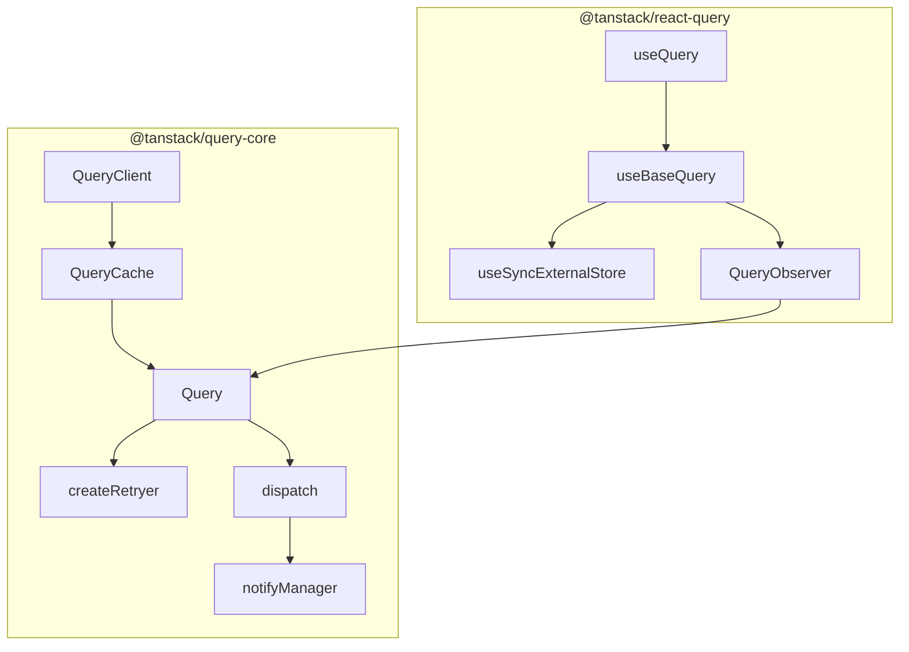

> **TanStack Query 딥다이브 시리즈**
>
> - **1편 (이 글)** — 서버 상태를 관리한다는 것: 사용법과 옵션, 그리고 그 설계 판단
> - [2편 — 소스로 읽는 내부 동작](./tanstack-query-deep-dive): `useBaseQuery`부터 `notifyManager`까지 v5.95.0 소스 순회

이전에는 `useState`와 `useEffect`로 API를 호출하여 데이터를 불러왔습니다. 로딩 플래그, 에러 상태, 언마운트 가드, 중복 요청 방지 등등 여러가지 부가적인 장치들이 필요하였습니다.

TanStack Query는 그 반복을 대신 해주는 도구입니다. useQuery 등을 사용하여 간단히 구현할 수 있습니다. 그런데 막상 제대로 사용하려고 하면 너무 다양한 옵션들이 있습니다. `staleTime`과 `gcTime`이 뭐가 다른지, `status`와 `fetchStatus`는 왜 둘인지, `invalidate`는 왜 refetch가 아닌지.

이 글은 그 옵션들이 **왜 그렇게 생겼는지**를 따라가는 1편입니다. 사용법을 나열하기보다 설계 의도를 보고, 마지막에 이 라이브러리가 안 맞는 경우까지 짚습니다. 내부 구현을 소스 레벨로 따라가는 건 [2편](./tanstack-query-deep-dive)에서 다룹니다.

## 1. 소개와 목적

### TanStack Query가 해결하는 문제

| 문제                                   | TanStack Query의 답                                   |
| -------------------------------------- | ----------------------------------------------------- |
| 같은 API를 여러 컴포넌트에서 중복 호출 | **queryKey** 기반 캐시 + 요청 dedupe                  |
| 로딩/에러/성공 UI 분기 반복            | `isPending`, `isError`, `data` 등 **표준화된 result** |
| stale 데이터 vs fresh 데이터           | `staleTime`, `gcTime`, background refetch             |
| mutation 후 목록 갱신                  | `invalidateQueries`, `setQueryData`                   |
| 탭 포커스, 네트워크 복구 시 재요청     | `focusManager`, `onlineManager`                       |

### fetch, axios vs TanStack Query

**TanStack Query는 "서버 상태 관리" 전체를 푸는 도구입니다.**

#### 1. 캐싱 + 자동 중복 제거

```javascript
// axios만 쓸 때
function UserBadge() { useEffect(() => { axios.get('/users/1')... }, []) }
function UserProfile() { useEffect(() => { axios.get('/users/1')... }, []) }
function UserMenu() { useEffect(() => { axios.get('/users/1')... }, []) }
// → 네트워크 요청 3번
```

TanStack Query에서는 셋이 모두 `useQuery({ queryKey: ['user', 1] })`로 호출해도 **실제 fetch는 한 번만** 일어나고, 두 번째 호출부터는 캐시에서 즉시 반환합니다. 컴포넌트가 마운트·언마운트되면서 같은 요청이 반복되는 문제를 직접 풀려면, 결국 모듈 스코프 캐시 + 키 정규화 + 진행 중 Promise 공유까지 손수 만들게 됩니다.

#### 2. stale-while-revalidate 모델

axios만 쓰면 데이터 신선도를 직접 관리해야 합니다. "포커스가 돌아왔을 때 다시 가져오기", "5분이 지나면 stale로 표시하고 백그라운드 refetch", "네트워크 재연결 시 자동 재시도" 이 모든 것을 직접 짜야 합니다. TanStack Query는 `staleTime`, `gcTime`, `refetchOnWindowFocus`, `refetchOnReconnect` 같은 옵션으로 간단히 설정할 수 있습니다.

#### 3. 상태 표현의 일관성

```javascript
// axios 직접 사용
const [data, setData] = useState(null);
const [isLoading, setIsLoading] = useState(true);
const [error, setError] = useState(null);
const [isRefetching, setIsRefetching] = useState(false);

useEffect(() => {
  const controller = new AbortController();
  setIsLoading(true);
  axios
    .get("/api", { signal: controller.signal })
    .then((res) => setData(res.data))
    .catch((err) => {
      if (err.name === "CanceledError") return;
      setError(err);
    })
    .finally(() => setIsLoading(false));
  return () => controller.abort();
}, []);
```

```javascript
// TanStack Query
const { data, isLoading, error, isFetching } = useQuery({
  queryKey: ["data"],
  queryFn: ({ signal }) => axios.get("/api", { signal }).then((r) => r.data),
});
```

이처럼 반복적인 코드를 줄여주고 정형화된 방식으로 내장된 기능을 사용할 수 있습니다.
세부적인 옵션들을 살펴보기전에 먼저 기본적인 아키텍처 구조부터 설명하겠습니다.

### 아키텍처 (2-layer)



- **`@tanstack/query-core`**: 프레임워크에 무관한 엔진입니다(캐시·fetch·retry·invalidate).
- **`@tanstack/react-query`**: React 훅 어댑터입니다(`useSyncExternalStore`로 구독).

**플로우차트 노드 한 줄 설명 — react-query (React 어댑터)**

| 노드                   | 한 줄 역할                                                                                                                                                                                                                  |
| ---------------------- | --------------------------------------------------------------------------------------------------------------------------------------------------------------------------------------------------------------------------- |
| `useQuery`             | 공개 훅. 타입 오버로드 + `useBaseQuery`에 `QueryObserver`를 넘겨 위임                                                                                                                                                       |
| `useBaseQuery`         | React ↔ core 연결 본체. observer 생성·구독·suspense/error 처리                                                                                                                                                              |
| `useSyncExternalStore` | React 18 내장 훅. 외부 스토어(observer) 스냅샷을 tearing 없이 구독                                                                                                                                                          |
| `QueryObserver`        | 컴포넌트당 1개. fetch/stale 판단, `result` 조립, 읽은 prop만 리렌더(Proxy). 옵션이 바뀌면 다시 fetch할지 판단, staleTime·refetch 타이밍 계산, QueryCache에서 데이터 꺼내오기, 데이터가 바뀌면 **구독자에게 알림**(`notify`) |

```javascript
function useBaseQuery(options, ObserverClass) {
  const client = useQueryClient();
  const observerRef = useRef();
  observerRef.current ??= new ObserverClass(client, options);
  observerRef.current.setOptions(options);

  useSyncExternalStore(
    (cb) => observerRef.current.subscribe(cb), // 구독
    () => observerRef.current.getCurrentResult(), // 현재값
  );

  return observerRef.current.getCurrentResult();
}
```

서버 응답이 오면 → **QueryCache**가 업데이트되고 → **QueryObserver**가 이를 감지해 구독자에게 통보하고 → `useSyncExternalStore`가 React에 "리렌더링하라"는 신호를 보내고 → **useBaseQuery**가 새 결과를 반환하고 → **useQuery**가 그대로 컴포넌트에 전달합니다.

**query-core (엔진)**

| 노드            | 한 줄 역할                                                                            |
| --------------- | ------------------------------------------------------------------------------------- |
| `QueryClient`   | 최상위 오케스트레이터. 캐시 보유 + invalidate/refetch/prefetch API, focus·online 구독 |
| `QueryCache`    | queryHash→Query Map 저장소. `build()`로 get-or-create (같은 키 = 같은 인스턴스 공유)  |
| `Query`         | queryKey 1개 = 캐시 엔트리 1개. `state` · `fetch()` 파이프라인 보유                   |
| `createRetryer` | fetch 실행 루프. 재시도(지수 백오프)·일시정지(offline)·취소 담당                      |
| `dispatch`      | `Query.#dispatch` reducer. action으로 `state` 갱신 후 모든 observer에 알림            |
| `notifyManager` | 알림 배치 스케줄러. 여러 `state` 변경을 1 tick 리렌더로 묶음                          |

---

## 2. 간단한 사용법

### v5 API 형태 (객체 only)

v5부터는 **모든 옵션을 객체 하나**로 전달합니다.

```typescript
import { useQuery } from "@tanstack/react-query";

function UserProfile({ userId }: { userId: number }) {
  const { data, isPending, isError, error } = useQuery({
    queryKey: ["user", userId],
    queryFn: () => fetchUser(userId),
    enabled: userId > 0,
  });

  if (isPending) return <Spinner />;
  if (isError) return <Error message={error.message} />;
  return <div>{data.name}</div>;
}
```

### Query Key Factory (권장 패턴)

```typescript
export const userQueryKeys = {
  all: () => ["users"] as const,
  lists: () => [...userQueryKeys.all(), "list"] as const,
  list: (filters: { role?: string; page?: number }) =>
    [...userQueryKeys.lists(), filters] as const,
  details: () => [...userQueryKeys.all(), "detail"] as const,
  detail: (userId: number) => [...userQueryKeys.details(), userId] as const,
};
```

- `invalidateQueries({ queryKey: userQueryKeys.all() })` → 모든 user 관련 쿼리 무효화
- `invalidateQueries({ queryKey: userQueryKeys.detail(userId) })` → 특정 user만 무효화

### useMutation 기본

```typescript
const queryClient = useQueryClient();

const mutation = useMutation({
  mutationFn: (body: { name: string }) => updateUser(userId, body),
  onSuccess: () => {
    void queryClient.invalidateQueries({
      queryKey: userQueryKeys.detail(userId),
    });
  },
});
```

### 커스텀 훅

```typescript
// hooks/useUserQuery.ts
export function useUserQuery(userId: number, enabled = true) {
  return useQuery({
    queryKey: userQueryKeys.detail(userId),
    queryFn: () => fetchUser(userId),
    enabled: userId > 0 && enabled,
    staleTime: 60_000,
  });
}
```

---

## 3. 주요 옵션 정리

### useQuery 핵심 옵션

| 옵션                   | 역할                                            | 일반적인 예시                   |
| ---------------------- | ----------------------------------------------- | ------------------------------- |
| `queryKey`             | 캐시 식별자. 인자가 바뀌면 다른 캐시 엔트리     | `userQueryKeys.detail(userId)`  |
| `queryFn`              | 실제 fetch 함수. `signal`(AbortSignal) 제공     | `() => fetchUser(userId)`       |
| `enabled`              | `false`면 fetch 안 함                           | `userId > 0`                    |
| `staleTime`            | 이 시간 동안 "fresh" → 자동 refetch 억제        | 목록 30s, 상세 60s              |
| `gcTime`               | observer 0개일 때 캐시 유지 시간 (구 cacheTime) | 기본 5분                        |
| `retry`                | 실패 시 재시도 횟수/함수                        | 401이면 `false`, 그 외 3회      |
| `refetchOnWindowFocus` | 탭 포커스 시 refetch                            | 대시보드: `true`, 설정: `false` |
| `refetchInterval`      | 주기적 polling (숫자 또는 함수)                 | 온라인 상태: 10초               |
| `placeholderData`      | 이전 데이터 유지 (`keepPreviousData`)           | 페이지네이션 user 목록          |
| `select`               | 캐시 데이터 → 컴포넌트용 변환                   | `select: (user) => user.name`   |

### status, fetchStatus

| 축            | 값                              | 의미                         |
| ------------- | ------------------------------- | ---------------------------- |
| `status`      | `pending` / `success` / `error` | 데이터 존재 여부 (결과 상태) |
| `fetchStatus` | `idle` / `fetching` / `paused`  | 현재 네트워크 요청 진행 여부 |

- `isLoading` = `isPending && isFetching` (첫 로딩)
- `isRefetching` = `isFetching && !isPending` (백그라운드 재요청)

> **쉽게:** `status`는 "**데이터 있어?**"(결과), `fetchStatus`는 "**지금 네트워크 돌아?**"(과정)를 뜻합니다. 둘은 독립 축이라 — _데이터는 있는데(success) 동시에 백그라운드로 새로 받는 중(fetching)_ 같은 조합이 자연스럽습니다.

#### 두 축의 질문

- **status**: "나, **데이터** 있어?" (결과의 축)
- **fetchStatus**: "나, **지금 일하고 있어**?" (활동의 축)

|                       | `fetchStatus: idle`                  | `fetchStatus: fetching`              | `fetchStatus: paused`        |
| --------------------- | ------------------------------------ | ------------------------------------ | ---------------------------- |
| **`status: pending`** | 아직 한 번도 못 받음, 쉬는 중 (드묾) | **첫 로딩 중** ⏳                    | 첫 로딩하려는데 오프라인     |
| **`status: success`** | 데이터 있고 가만히 있음              | 데이터 있지만 **백그라운드 refetch** | 데이터 있고, refetch 대기 중 |
| **`status: error`**   | 실패한 채로 가만히 있음              | 실패했지만 **재시도 중**             | 재시도하려는데 오프라인      |

### QueryClient 메서드

QueryClient는 캐시(QueryCache)를 제어합니다.

#### 1. 캐시 직접 읽기/쓰기 (네트워크 안 탐)

| 메서드                             | 하는 일                                                   |
| ---------------------------------- | --------------------------------------------------------- |
| `getQueryData(key)`                | 캐시에 있는 **데이터** 꺼내기 (없으면 undefined)          |
| `setQueryData(key, updater)`       | 캐시에 데이터 **직접 주입/갱신**                          |
| `getQueryState(key)`               | 데이터뿐 아니라 status, error, updatedAt 등 **상태 전체** |
| `setQueriesData(filters, updater)` | 필터에 걸리는 **여러 쿼리를 한 번에** 갱신                |

```typescript
// optimistic update의 단골 패턴
queryClient.setQueryData(["todos"], (old) => [...old, newTodo]);
```

#### 2. 페치 트리거 (네트워크 탐)

| 메서드                     | 하는 일                                          | 반환            |
| -------------------------- | ------------------------------------------------ | --------------- |
| `fetchQuery(options)`      | 데이터 가져오기. 캐시 있고 fresh면 그것 반환     | `Promise<data>` |
| `prefetchQuery(options)`   | 백그라운드로 **미리 채워두기**. 에러 던지지 않음 | `Promise<void>` |
| `ensureQueryData(options)` | 캐시 있으면 그것, 없으면 fetch                   | `Promise<data>` |
| `refetchQueries(filters)`  | 필터 걸리는 쿼리 **강제 재요청**                 | `Promise<void>` |

```typescript
// Next.js 서버 컴포넌트에서 미리 채우기
await queryClient.prefetchQuery({ queryKey: ["user", id], queryFn });
```

셋의 차이가 헷갈릴 때는 이렇게 구분하면 됩니다. `fetchQuery`는 _데이터가 필요해서 직접 받아 쓸 때_, `prefetchQuery`는 _나중에 useQuery가 쓸 것을 미리 준비할 때_, `ensureQueryData`는 _있으면 쓰고 없으면 받을 때_ 씁니다.

#### 3. 무효화 · 취소 · 제거 (생명주기 조작)

| 메서드                       | 하는 일                                                    |
| ---------------------------- | ---------------------------------------------------------- |
| `invalidateQueries(filters)` | **stale로 표시 + 활성 쿼리는 즉시 refetch** (가장 자주 씀) |
| `cancelQueries(filters)`     | 진행 중인 요청 abort. optimistic update 직전에 호출        |
| `removeQueries(filters)`     | 캐시에서 **완전 삭제** (구독자도 다 떨어져 나감)           |
| `resetQueries(filters)`      | 초기 상태로 **리셋** + 활성이면 refetch                    |

```typescript
// mutation 성공 후 단골
onSuccess: () => queryClient.invalidateQueries({ queryKey: ["todos"] });
```

`invalidate`와 `reset`의 차이는 이렇습니다. `invalidate`는 *기존 데이터를 유지하면서 stale로 표시*하므로 refetch 동안에도 화면에 데이터가 남아 있고, `reset`은 _데이터까지 초기 상태로_ 되돌리므로 스켈레톤이 다시 뜹니다.

#### 4. Mutation 관련

| 메서드                              | 하는 일                                             |
| ----------------------------------- | --------------------------------------------------- |
| `isMutating(filters?)`              | 진행 중인 mutation **개수** 반환 (전역 로딩 표시용) |
| `setMutationDefaults(key, options)` | 특정 mutation key에 기본 옵션 설정                  |
| `getMutationDefaults(key)`          | 그 기본값 조회                                      |
| `resumePausedMutations()`           | 오프라인에서 멈췄던 mutation 재개                   |

#### 5. 무한 스크롤 전용

| 메서드                           | 하는 일                    |
| -------------------------------- | -------------------------- |
| `fetchInfiniteQuery(options)`    | `useInfiniteQuery`용 fetch |
| `prefetchInfiniteQuery(options)` | 무한 쿼리 prefetch         |

일반 버전과 동일한 패턴이고, 페이지네이션 구조만 다릅니다.

#### 6. 전역 설정 / 캐시 접근

| 메서드                           | 하는 일                                        |
| -------------------------------- | ---------------------------------------------- |
| `getQueryCache()`                | QueryCache **인스턴스 직접** 받기 (고급 용도)  |
| `getMutationCache()`             | MutationCache 인스턴스                         |
| `setDefaultOptions(options)`     | 전역 기본 옵션 변경 (런타임)                   |
| `getDefaultOptions()`            | 현재 전역 기본값                               |
| `setQueryDefaults(key, options)` | **특정 key 패턴**에만 기본값 적용              |
| `clear()`                        | 모든 쿼리·mutation **완전 삭제** (로그아웃 시) |

가장 자주 쓰는 다섯 가지만 다시 추리면 이렇습니다.

| 메서드              | 역할                                       |
| ------------------- | ------------------------------------------ |
| `fetchQuery`        | 즉시 fetch + Promise 반환                  |
| `prefetchQuery`     | 백그라운드 캐시 워밍 (hover, RSC)          |
| `setQueryData`      | 캐시 직접 수정 (optimistic)                |
| `invalidateQueries` | `isInvalidated=true` · active 쿼리 refetch |
| `cancelQueries`     | 진행 중 fetch 취소 (AbortSignal)           |

---

## 4. 자주 막히는 개념 세 가지

### Q1. `staleTime`이랑 `gcTime` 차이가 계속 헷갈려요.

`staleTime` = "데이터가 신선한 기간"(이 동안은 refetch 안 함, 기본 0 = 즉시 stale). `gcTime` = "구독자(observer)가 0개가 된 뒤 캐시를 메모리에 유지하는 시간"(기본 5분, 지나면 GC). staleTime은 네트워크 절약, gcTime은 메모리 회수 — 서로 별개 축입니다.

### Q2. `queryKey`랑 `queryHash`는 뭐가 달라요?

`queryKey`는 배열(`['user', 1]`)이고, `queryHash`는 그 배열을 안정적으로 직렬화한 문자열(`hashQueryKeyByOptions`)입니다. `QueryCache`의 Map은 `queryHash` 문자열을 키로 씁니다. 같은 `queryKey` → 같은 hash → 같은 `Query`.

### Q3. `invalidate`랑 `refetch` 차이?

`invalidate` = "이 데이터 오래됐다"고 표시(`isInvalidated=true`)만 합니다. `refetch` = 실제 네트워크 재요청입니다. `invalidateQueries`는 ① 표시 후 ② 화면에 떠 있는(active) 쿼리만 refetch합니다. 안 떠 있는 건 다음에 볼 때 stale라 자동 갱신됩니다.

---

나머지 열 개 — `useSyncExternalStore`, tearing, Observer, `notifyManager` 배칭 등 — 는 내부 구현을 봐야 답이 되는 것들이라 [2편](./tanstack-query-deep-dive)으로 옮겼습니다.

## 5. v5 체크리스트

- [ ] API는 **객체 형태 only** (`useQuery({ ... })`)
- [ ] `status`와 `fetchStatus` 분리 이해
- [ ] `staleTime` vs `gcTime` 구분
- [ ] `invalidate`는 플래그, refetch는 별도 단계
- [ ] React 연결은 `useSyncExternalStore` (v4의 useState+effect 아님)
- [ ] queryKey factory로 invalidate/setQueryData 키 일치
- [ ] `queryFn`은 API 모듈에, 훅은 thin wrapper

## 6. 옵션 이름이 헷갈리는 진짜 이유

여기까지가 무엇을 쓰는지입니다. 여기서부터는 왜 이렇게 생겼는지에 대한 제 판단입니다.

`staleTime`과 `gcTime`이 계속 헷갈리는 건 개념이 어려워서가 아닙니다. **두 값이 서로 다른 질문에 답하는데, 이름이 둘 다 시간처럼 보이기 때문**입니다.

|             | 답하는 질문                            | 만료되면                           | 화면에 미치는 영향    |
| ----------- | -------------------------------------- | ---------------------------------- | --------------------- |
| `staleTime` | 이 데이터를 **다시 받아야 하나**       | 다음 트리거에서 background refetch | 없음. 화면은 그대로   |
| `gcTime`    | 이 데이터를 **메모리에서 버려도 되나** | 캐시에서 제거                      | 다음 진입 시 로딩부터 |

축이 다릅니다. 앞은 **신선도**, 뒤는 **수명**입니다. `staleTime`이 지나도 데이터는 남아 있고, `gcTime`이 지나야 사라집니다. 그래서 `staleTime > gcTime`은 사실상 무의미한 설정이 됩니다. 버려진 뒤에 갱신할 게 없으니까요.

`status`와 `fetchStatus`를 쪼갠 것도 같은 종류의 정리입니다. v4의 `isLoading`은 "데이터가 없다"와 "네트워크가 돌고 있다"를 한 플래그에 뭉쳐놨습니다. 그래서 background refetch 중에도 `isLoading`이 true가 되어 스켈레톤이 다시 뜨는 문제가 흔했습니다. v5는 이걸 갈랐습니다.

- `status` — 데이터가 있느냐 (`pending` / `error` / `success`)
- `fetchStatus` — 지금 네트워크가 도느냐 (`fetching` / `paused` / `idle`)

이건 API를 복잡하게 만든 게 아니라, **원래 두 개였던 걸 두 개로 되돌린 것**입니다. 이름이 늘어나는 대신 "첫 로딩엔 스켈레톤, 갱신 중엔 기존 데이터 + 인디케이터"를 분기 없이 표현할 수 있게 됩니다.

`invalidate`가 refetch가 아닌 것도 마찬가지입니다. 무효화는 "이 데이터 낡았다"는 **표시**고, 실제 재요청은 화면에 떠 있는 쿼리에만 일어납니다. 안 보이는 화면까지 다 다시 받으면 목록 하나 갱신에 수십 개 요청이 나갈 테니까요. 이름이 직관적이지 않은 대신 **동작이 안전한 쪽**을 골랐다고 봅니다.

세 경우 모두 패턴이 같습니다. **v5는 이름의 친절함을 정확함과 맞바꿨습니다.** 배울 때 헷갈리는 대신, 배우고 나면 잘못 쓰기 어렵습니다. 개인적으로는 맞는 트레이드오프라고 생각하지만, 팀에 새 사람이 올 때마다 같은 설명을 반복하게 되는 비용은 실재합니다.

## 7. 이걸 안 쓰는 게 나은 경우

TanStack Query가 푸는 건 **서버 상태**입니다. 내가 소유하지 않고, 언제든 낡을 수 있고, 비동기로만 접근 가능한 데이터. 그게 아닌 데이터에 쓰면 도구만 무거워집니다.

- **로컬 UI 상태.** 모달 열림, 폼 입력값, 탭 선택. `useState`로 충분합니다. 이걸 queryKey로 관리하는 코드를 가끔 보는데, 캐시 무효화 규칙만 늘어납니다.
- **서버 통신이 몇 군데 안 되는 앱.** 화면 두세 개에서 fetch를 부르는 정도라면, 라이브러리 하나를 배우는 비용이 더 큽니다.
- **실시간 양방향 데이터.** WebSocket으로 서버가 밀어주는 데이터는 캐시 무효화 모델과 잘 안 맞습니다. `setQueryData`로 밀어넣어 억지로 쓸 수는 있지만, 그러면 TanStack Query는 그냥 저장소 역할만 합니다. 그 용도라면 더 가벼운 상태 라이브러리가 낫습니다.
- **RSC로 대부분 해결되는 경우.** 서버 컴포넌트에서 데이터를 받아 렌더하고 클라이언트 상호작용이 거의 없다면, 클라이언트 캐시가 필요 없을 수 있습니다.

반대로 **여러 컴포넌트가 같은 서버 데이터를 보고, 그 데이터가 사용자 행동에 따라 갱신되어야 하는** 구조라면 직접 만들 이유가 없습니다. 직접 만들면 결국 queryKey 정규화, 진행 중 Promise 공유, 포커스 리스너, 재시도 백오프를 하나씩 다시 짜게 됩니다.

## 8. 그럼 내부까지 알아야 하나

솔직히 말하면, 처음부터는 아닙니다. 1~5장만으로 실무는 돌아갑니다.

다만 두 상황에서 내부 지식이 필요해집니다. 하나는 **성능 문제가 생겼을 때**입니다. 리렌더가 왜 이렇게 자주 도는지, 왜 이 컴포넌트만 안 갱신되는지 같은 문제는 Observer가 어떻게 붙고 알림이 어떻게 배칭되는지를 모르면 진단이 안 됩니다. 다른 하나는 **라이브러리가 예상과 다르게 동작할 때**입니다. 문서에 없는 동작을 만나면 결국 소스를 열게 됩니다.

그리고 이건 TanStack Query에만 해당하는 얘기가 아니라고 생각합니다. 라이브러리를 쓰는 동안은 그 라이브러리가 내린 설계 결정을 내가 물려받는 셈입니다. `staleTime`을 60초로 두는 순간 "1분 낡은 데이터를 보여줘도 된다"는 제품 판단을 한 것이고, 그건 라이브러리가 대신 해줄 수 없는 결정입니다.

옵션 이름을 외우는 것과 그 옵션이 무엇을 맞바꾸는지 아는 것은 다릅니다. 후자가 필요해지는 순간이 오면 [2편](./tanstack-query-deep-dive)에서 소스를 같이 열어보겠습니다.

## 참고

- [TanStack Query 공식 문서](https://tanstack.com/query/latest)
- [TanStack Query GitHub](https://github.com/TanStack/query)
- [v5 마이그레이션 가이드 — 객체 API, `isPending`, `gcTime`](https://tanstack.com/query/latest/docs/framework/react/guides/migrating-to-v5)
- [Important Defaults — `staleTime` / `gcTime`](https://tanstack.com/query/latest/docs/framework/react/guides/important-defaults)
- [TkDodo — Practical React Query 시리즈](https://tkdodo.eu/blog/practical-react-query)
- [TkDodo — Effective React Query Keys](https://tkdodo.eu/blog/effective-react-query-keys)

<!-- 이미지 체크리스트
IMG-01 [내가 캡처] React Query Devtools — staleTime 경과 전/후 쿼리 상태 — 미완료
         의도: 6장의 "신선도와 수명은 다른 축"을 눈으로
IMG-02 [내가 캡처] background refetch 중 화면 (기존 데이터 유지 + 인디케이터) — 미완료
         의도: status/fetchStatus 분리의 실익
-->
