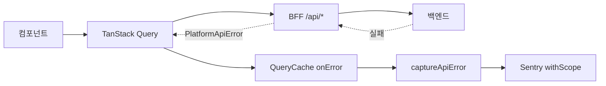

에러는 잡히고 있었습니다. 그런데 이슈를 열어보면 압축된 스택 한 줄이 전부였습니다. 누가 겪었는지, 어떤 API가 터졌는지, 어느 화면에서 무슨 요청을 하다 그랬는지, 어느 릴리즈부터인지 — 궁금한 건 하나도 없었습니다.

Sentry는 `feature/sentry` 브랜치에 DSN을 꽂고 예제 라우트로 "에러가 올라오네"까지 확인한 상태였습니다. 딱 거기까지였죠. 실제로 `captureException`을 부르는 곳은 `global-error.tsx` 단 한 곳이었습니다. 나머지는 전부 SDK 자동 캡처에 맡기고 있었고요.

이 글은 그 상태에서 출발해 이슈 하나로 원인을 좇을 수 있는 수준까지 올린 과정입니다. 무엇을 심었는지, 무엇을 걸러냈는지, 그리고 그 선택들이 무엇을 대가로 치렀는지까지 다룹니다. (`@sentry/nextjs` v10 · Next 16 · React 19 기준)

## 1. 켜져 있는데 아무 말도 안 하는 상태

아직 이걸로 크게 데인 적은 없었습니다. 하지만 뒤집어 말하면 **지금 장애가 나도 Sentry가 알려줄 게 없다**는 뜻이었습니다.

본격적으로 고치기 전에 그릇이 어떤 상태인지부터 짚었습니다.

| 영역 | 처음 상태 |
| --- | --- |
| 계측 실사용 | `captureException` 단 1곳(`global-error.tsx`). 나머지는 SDK 자동 캡처 |
| 환경 구분 | `environment` 없음 — dev/qa/prod를 프로젝트(DSN)로만 구분 |
| 릴리즈 | `release` 없음 — "어느 배포부터인지" 추적 불가 |
| 샘플링 | `tracesSampleRate: 1`(전량) — prod 비용·quota 폭발 위험 |
| 유저 컨텍스트 | `setUser` 없음. 거기에 `sendDefaultPii: true`로 PII는 통째로 전송 |
| 노이즈 필터 | `beforeSend`·`ignoreErrors`·`denyUrls` 전부 없음 |
| 설정 파일 | `sentry.client.config.ts`와 `instrumentation-client.ts`가 공존(값까지 불일치). Next 16은 후자만 로드 |

마지막 줄이 특히 나빴습니다. 두 파일의 값이 서로 다른데 하나만 로드되고 있었으니, 설정을 읽어도 실제 동작을 알 수 없는 상태였습니다.

목표는 셋으로 잡았습니다. 에러 수집을 고도화하고, 노이즈를 걸러 Alert을 신뢰할 수 있게 만들고, 팀이 굴릴 수 있는 프로세스를 얹는 것.

## 2. 길목이 하나였다는 행운

`captureException(error)`로 JS Error 객체만 던지면 Sentry는 그 이상을 알 수 없습니다. 필요한 건 **Scope**였습니다. 에러에 맥락(level, tags, context, fingerprint)을 붙여 보내면 재현 없이도 이슈만 보고 원인을 좁힐 수 있습니다.

문제는 "어디에 붙이느냐"였는데, 여기서 운이 좋았습니다. 이 앱은 에러가 한 군데로 모입니다. 모든 서버 요청이 TanStack Query를 타고, 그 실패는 `QueryCache`/`MutationCache`의 `onError`를 지나갑니다. 백엔드 에러는 이미 `PlatformApiError`로 타입되어 `status`와 `code`를 들고 있었고요.

그래서 `captureException`을 코드 곳곳에 뿌리지 않고, 이 길목 하나에서 맥락을 입혔습니다.



에러가 한 지점을 지나간다는 건 우연이 아니라 앞선 아키텍처 선택의 결과입니다. 만약 컴포넌트마다 `fetch`를 직접 부르는 구조였다면, 이 작업은 계측 지점을 수십 군데 찾아 심는 일이 됐을 겁니다.

### 2.1 Level — Alert의 필터 축

Level은 단순하지만 쿼리와 Alert의 필터 축이 되기 때문에 효용이 큽니다. 서비스 영향도를 기준으로 정의했습니다.

| Level | 정의 | 해당 케이스 |
| --- | --- | --- |
| **fatal** | 화면 렌더 실패 · 필수 기능 동작 불가 | `global-error.tsx`·route `error.tsx` 크래시, `captureApiError(e, { fatal: true })` 수동 escalate |
| **error** (기본) | 예상 못한 unhandled 에러 | 5xx · 파싱 실패 · 미지의 code · 서버 런타임 네트워크 실패 |
| **warning** | 예상 가능 + 영향 낮음 | 503 · 429 · 타임아웃 |
| (breadcrumb) | 이미 비즈니스 로직이 처리 | 예상된 4xx(VALIDATION·PERMISSION·DUPLICATE·NOT_FOUND) · 401 auth |

이걸로 "fatal 하나만 떠도 즉시, warning은 모아서" 볼 수 있는 토대가 생겼습니다.

### 2.2 제목만 보고 어떤 API인지 알게

이슈 목록에서 제목만 봐도 어떤 API인지 보이도록, 에러 이름에 상태코드와 경로를 넣었습니다. 가변 세그먼트는 `{id}`로 치환해 같은 API 에러가 하나로 묶이게 했습니다.

```text
[500 Error] GET /api/applications/{id}/eval-runs/{id}/tasks/{id}
```

참고한 아티클은 `[500 Error] - {baseURL}{path}` 형식이었는데, 여기서는 baseURL을 뺐습니다. 브라우저가 항상 자기 도메인의 BFF(`/api/*`)를 통해 백엔드를 부르므로 baseURL이 늘 같기 때문입니다. 대신 method와 BFF 경로를 넣으니 이슈 제목이 화면·기능과 1:1로 대응됐습니다.

여기에 하나 더 손댔습니다. Sentry의 기본 그룹화는 StackTrace 기반이라 같은 API 에러가 메시지별로 쪼개집니다. 그래서 **커스텀 Fingerprint로 그룹 축을 API로 고정**했습니다. 이 선택에는 대가가 따르는데, 뒤에서 다시 짚겠습니다.

### 2.3 재현 없이 원인을 보도록

요청 맥락과 공통 맥락을 Context·Tags로 적재했습니다. 아래가 그 조립부 전체입니다.

```typescript
Sentry.withScope((scope) => {
  // 그룹화: StackTrace 대신 API 축으로 고정 (+ backend code까지)
  scope.setFingerprint([method, endpoint, String(status), code]);
  scope.setLevel(level);

  // Tags = 검색/필터 축 (release·environment는 init에서 자동)
  scope.setTags({
    "api.endpoint": endpoint,
    "api.method": method,
    "http.status": String(status),
    "backend.code": code,
    "error.page": screen,
  });

  // Context = 재현 없이 원인분석용 상세
  scope.setContext("api_request", { endpoint, method, query: scrubbedQuery });
  scope.setContext("api_response", { status, code, message });

  error.name = `[${status} Error] ${method} ${endpoint}`; // 이슈 제목
  Sentry.captureException(error);
});
```

OS·브라우저·기종은 Sentry가 user-agent로 자동 수집하고, 앱 버전(release)과 환경(environment)은 init에서 박아뒀습니다. 처음에 원했던 발생 장소·세부·환경·시점이 이슈 하나에 다 담기게 됐습니다.

## 3. 노이즈를 3계층으로 거르기

에러가 많다고 서비스가 치명적인 건 아닙니다. 이미 비즈니스 로직에서 핸들링된 에러, 단말 네트워크 문제로 생긴 에러는 서비스에 영향이 없습니다. 이런 게 사용량과 주의를 태우면 스팸으로 가득 찬 메일함과 다를 게 없습니다.

| 계층 | 어디서 | 거르는 것 | 사용량 |
| --- | --- | --- | --- |
| ① Inbound Filters | Sentry 대시보드 | `ChunkLoadError*` · `Failed to fetch`/`Load failed` · 브라우저 확장 · 크롤러 | 소모 안 함 |
| ② beforeSend | init 3종 (scope 없음) | PII 스크럽 + `ResizeObserver`·`AbortError` · 클라 네트워크 throw | 소모 |
| ③ SKIP_RULES | `sentry-level.ts` (scope 있음) | code/endpoint 기반 정밀 skip | 소모 |

위쪽 계층일수록 싸게 걸러집니다. 그래서 "문자열로 판단 가능한 것"은 최대한 ①로 올리고, 맥락이 필요한 것만 아래로 내렸습니다.

참고한 아티클은 `error.response.data === "최대 구매 가능 수량을 초과했어요"`처럼 **메시지 문자열**로 skip했습니다. 에러 코드가 없는 구조였기 때문입니다. 여기서는 `PlatformApiError.code`가 있으니 skip 조건을 코드 기반으로 뒀습니다. 다국어를 쓰는 서비스라 문구가 바뀌어도 안 깨지는 게 중요했습니다.

네트워크 에러는 조금 다르게 접근했습니다. 원본은 이걸 전부 필터했습니다. 서버는 서버팀이 따로 모니터링하니까요. 그런데 여기서 말하는 "서버"는 BFF입니다. 구분이 필요했습니다.

- 클라 런타임 네트워크 throw(오프라인·탭 이탈) → 노이즈. drop
- BFF → 백엔드 실패 → 진짜 신호. server config에서는 살림

`beforeSend`가 런타임별로 따로 돌기 때문에 가능한 분기였습니다.

캡처 정책은 결국 "신호만"으로 정리됐습니다. 5xx·네트워크(서버)·파싱 실패·미지의 code만 issue로 보내고, 예상된 4xx는 breadcrumb으로만 남깁니다.

## 4. Alert과 사람

정보가 풍부해지고 노이즈가 걸러졌으니, 이제 "몇 건 이상, 어떤 Level"일 때만 울리는 Alert을 걸 차례입니다. 앞서 심은 태그(`level`·`api.endpoint`·`error.page`·`release`)를 필터로 씁니다.

| 이름 | 조건 | 액션 |
| --- | --- | --- |
| Critical | `level:fatal` 1건이라도 | Slack 알림 (critical 채널) |
| Warning | `level:warning` 20건 초과 / 1시간 | Slack 알림 (warning 채널) |
| 스파이크 | 동일 이슈 50건 초과 / 1시간 | Slack 알림 (warning 채널) |
| 신규 회귀 | 최신 `release`에서 신규 이슈 생성 | Slack 알림 — "최신 배포가 새 에러 유발" |

임계값은 처음부터 맞을 리 없습니다. 운영하면서 다듬을 숫자입니다.

알람이 울린 뒤가 더 중요합니다. 담당자를 주간 2~3명 묶음으로 돌리기로 했습니다. 한 명 전담은 부재중이거나 바쁠 때 검토가 밀립니다. Level 임계를 넘으면 Slack 봇이 그 메시지에 스레드를 달아 담당자를 호출하고, "검토중 / 원인 / 조치" 상태를 남겨 중복 검토를 막습니다. 검토가 끝나면 resolve하고 스레드에 결론을 남깁니다.

## 5. 아티클엔 없던 복병 둘

### 5.1 커밋되어 있던 인증 토큰

설정을 들여다보다 `env.sentry-build-plugin`에 실제 `SENTRY_AUTH_TOKEN`이 **git에 커밋된 상태**임을 발견했습니다. 파일명에 점이 없었습니다. `.gitignore`는 `.env.sentry-build-plugin`(점 있음)만 막고 있었고요.

한 글자 차이입니다. 이미 여러 원격 브랜치에 올라간 상태였습니다.

토큰을 재발급해 무력화하고, `.gitignore`를 고치고, 추적을 끊었습니다. CI는 이미 secret을 쓰고 있어 무중단으로 끝났습니다. 운이 좋았던 건, 이 작업을 하다가 발견했다는 것뿐입니다. 안 봤으면 계속 그대로였을 겁니다.

### 5.2 난독화와 심볼리케이션은 같이 못 산다

배포 파이프라인에 기술심사용 난독화 스텝이 있습니다. 이게 `next build`(= Sentry 소스맵 업로드) **이후**에 앱 청크를 mangle하면서 소스맵을 재생성하지 않습니다. 업로드된 소스맵과 배포된 코드가 어긋나니, 앱 코드의 스택트레이스 복원이 흔들립니다. vendor 청크는 정상입니다.

난독화는 반드시 유지해야 하는 요구사항이라 이 한계는 수용했습니다. 그런데 여기서 2장에 공들인 게 빛을 봤습니다. 이슈 이름·tags·fingerprint·context·breadcrumbs는 **스택트레이스 심볼리케이션에 의존하지 않습니다.** API 에러는 이것만으로 충분히 좇을 수 있고, `fatal` 렌더 크래시의 스택만 손해입니다.

결과적으로는 그렇게 됐지만, 처음부터 이걸 노리고 설계한 건 아니었습니다. Scope에 정보를 많이 심어둔 게 다른 곳의 결함을 덮어준 셈입니다.

## 6. 이 선택들이 치른 대가

여기까지가 무엇을 했는지입니다. 여기서부터는 그 대가에 대한 이야기입니다.

**Fingerprint를 API 축으로 고정한 것.** 이게 제일 큰 트레이드오프입니다. 같은 엔드포인트에서 서로 다른 원인으로 터진 500 에러가 이제 한 이슈로 뭉칩니다. `[500 Error] POST /api/eval-runs`가 DB 타임아웃 때문일 수도, 직렬화 실패 때문일 수도 있는데 이슈 목록에서는 구분이 안 됩니다. `backend.code`를 fingerprint에 같이 넣어 어느 정도 갈랐지만, code가 같고 원인이 다른 경우는 여전히 뭉칩니다.

이 선택은 **이슈 목록의 가독성을 원인 분해능과 맞바꾼 것**입니다. 이슈가 수백 개로 쪼개져 아무도 안 보는 것보다는, 적은 수로 묶여서 매일 보는 게 낫다고 판단했습니다. 지금은 Sentry를 제대로 쓰기 시작하는 단계라 가독성이 먼저라고 봤습니다. 이슈 목록이 안정되고 나면 fingerprint를 다시 풀어야 할 수도 있습니다.

**예상된 4xx를 breadcrumb으로 내린 것.** 개인적인 의견이지만, 이건 언젠가 물릴 선택입니다. "예상된 4xx"의 기준은 프론트엔드가 정한 것이고, 백엔드의 판단과 다를 수 있습니다. 예를 들어 `PERMISSION` 4xx가 갑자기 폭증하는 건 권한 정책 배포가 잘못됐다는 신호일 수 있는데, 지금 구조에서는 issue로 안 올라오니 아무도 모릅니다. Inbound Filter 대신 **낮은 샘플링 비율로 남기는 방식**이 더 나았을지도 모르겠습니다.

**PII를 스크럽한 것.** `sendDefaultPii: true`를 끄고 스크럽 함수를 넣었습니다. 안전해진 대신, 디버깅에 필요한 정보까지 같이 날아갈 수 있습니다. 어떤 파라미터 값 때문에 터졌는지 봐야 하는 상황에서 그 값이 마스킹되어 있으면 재현부터 다시 해야 합니다. 지금은 `setUser`에 id와 email만 남겨 최소한의 추적성을 확보했는데, 이건 규제와 디버깅 사이의 타협이지 정답이 아닙니다.

## 7. 그럼 기본 설정으로는 부족한가

솔직히 말하면, 서비스에 따라 다릅니다.

Sentry 기본 설정만으로 충분한 경우가 있습니다. 프론트엔드가 얇고 대부분의 로직이 서버에 있다면, 프론트에서 잡히는 건 렌더 크래시 정도라 스택트레이스만으로 충분합니다. 여기서 한 작업은 오버엔지니어링입니다.

반대로 이 작업이 값어치를 하는 조건은 이렇습니다.

1. **API 실패가 에러의 주종이다.** 렌더 크래시보다 서버 통신 실패가 훨씬 많다면, 스택트레이스는 거의 쓸모가 없습니다. `fetch` 안쪽 어딘가를 가리킬 뿐이니까요. 이때 필요한 건 어떤 요청이 어떤 응답을 받았는가입니다.
2. **에러가 지나가는 길목이 하나다.** 이게 없으면 계측 비용이 급증합니다. 사실 이 작업의 난이도를 결정한 건 Sentry 지식이 아니라 **앱이 이미 그런 구조였는가**였습니다.
3. **팀이 이슈를 실제로 볼 것이다.** 안 볼 거면 정보를 아무리 심어도 소용없습니다. 4장의 담당자 로테이션이 사실 이 중에서 제일 중요합니다.

세 개 중 두 개가 안 맞으면 기본값에서 `environment`와 `release`만 채우고 멈추는 게 낫습니다. 그 둘은 5분이면 되고 효용은 큽니다.

## 8. 마치며

"에러가 잡히는가"에서 "에러 하나로 원인을 좇을 수 있는가"로 옮긴 게 이번 작업의 핵심입니다. 설정만으로도 환경·릴리즈·샘플링·노이즈가 정리됐지만, 진짜 가치는 Scope 계측에서 나왔습니다.

작업하면서 생각이 바뀐 게 하나 있습니다. 처음에는 이걸 "Sentry를 잘 쓰는 법"이라고 생각했는데, 끝나고 보니 아니었습니다. 실제로 결정적이었던 건 **에러가 한 길목을 지나가도록 앱이 이미 만들어져 있었다는 사실**이었습니다. `PlatformApiError`가 `status`와 `code`를 들고 있었던 것, 모든 요청이 TanStack Query를 탔던 것 — 이건 모니터링을 염두에 두고 한 설계가 아니었는데, 결과적으로 계측 비용을 한 자리로 줄여줬습니다.

관측 가능성은 도구를 붙여서 생기는 게 아니라 **코드가 자기 상태를 말할 수 있는 구조인가**에서 나옵니다. Sentry는 그걸 받아 적는 쪽이지, 없는 걸 만들어주지는 않습니다. 다음에 새 서비스를 만든다면 에러 타입에 `code`를 넣을지부터 정하고 시작할 것 같습니다.

남은 일은 Alert 임계값을 실제 트래픽에 맞춰 조정하는 것, 그리고 6장에서 짚은 fingerprint 문제가 실제로 발목을 잡는지 몇 달 지켜보는 것입니다.

## 참고

- [Sentry for Next.js 공식 문서](https://docs.sentry.io/platforms/javascript/guides/nextjs/)
- [Sentry Fingerprinting 규칙](https://docs.sentry.io/concepts/data-management/event-grouping/fingerprint-rules/)
- [Sentry Inbound Filters](https://docs.sentry.io/concepts/data-management/filtering/)
- [`beforeSend` / `beforeSendTransaction` 훅](https://docs.sentry.io/platforms/javascript/configuration/filtering/)
- [TanStack Query — QueryCache `onError`](https://tanstack.com/query/latest/docs/reference/QueryCache)
- [확인필요: 참고한 원본 아티클 링크 — 3·5장에서 세 번 인용했는데 출처가 없습니다]

{/* 이미지 체크리스트
IMG-01 [내가 캡처] 개선 전/후 Sentry 이슈 목록 비교 — 미완료
         의도: "압축된 스택 한 줄"과 "[500 Error] GET /api/..."의 차이를 한눈에
IMG-02 [내가 캡처] 이슈 상세의 Tags·Context 패널 — 미완료
         의도: 재현 없이 원인을 좁힐 수 있다는 주장의 실물 증거
*/}
